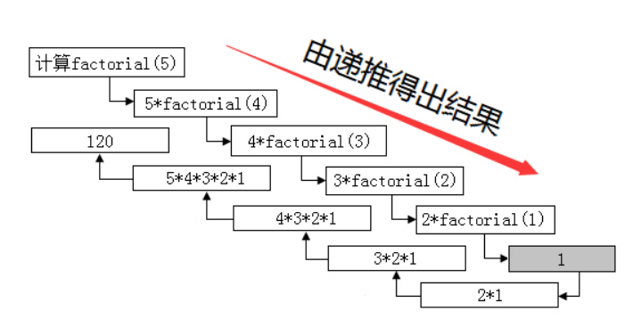

## C 语言基础

C语言一经出现就以其功能丰富、表达能力强、灵活方便、应用面广等特点迅速在全世界普及和推广。C语言不但执行效率高而且可移植性好，可以用来开发应用软件、驱动、操作系统等。C语言也是其它众多高级语言的鼻祖语言，所以说学习C语言是进入编程世界的必修课


**main.c**
```
#include<stdio.h>

int main()
{
    printf("Hello World");
    return 0;
}
```
使用 `gcc main.c` 编译该程序，默认生成 `a.exe` 文件, 使用 `.\a.exe` 运行即可。


### C程序结构

**简单来说，一个C程序就是由若干头文件和函数组成**


`#include <stdio.h>`就是一条预处理命令，它的作用是通知C语言编译系统在对C程序进行正式编译之前需做一些预处理工作

函数就是实现代码逻辑的一个小的单元

**在最新的C标准中，main函数前的类型为int而不是void**

### 必不可少之主函数

一个C程序有且只有一个主函数，即`main`函数


**C程序就是执行主函数里的代码，也可以说这个主函数就是C语言中的唯一入口**

`printf()`是格式输出函数，这里就记住它的功能就是在屏幕上输出指定的信息

`return`是函数的返回值，根据函数类型的不同，返回的值也是不同的

`\n`是转义字符

**C程序一定是从主函数开始执行的**

### 良好习惯之规范

1. 一个说明或一个语句占一行，例如：包含头文件、一个可执行语句结束都需要换行
2. 函数体内的语句要有明显缩进，通常以按一下Tab键为一个缩进
3. 括号要成对写，如果需要删除的话也要成对删除
4. 当一句可执行语句结束的时候末尾**需要有分号**, 跟 go 语言不同
5. 代码中所有符号均为**英文半角符号**


### 程序解释(注释)

注释是为了使别人能看懂你写的程序，也为了使你在若干年后还能看得懂你曾经写的程序而设定的。**注释是写给程序员看的，不是写给电脑看的**。所以注释的内容，C语言编译器在编译时会被自动忽略

C语言注释方法有两种:
1. 多行注释:  /* 注释内容 */
2. 单行注释:  //注释一行

```
/*
    作者: Lss
    作用: 注释演示
*/
#include<stdio.h>
int main()
{
    printf("C Good\n");    //C 语言很好
    printf("Go Good\n");   //Go 语言很好
    return 0;
}
```

### 有名有姓的C

编程时**给变量或者函数起的名字就是标识符**

C语言的标识符是不可以随便起名字的，必须遵守一定的规则:
- 标识符可以是字母`(A～Z，a～z)`、数字`(0～9)`、下划线`_`组成的字符串，并且第一个字符必须是字母或下划线
- 标识符是严格区分大小写的。例如Lss和lss 是两个不同的标识符
- 标识符最好选择有意义的英文单词组成做到"见名知意"，不要使用中文
- 标识符不能是C语言的关键字


### 变量及赋值

变量就是可以变化的量，而每个变量都会有一个名字（标识符）。变量占据内存中一定的存储单元。使用变量之前必须先定义变量，要区分**变量名和变量值是两个不同的概念**


变量定义的一般形式为: `数据类型 变量名;`

多个类型相同的变量: `数据类型 变量名1, 变量名2, 变量名3 ...;`

```
#include<stdio.h>

int main()
{
    int num;
    num = 100;
    int a, b, c;
    a = 1;
    b = 2;
    c = 3;
    printf("%d\n", num);
}
```

变量名和标识符的命名规范完全相同

变量的赋值分为两种方式:
1. 先声明在赋值
2. 声明的同时赋值

```
//先声明在赋值
int num;
num = 100;

//声明的同时赋值
int x = 10;
```

**在定义中不允许连续赋值，如int a=b=c=5;是不合法的**

### 基本数据类型

C语言中，数据类型可分为：**基本数据类型，构造数据类型，指针类型，空类型**四大类


#### 1. 整型 浮点型 字符型

数据类型|说明|字节|应用|示例
---|:---:|:---:|:---:|---:
char|字符型|1|用于存储单个字符|char sex = 'M';
int|整型|2|用于存储整数|int height = 18;
folat|单精度浮点型|4|用于存储小数|float price = 11.1;
double|双精度浮点型|8|用于存储位数更多的小数|double pi = 3.1415926;


整型数据是指不带小数的数字。生活中有很多信息适合使用整型数据来表示，比如：人的年龄、班级的人数、书的总页数等等。因此整型的类型比较多:

数据类型|说明|字节|取值范围
---|:---:|:---:|---:
int|整型|2|
short int|短整型|2|
unsigned int|无符号整型|2|
long int|长整型|4|
unsigned short int|无符号短整型|2|
unsigned long int|无符号长整型|4|

浮点数据是指带小数的数字。生活中有很多信息适合使用浮点型数据来表示，比如：人的体重(单位：公斤)、商品价格、圆周率等等。因为精度的不同又分为3种:

数据类型|说明|字节|取值范围
---|:---:|:---:|---:
float|单精度型|4|
double|双精度型|8|
long double|长双精度型|16|

**C语言中不存在字符串变量，字符串只能存在字符数组中**

### 格式化输出语句
格式化输出语句，也可以说是占位输出，是将各种类型的数据按照格式化后的类型及指定的位置从计算机上显示。这样做的好处，是有利于计算机能够准确的将我们所要类型数据给我们

其格式为: `printf("输出格式符"，输出项);`

C语言中的常用格式化符:

格式符|说明|举例
:---:|:---:|:---:
%d|带符号十进制整数|
%c|单个字符|
%s|字符串|
%f|6位小数|

**格式符的个数要与变量、常量或者表达式的个数一一对应**

### 不可改变的常量

在程序执行过程中，值不发生改变的量称为常量。C语言的常量可以分为**直接常量和符号常量**

直接常量也称为**字面量**，是可以直接拿来使用，无需说明的量，比如:
- 整型常量：13、0、-13
- 浮点型常量：13.33、-24.4
- 字符常量：'a'、'M'
- 字符串常量："I Love You"

下面的代码分别打印这四种直接常量:
```
printf("%d\n", 100)   //整型常量
printf("%f\n", 3.14)  //浮点型常量
printf("%c\n", 'A')   //字符常量
printf("I Love You!") //字符串常量
```

在C语言中，可以用一个标识符来表示一个常量，称之为符号常量。符号常量在使用之前必须先定义，其一般形式为: `#define 标识符 常量值`

**符号常量的标示符一般习惯使用大写字母，变量的标示符一般习惯使用小写字母**，加以区分。下面是一个使用符号常量的小例子:

```
#include<stdio.h>
#define PI 3.14    //定义一个圆周率常量

int main()
{
    printf("圆周率: %f\n", PI);
    return 0;
}
```

**常量是不可改变的**


### 自动类型转换
数据类型存在自动转换的情况:
```
char c = 'a';
int x;
double d;
x = c;     //字符类型可以自动转换为整型
d = x;     //整型可以自动转换为浮点类型
```

自动转换发生在不同数据类型运算时，在编译的时候自动完成。自动转换遵循的规则就好比小盒子可以放进大盒子里面一样，下图表示了类型自动转换的规则:


**char类型数据转换为int类型数据遵循ASCII码中的对应值**

**字节小的可以向字节大的自动转换，但字节大的不能向字节小的自动转换**


### 强制类型转换

强制类型转换是通过定义类型转换运算来实现的。其一般形式为: `(数据类型)(表达式)`

其作用是把表达式的运算结果强制转换成类型说明符所表示的类型:
```
double tempOne = 6.666;
int tempTwo = int(tempOne);  //强制转换为int类型
printf("%f\n", tempOne)
printf("%d\n", tempTwo)
```

**数据类型和表达式都必须加括号，如把`(int)(x/2+y)`写成`(int)x/2+y`则成了把x转换成`int`型之后再除2再与y相加了**

**转换后不会改变原数据的类型及变量值，只在本次运算中临时性转换**

**强制转换后的运算结果不遵循四舍五入原则**

### 运算符

C语言中的运算就是对数据进行操作、处理的过程。那么运算符又干什么的呢？运算符就是指定该运算的处理方式

- 算术运算符
- 赋值运算符
- 关系运算符
- 逻辑运算符
- 三目运算符


### 算术运算符

名称|运算符号
:--:|:--:
加法|+
减法|-
乘法|*
除法|/
求余运算(模运算符)|%
自增运算符|++
自减运算符|--


如果相除的两个数都是整数的话，则结果也为整数，小数部分省略，如`8/3 = 2`；而两数中有一个为小数，结果则为小数，如：`9.0/2 = 4.500000`

取余运算只适合用两个整数进行取余运算，如：`10%3 = 1`；而`10.0%3`则是错误的；运算后的符号取决于**被模数**的符号，如`(-10)%3 = -1`;而`10%(-3) = 1`

### 自增与自减运算符

自增运算符为`++`，其功能是使变量的值自增1；自减运算符为`--`，其功能是使变量值自减1。它们经常使用在循环中。自增自减运算符有以下几种形式:

运算表达式|说明|运算规则
:--:|:--:|:--:
++a|a自增1后，在取值|先运算，在取值
--a|a自减1后，在取值|先运算，在取值
a++|a取值之后，a的值在自增1|先取值，在运算
a--|a取值之后，a的值在自减1|先取值，在运算

```
#include<stdio.h>

int main()
{
    int a = 100;
    printf("%d\n",a++);  //100
    printf("%d\n",++a);  //102
    printf("%d\n",a--);  //102
    printf("%d\n",--a);  //100
    printf("%d\n",a+1);  //101
    printf("%d\n",a);    //100
    return 0;
}
```

### 赋值运算符

语言中赋值运算符分为**简单赋值运算符**和**复合赋值运算符**，之前我们已经接触过简单赋值运算符`=`号了

复合赋值运算符就是在简单赋值符`=`之前加上其它运算符构成，例如`+=、-=、*=、/=、%=`

```
int a = 3;
a += 5;
```

义整型变量a并赋值为3，**a += 5;这个算式就等价于a = a+5;** 将变量a和5相加之后再赋值给a

**复合运算符中运算符和等号之间是不存在空格的**

### 关系运算符

符号|意义|举例|结果
:--:|:--:|:--:|:--:
>|大于|10>5|1
>=|大于等于|10>=10|1
<|小于|10<5|0
<=|小于等于|10<=10|1
==|等于|10==5|0
!=|不等于|10!=5|1

```
#include<stdio.h>

int main()
{
    int a = 10;
    int b = 4;
    printf("%d\n", a>b);   //1
    printf("%d\n", a==b);  //0
}
```

**关系表达式的值是`真`和`假`，在C程序用整数`1`和`0`表示**


### 逻辑运算符

符号|意义|举例|结果
:--:|:--:|:--:|:--:
`&&`|逻辑与|0`&&`1|0
`||`|逻辑或|0`||`1|1
`!`|逻辑非|`!`0|1

逻辑运算的值也是有两种分别为`真`和`假`，C语言中用整型的1和0来表示:
1. **与运算(&&):**
   参与运算的两个变量都为真时，结果才为真，否则为假。例如：`5>=5 && 7>5` ，运算结果为真
2. **或运算(||):**
   参与运算的两个变量只要有一个为真，结果就为真。 两个量都为假时，结果为假。例如：`5>=5||5>8`，运算结果为真
3. **非运算(!):**
   参与运算的变量为真时，结果为假；参与运算量为假时，结果为真。例如：`!(5>8)`，运算结果为真


### 三目运算符

C语言中的三目运算符：`?:`，其格式为: `表达式1 ? 表达式2 : 表达式3;`

执行过程: **先判断表达式1的值是否为真，如果是真的话执行表达式2；如果是假的话执行表达式3**

```
#include<stdio.h>

int main()
{
    int money = 100;
    int price = 120;
    printf("我们买不买呢:");
    printf("%c\n", price <= money ? 'y' : 'n');
    return 0;
}
```

### 运算符优先级

C语言中运算符中最高等级的为`()`

### 分支结构之简单if语句

```
if(results == 100)
{
    printf("%s\n", "good");
}
```

**if()后面没有分号，直接写{}**

### 分支结构之简单if-else语句

```
if(results == 100)
{
    printf("%s\n", "good ok");
}
else
{
    printf("%s\n", "no good");
}
```

**if()后面没有分号，直接写{}，else后面也没有分号，直接写{}**

### 分支结构之多重if-else语句

```
if(results == 100)
{
    printf("%s\n", "one");
}
else if(results >= 70)
{
    printf("%s\n", "two");
}
else
{
    printf("%s\n", "three");
}
```

**当某一条件为真的时候，则不会向下执行该分支结构的其他语句**

### 分支结构之嵌套if-else语句

```
int results = 98;
int ranking = 2;
if(results > 90)
{
    if(ranking <= 3)
    {
        printf("%s\n", "good");
    }
    printf("%s\n", "two good");
}
else
{
    printf("%s\n", "no good");
}
```


### 循环结构之while循环

```
int i = 0;
while(i<10)
{
    i++;
    printf("%d\n", i);
}
```

- while语句中的表达式一般是关系表达或逻辑表达式，当表达式的值为假时不执行循环体，反之则循环体一直执行
- 一定要记着在循环体中改变循环变量的值，否则会出现死循环
- 循环体如果包括有一个以上的语句，则必须用{}括起来，组成复合语句


### 循环结构之do-while循环

`do-while`循环语句的语义是：它先执行循环中的执行代码块，然后再判断`while`中表达式是否为真，如果为真则继续循环；如果为假，则终止循环。因此，**do-while循环至少要执行一次循环语句**

```
int i = 0;
do
{
    i++;
    printf("%d\n", i);
}while(i<10);
```

**使用do-while结构语句时，while括号后必须有分号**


### 循环结构之for循环

```
int i;
for(i=1; i<=10; i++)
{
    printf("%d", i);
}
```

**for循环中的分号一定要写**

for循环中的**表达式1、2、3**均可可以缺省，但分号(;)不能缺省

省略**表达式1（循环变量赋初值）**，表示不对循环变量赋初始值:
```
int i = 1;
for( ; i<=10; i++)
{
    printf("%s\n", i);
}
```

省略**表达式2(循环条件)**，不做其它处理，循环一直执行（死循环）:
```
int i;
for(i=0; ; i++)
{
    printf("%d\n", i);
}
```

省略**表达式3(循环变量增量)**，不做其他处理，循环一直执行（死循环）:
```
int i;
for(i=0; i<=10; )
{
    printf("%d", i);
}
```

**死循环可以使用break解决**


表达式1和表达式3可以是一个简单表达式也可以是多个表达式以逗号分割:
```
int sum, num;
for(sum=0, num=0; num <= 3; num++, sum++)
{
    sum += num;
    printf("%d, %d\n", num, sum);
}
```

表达式2一般是关系表达式或逻辑表达式，但也可是数值表达式或字符表达式，只要其值非零，就执行循环体:
```
int sum, num;
for(sum=0, num=0; num<=3 && sum <=5; num++, sum++)
{
    sum += num;
    printf("%d, %d\n", num, sum);
}
```

**各表达式中的变量一定要在for循环之前定义**

```
//这样是错误的, sum, num 变量一定要在for之前定义
for(int sum=0, int num=0; num<=3 && sum <= 5; num++, sum++)
```

### 循环结构之三种循环比较

`while、do-while和for`三种循环在具体的使用场合上是有区别的:

- 在知道循环次数的情况下更适合使用for循环
- 在不知道循环次数的情况下适合使用while或者do-while循环，如果有可能一次都不循环应考虑使用while循环，如果至少循环一次应考虑使用do-while循环

### 循环结构之多重循环

```
#include<stdio.h>

int main()
{
    int i, j;
    for(i=1;i<=5;i++)
    {
        for(j=1;j<=5;j++)
        {
            printf("*");
        }
        printf("\n");
    }
    return 0;
}
```

### 结束语句之break语句

```
#include<stdio.h>

int main()
{
    int i;
    for(i=1; i<=10; i++)
    {
        printf("%d", i);
        if(i == 5)
        {
            printf("stop...\n");
            break;
        }
    }
    printf("today over...");
    return 0;
}
```

**在没有循环结构的情况下，break不能用在单独的if-else语句中**

**在多层循环中，一个break语句只跳出当前循环**

### 结束语句之continue语句

```
#include<stdio.h>

int main()
{
    int i;
    for(i=1; i<=10; i++)
    {
        printf("%d", i);
        if(i == 5)
        {
            printf("stop...\n");
            continue;
        }
    }
    printf("today over...");
    return 0;
}
```

**continue语句的作用是结束本次循环开始执行下一次循环**

**break语句与continue语句的区别是：break是跳出当前整个循环，continue结束本次循环开始下一次循环**


### 分支结构之switch语句

```
#include<stdio.h>

int main()
{
    int day = 1;
    switch (day)
    {
    case 1:
        printf("%s\n", "one");
        break;
    case 2:
        printf("%s\n", "two");
        break;
    default:
        printf("%s\n", "default");
        break;
    }
}
```

- 在case后的各常量表达式的值不能相同，否则会出现错误
- 在case子句后如果没有break;会一直往后执行一直到遇到break;才会跳出switch语句
- switch后面的表达式语句只能是整型或者字符类型
- 在case后，允许有多个语句，可以不用{}括起来
- 各case和default子句的先后顺序可以变动，而不会影响程序执行结果
- default子句可以省略不用


### goto语句

goto语句是一种无条件分支语句

```
#include<stdio.h>

int main()
{
    int sum = 0;
    int i = 1;
    LOOP:if(i<=10)   //LOOP就是一个有效标识符
    {
        sum += i;
        i++;
        goto LOOP;   //转到LOOP所在的位置继续执行
    }
    printf("%d\n", sum);
    return 0;
}
```

其中LOOP是一个标识符，该标识符一般用英文大写并遵守标识符命名规则，这个标识符加上一个`:`一起出现在函数内某处，执行goto语句后，程序将跳转到该标号处并执行其后的语句


### 自创函数

C语言提供了大量的库函数，比如stdio.h提供输出函数，但是还是满足不了我们开发中的一些逻辑，所以这个时候需要自己定义函数

```
[数据类型说明] 函数名称([参数])
{
    代码块;
    return (表达式);
}
```

1. []包含的内容可以省略，数据类型说明省略，默认是int类型函数；参数省略表示该函数是无参函数，参数不省略表示该函数是有参函数
2. 函数名称遵循标识符命名规范
3. 自定义函数尽量放在main函数之前，如果要放在main函数后面的话，需要在main函数之前先声明自定义函数，声明格式为：**[数据类型说明] 函数名称（[参数]）**


```
#include<stdio.h>

//自定义函数
int sayHello()
{
    printf("%s\n", "Hello, good");
    return 0;
}

//主函数
int main()
{
    sayHello();   //函数调用
    return 0;
}
```

### 函数调用

`函数名([参数]);`

- 对无参函数调用的时候可以将[]包含的省略
- []中可以是常数，变量或其它构造类型数据及表达式，各参数之间用逗号分隔


### 有参与无参

有参函数和无参函数的唯一区别在于：函数（）中多了一个参数列表

无参函数:
```
#include<stdio.h>

//自定义函数
int Matrix()
{
    int i,j;
    for(i=1;i<=3;i++)
    {
        for(j=1;j<=3;j++)
        {
            printf("* ");
        }
        printf("\n");
    }
    return 0;
}

//主函数
int main()
{
    Matrix();
    return 0;
}
```

有参函数:
```
#include<stdio.h>

//自定义函数
int Matrix(int n)
{
    int i,j;
    for(i=1;i<=n;i++)
    {
        for(j=1;j<=n;j++)
        {
            printf("* ");
        }
        printf("\n");
    }
    return 0;
}

//主函数
int main()
{
    Matrix(5);
    return 0;
}
```

我们可以看到, 有参函数更为灵活


### 形参与实参

函数的参数分为形参和实参两种,形参是在定义函数名和函数体的时候使用的参数,目的是用来接收调用该函数时传入的参数, 实参是在调用时传递该函数的参数


函数的形参和实参具有以下特点:
- 形参只有在被调用时才分配内存单元，在调用结束时，即刻释放所分配的内存单元。因此，形参只有在函数内部有效。函数调用结束返回主调函数后则不能再使用该形参变量
- 实参可以是常量、变量、表达式、函数等，无论实参是何种类型的量，在进行函数调用时，它们都必须具有确定的值，以便把这些值传送给形参。因此应预先用赋值等办法使实参获得确定值
- 在参数传递时，实参和形参在数量上，类型上，顺序上应严格一致，否则会发生类型不匹配的错误


```
#include<stdio.h>

//自定义函数
int MultDouble(int x)   //这里的x 是形参
{
    return x*2;
}

//主函数
int main()
{
   int x = 10;
   printf("%d\n", MultDouble(x));  //这里的x是实参
   return 0;
}
```

### 函数的返回值

函数的返回值要注意以下几点:
1. 函数的值只能通过return语句返回主调函数,`return 表达式 或 return (表达式)`
2. 函数值的类型和函数定义中函数的类型应保持一致。如果两者不一致，则以函数返回类型为准，自动进行类型转换
3. 没有返回值的函数，返回类型为void

**void函数中可以有执行代码块，但是不能有返回值，另void函数中如果有return语句，该语句只能起到结束函数运行的功能。其格式为：return**


**自定义的函数中可以有多个return语句，但是只能返回一个值**

### 递归函数

**递归就是一个函数在它的函数体内调用它自身**。执行递归函数将反复调用其自身，每调用一次就进入新的一层

```
#include<stdio.h>

int factorial(int n)
{
    int result;
    if(n<0)
    {
        return 0;
    }
    else if(n==0 || n==1)
    {
        result = 1;
    }
    else
    {
        result = factorial(n-1)*n;
    }
    return result;
    
}

int main()
{
   int n = 5;
   printf("%d, %d\n", n, factorial(n));
   return 0;
}
```

运算过程:



递归函数特点:
1. 每一级函数调用时都有自己的变量，但是函数代码并不会得到复制，如计算5的阶乘时每递推一次变量都不同
2. 每次调用都会有一次返回，如计算5的阶乘时每递推一次都返回进行下一次
3. 递归函数中，位于递归调用前的语句和各级被调用函数具有相同的执行顺序
4. 递归函数中，位于递归调用后的语句的执行顺序和各个被调用函数的顺序相反
5. 递归函数中必须有终止语句

**自我调用且有完成状态**

### 局部与全局

C语言中的变量，按作用域范围可分为两种，即**局部变量和全局变量**

局部变量也称为内部变量。局部变量是在函数内作定义说明的。其作用域仅限于函数内， 离开该函数后再使用这种变量是非法的。在复合语句中也可定义变量，其作用域只在复合语句范围内

全局变量也称为外部变量，它是在函数外部定义的变量。它不属于哪一个函数，它属于一个源程序文件。其作用域是整个源程序

```
#include<stdio.h>

int x = 1; //定义全局变量
int fn(int x)
{
    int y, z;  //函数中的 x y z均为局部变量
    z = 2;
    y = x+z;
    printf("%d\n", y);
    return 0;
}

int main()
{
   fn(2);
   int y = 10;    //定义局部变量y
   printf("%d", y+x);
   return 0;
}
```

### 变量存储类别

C语言根据变量的生存周期来划分，可以分为**静态存储方式和动态存储方式**

静态存储方式,是指在程序运行期间分配固定的存储空间的方式

**静态存储区中存放了在整个程序执行过程中都存在的变量，如全局变量**

动态存储方式,是指在程序运行期间根据需要进行动态的分配存储空间的方式

**动态存储区中存放的变量是根据程序运行的需要而建立和释放的，通常包括：函数形式参数；自动变量；函数调用时的现场保护和返回地址等**

C语言中存储类别又分为四类:
- 自动（auto）
- 静态（static）
- 寄存器（register）
- 外部（extern）

用关键字auto定义的变量为自动变量，auto可以省略，auto不写则隐含定为**自动存储类别**，属于动态存储方式:
```
int fn(int a)
{
    auto int b, c;
}
```

用static修饰的为静态变量，如果定义在函数内部的，称之为静态局部变量；如果定义在函数外部，称之为静态外部变量。如下为静态局部变量:
```
#include<stdio.h>
int fn()
{
    static int x = 0;
    x++;
    printf("%d", x);
}

int main()
{
   int i;
   for(i=0;i<10;i++)
   {
       fn();
   }
}
```

**静态局部变量属于静态存储类别，在静态存储区内分配存储单元，在程序整个运行期间都不释放；静态局部变量在编译时赋初值，即只赋初值一次；如果在定义局部变量时不赋初值的话，则对静态局部变量来说，编译时自动赋初值0（对数值型变量）或空字符（对字符变量）**

为了提高效率，C语言允许将局部变量得值放在CPU中的寄存器中，这种变量叫**寄存器变量**，用关键字`register`作声明:
```
void fn()
{
    register int i;  //定义i为寄存器类型变量
}
```

**只有局部自动变量和形式参数可以作为寄存器变量；一个计算机系统中的寄存器数目有限，不能定义任意多个寄存器变量**

**局部静态变量不能定义为寄存器变量**

用extern声明的的变量是外部变量，外部变量的意义是某函数可以调用在该函数之后定义的变量:
```
#include<stdio.h>

int main()
{
   extern int x;
   printf("%d", x);
   return 0;
}
int x = 100;
```

### 内部函数与外部函数
在C语言中不能被其他源文件调用的函数称谓**内部函数** ，内部函数由`static`关键字来定义，因此又被称谓静态函数，形式为:`static [数据类型] 函数名([参数])`

这里的static是对函数的作用范围的一个限定，限定该函数只能在其所处的源文件中使用，因此在不同文件中出现相同的函数名称的内部函数是没有问题的

在C语言中能被其他源文件调用的函数称谓外部函数 ，外部函数由`extern`关键字来定义，形式为:`extern [数据类型] 函数名([参数])`

**C语言规定，在没有指定函数的作用范围时，系统会默认认为是外部函数，因此当需要定义外部函数时extern也可以省略**

### 数组
数组是程序中是一块连续的，大小固定并且里面的数据类型一致的内存空间

1. 数组的下标均以0开始
2. 数组在初始化的时候，数组内元素的个数不能大于声明的数组长度
3. 在声明数组后没有进行初始化的时候，静态（static）和外部（extern）类型的数组元素初始化元素为0，自动（auto）类型的数组的元素初始化值不确定


### 数组的遍历

```
int arr[3] = {1, 2, 3};
int i;
for(i=0;i<=3;i++)
{
    printf("%d\n", arr[i]);
}
return 0;
```

数组遍历时要注意以下几点:
- 最好避免出现数组越界访问，循环变量最好不要超出数组的长度
- C语言的数组长度一经声明，长度就是固定，无法改变，并且C语言并不提供计算数组长度的方法
- 由于C语言是没有检查数组长度改变或者数组越界的这个机制，可能会在编辑器中编译并通过，但是结果就不能肯定了，因此还是不要越界或者改变数组的长度


### 数组作为函数参数

整个数组当作函数参数，即把数组名称传入函数中:
```
#include<stdio.h>

void temp(int arr[])
{
    int i;
    for(i=0;i<5;i++)
    {
        printf("%d\n", arr[i]);
    }
}

int main()
{
   int arr[5] = {1, 2, 3, 4, 5};
   temp(arr);
   return 0;
}
```

数组中的元素当作函数参数，即把数组中的参数传入函数中:
```
#include<stdio.h>

void temp(int arrValue)
{
    printf("%d\n", arrValue);
}

int main()
{
   int arr[5] = {1, 2, 3, 4, 5};
   temp(arr[3]);
   return 0;
}
```

数组作为函数参数时注意以下事项:
- 数组名作为函数实参传递时，函数定义处作为接收参数的数组类型形参既可以指定长度也可以不指定长度
- 数组元素作为函数实参传递时，数组元素类型必须与形参数据类型一致


### 字符串与数组
字符串就是由多个字符组合而成的一段话

在C语言中，是没有办法直接定义字符串数据类型的，但是我们可以使用数组来定义我们所要的字符串。一般有以下两种格式:
1. `char strName[len] = "strValue";`
2. `char strName[len] = {'char1', 'char2', ... 'charn', '\0'};`

注意:
- []中的长度是可以省略不写的
- 采用第2种方式的时候最后一个元素必须是`\0`，`\0`表示字符串的结束标志
- 采用第2种方式的时候在数组中不能写中文

```
#include<stdio.h>

int main()
{
   char s1[] = "Hello World";
   char s2[] = {'h', 'e', 'l', 'l', 'o', '\0'};
   printf("%s\n", s1);
   printf("%s\n", s2);
}
```

### 内置函数

字符串函数

### 多维数组

```
int num[3][3] = {{1,2,3}, {4,5,6}, {7,8,9}};
```

**二维数组定义的时候，可以不指定行的数量，但是必须指定列的数量**

### 多维数组的遍历

```
#include<stdio.h>

int main()
{
   int num[3][3] = {{1,2,3}, {4,5,6}, {7,8,9}};
   int i, j;
   for(i=0;i<3;i++)
   {
       for(j=0;j<3;j++)
       {
           printf("%d", num[i][j]);
       }
   }
   return 0;
}
```

**多维数组的每一维下标均不能越界**

