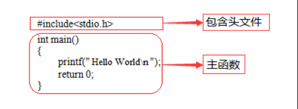
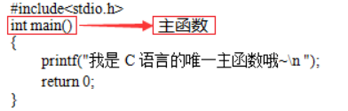
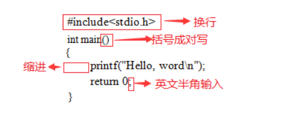
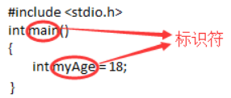
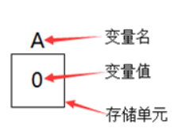

## C 语言基础

C语言一经出现就以其功能丰富、表达能力强、灵活方便、应用面广等特点迅速在全世界普及和推广。C语言不但执行效率高而且可移植性好，可以用来开发应用软件、驱动、操作系统等。C语言也是其它众多高级语言的鼻祖语言，所以说学习C语言是进入编程世界的必修课


**main.c**
```
#include<stdio.h>

int main()
{
    printf("Hello World");
    return 0;
}
```
使用 `gcc main.c` 编译该程序，默认生成 `a.exe` 文件, 使用 `.\a.exe` 运行即可。


### C程序结构

**简单来说，一个C程序就是由若干头文件和函数组成**



`#include <stdio.h>`就是一条预处理命令，它的作用是通知C语言编译系统在对C程序进行正式编译之前需做一些预处理工作

函数就是实现代码逻辑的一个小的单元

**在最新的C标准中，main函数前的类型为int而不是void**

### 必不可少之主函数

一个C程序有且只有一个主函数，即`main`函数



**C程序就是执行主函数里的代码，也可以说这个主函数就是C语言中的唯一入口**

`printf()`是格式输出函数，这里就记住它的功能就是在屏幕上输出指定的信息

`return`是函数的返回值，根据函数类型的不同，返回的值也是不同的

`\n`是转义字符

**C程序一定是从主函数开始执行的**

### 良好习惯之规范

1. 一个说明或一个语句占一行，例如：包含头文件、一个可执行语句结束都需要换行
2. 函数体内的语句要有明显缩进，通常以按一下Tab键为一个缩进
3. 括号要成对写，如果需要删除的话也要成对删除
4. 当一句可执行语句结束的时候末尾**需要有分号**, 跟 go 语言不同
5. 代码中所有符号均为**英文半角符号**





### 程序解释(注释)

注释是为了使别人能看懂你写的程序，也为了使你在若干年后还能看得懂你曾经写的程序而设定的。**注释是写给程序员看的，不是写给电脑看的**。所以注释的内容，C语言编译器在编译时会被自动忽略

C语言注释方法有两种:
1. 多行注释:  /* 注释内容 */
2. 单行注释:  //注释一行

```
/*
    作者: Lss
    作用: 注释演示
*/
#include<stdio.h>
int main()
{
    printf("C Good\n");    //C 语言很好
    printf("Go Good\n");   //Go 语言很好
    return 0;
}
```

### 有名有姓的C

编程时**给变量或者函数起的名字就是标识符**

C语言的标识符是不可以随便起名字的，必须遵守一定的规则:
- 标识符可以是字母`(A～Z，a～z)`、数字`(0～9)`、下划线`_`组成的字符串，并且第一个字符必须是字母或下划线
- 标识符是严格区分大小写的。例如Lss和lss 是两个不同的标识符
- 标识符最好选择有意义的英文单词组成做到"见名知意"，不要使用中文
- 标识符不能是C语言的关键字



### 变量及赋值

变量就是可以变化的量，而每个变量都会有一个名字（标识符）。变量占据内存中一定的存储单元。使用变量之前必须先定义变量，要区分**变量名和变量值是两个不同的概念**



变量定义的一般形式为: `数据类型 变量名;`

多个类型相同的变量: `数据类型 变量名1, 变量名2, 变量名3 ...;`

```
#include<stdio.h>

int main()
{
    int num;
    num = 100;
    int a, b, c;
    a = 1;
    b = 2;
    c = 3;
    printf("%d\n", num);
}
```

变量名和标识符的命名规范完全相同

变量的赋值分为两种方式:
1. 先声明在赋值
2. 声明的同时赋值

```
//先声明在赋值
int num;
num = 100;

//声明的同时赋值
int x = 10;
```

**在定义中不允许连续赋值，如int a=b=c=5;是不合法的**

### 基本数据类型


