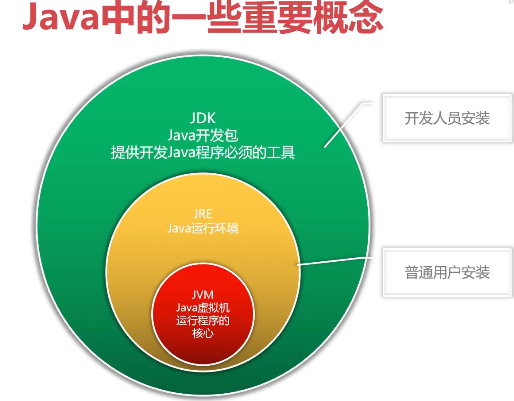
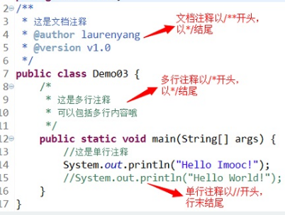
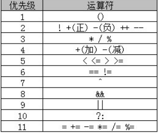

## Java 基础知识点---语法类

### 第一个程序

HelloWorld.java

```
public class HelloWorld {
    public static void main(String[] args){
        System.out.println("hello world");
    }
}
```

Java 开发工具包 (Java Development Kit), 简称 JDK




### Java 开发编辑器

IntellJ IDEA

### 程序的移植

### Java 中的关键字

Java 语言中有一些具有特殊用途的词被称为关键字

- abstract
- boolean
- braek
- byte
- case
- catch
- char
- class
- continue
- default
- do
- double
- else
- extends
- false
- final
- finally
- float
- for
- if
- implements
- import
- instanceof
- in
- interface
- long
- native
- new
- null
- package
- private
- protected
- public
- return
- short
- static
- super
- switch
- synchronized
- this
- throw
- throws
- transient
- true
- try
- void
- volatile
- while

java 关键字是区分大小写的

### Java 标识符

标识符就是用于给 java 程序中 变量，类，方法等命名的符号

```
public class HelloWorld {
    public static void main(String[] args){
        System.out.println("hello world");
    }
}
```

如上面程序所示, HelloWorld 就是一个类的标识符

#### 标识符规则

- 标识符可以由字母、数字、下划线（_）、美元符（$）组成, 不能以数字开头
- 标识符不能是 Java 关键字和保留字
- 标识符是严格区分大小写的
- 标识符的命名最好能反映出其作用，做到见名知意


### 变量

在 java 中通过三个元素描述变量:
- 变量类型
- 变量名
- 变量值

```
public class HelloWorld {
    public static void main(String[] args){
        String love = "hello java";  //定义变量
        System.out.println("hello world " + love);
        love = "java and golang";   //为变量重新赋值
        System.out.println("Hi " + love);
    }
}
```

从上面程序可以看出 java 程序使用 `+` 进行字符串拼接

### java 变量命名规则

- 变量名由多单词组成时，第一个单词的首字母小写，其后单词的首字母大写，俗称骆驼式命名法
- 变量命名时，尽量简短且能清楚的表达变量的作用，做到见名知意
- Java 变量名的长度没有限制，但 Java 语言是区分大小写的，所以 price 和 Price 是两个完全不同的变量


### Java 中的数据类型

**Java 语言是一种强类型语言。通俗点说就是，在 Java 中存储的数据都是有类型的，而且必须在编译时就确定其类型**

数据类型, 分为基本数据类型和引用数据类型:

- 整数类型
- 浮点类型
- 字符型
- 布尔型
- 类
- 接口
- 数组

在 Java 的领域里，**基本数据类型变量存的是数据本身，而引用类型变量存的是保存数据的空间地址**


### Java 中变量的使用规则

- Java 中的变量需要先声明后使用
- 变量使用时，可以声明变量的同时进行初始化
- main 方法中定义的变量必须先赋值，然后才能输出


### Java 中的自动类型转换

在 Java 程序中，不同的基本数据类型的数据之间经常需要进行相互转换

- 目标类型能与源类型兼容，如 `double` 型兼容 `int` 型，但是 `char` 型不能兼容 `int` 型
- 目标类型大于源类型，如 `double` 类型长度为 8 字节， `int` 类型为 4 字节，因此 `double` 类型的变量里直接可以存放 `int` 类型的数据，但反过来就不可以了

```
public class HelloWorld{
    public static void main(String[] args) {
		double avg1=78.5;
		int rise=5;
		double avg2=avg1+rise;
		System.out.println("考试平均分："+avg1);
		System.out.println("调整后的平均分："+avg2);
	}
}
```

### Java 中的强制类型转换

当程序中需要将 double 型变量的值赋给一个 int 型变量，该如何实现呢？显然，这种转换是不会自动进行的！因为 int 型的存储范围比 double 型的小。此时就需要通过强制类型转换来实现了。

```
public class HelloWorld{
    public static void main(String[] args) {
		double heightAvg1=176.2;
		int heightAvg2=(int)heightAvg1;
		System.out.println(heightAvg1);
		System.out.println(heightAvg2);
	}
}
```

`int heightAvg2=(int)heightAvg1;`, 强制类型转换可能会造成数据的丢失


### Java 常量的应用

所谓常量，我们可以理解为是一种特殊的变量，它的值被设定后，在程序运行过程中不允许改变

语法：`final 常量名 = 值;`

```
public class HelloWorld{
    public static void main(String[] args) {
		final char MAN_SEX = '男';
		final char WOMAN_SEX = '女';
		System.out.println(MAN_SEX);
		System.out.println(WOMAN_SEX);
	}
}
```

程序中使用常量可以提高代码的可维护性。例如，在项目开发时，我们需要指定用户的性别，此时可以定义一个常量 SEX，赋值为 "男"，在需要指定用户性别的地方直接调用此常量即可，避免了由于用户的不规范赋值导致程序出错的情况

**常量名一般使用大写字符**


### Java 中如何使用注释

在编写程序时，经常需要添加一些注释，用以描述某段代码的作用

Java 中注释有三种类型:
- 单行注释
- 多行注释
- 文档注释




### Java 运算符

运算符是一种**功能**符号，用以通知 Java 进行相关的运算

- 算术运算符
- 赋值运算符
- 比较运算符
- 逻辑运算符
- 条件运算符


### 算术运算符

- `+`
- `-`
- `*`
- `/`
- `%`
- `++`
- `--`

`++` 和 `--` 既可以出现在操作数的左边，也可以出现在右边，但结果是不同的

自增和自减运算符只能用于**操作变量**，不能直接用于操作数值或常量！例如 `5++` 、 `8--` 等写法都是错误的

```
public class HelloWorld{
    public static void main(String[] args) {
		int age1=24;
		int age2=18;
		int age3=36;
		int age4=27;
		
		int sum = age1 + age2 + age3 + age4;
		double avg = sum/4;
		int minus = age1 - age2;
		int newAge = --age1;
		
	    System.out.println("年龄总和："+sum);
    	System.out.println("平均年龄："+avg);
		System.out.println("年龄差值："+minus);
		System.out.println("自减后的年龄："+newAge);

	}
}
```


### 赋值运算符

- `=`
- `+=`
- `-=`
- `*=`
- `/=`
- `%=`


### 比较运算符

- `>`
- `<`
- `>=`
- `<=`
- `==`
- `!=`


 `> 、 < 、 >= 、 <=` 只支持左右两边操作数是数值类型

 `== 、 !=` 两边的操作数既可以是数值类型，也可以是引用类型

 ### 逻辑运算符

 - `&&`, 与
 - `||`, 或
 - `!`, 非, 取反的意思
 - `~`, 异或, 如果 a, b 有且只有一个 true, 则返回 true


当使用逻辑运算符时，我们会遇到一种很有趣的**短路**现象, 要注意


### 条件运算符

- `? : `

也称为三元运算符

语法形式：`布尔表达式 ？ 表达式1 ：表达式2`

运算过程：**如果布尔表达式的值为 true ，则返回 表达式1 的值，否则返回 表达式2 的值**

```
String str = (8>5) ? "8>5" : "8<5";
System.out.println(str);
```


### Java 运算符的优先级



### Java 条件语句

`if ...`
```
int score = 92;
if(score>90){
    System.out.println("good");
}
```

如果 if 条件成立时的执行语句只有一条，是可以省略大括号的！但如果执行语句有多条，那么大括号就是不可或缺的

`if ...else ...`
```
int score = 85;
if(score>90){
    System.out.println("Good");
}else{
    System.out.println("Bad");
}
```

`if ...else if ...else ...`

```
int score = 85;
if (score>90){
    System.out.println("Good");
}else if (score>70){
    System.out.println("OK");
}else{
    System.out.println("Bad");
}
```

**条件判断语句可以多次嵌套**


`switch`

```
int num = 1;
switch(num){
    case 1:
        System.out.println("1");
        break;
    case 2:
        System.out.println("2");
        break;
    case 3:
        System.out.println("3");
        break;
    default:
        System.out.println("ok");
}
```

当 `switch` 后表达式的值和 `case` 语句后的值相同时，从该位置开始向下执行，直到遇到 `break` 语句或者 `switch` 语句块结束；如果没有匹配的 `case` 语句则执行 `default` 块的代码

- `switch` 后面小括号中表达式的值必须是整型或字符型
- `case` 后面的值可以是常量数值，如 1、2；也可以是一个常量表达式，如 2+2 ；但不能是变量或带有变量的表达式，如 a * 2
- `case` 匹配后，执行匹配块里的程序代码，如果没有遇见 `break` 会继续执行下一个的 `case` 块的内容，直到遇到 `break` 语句或者 `switch` 语句块结束
- 可以把功能相同的 `case` 语句合并起来
- default 块可以出现在任意位置，也可以省略


```
case 1:
case 2:
    Syetem.out.println("ok");
```

### Java 循环语句

java 常用的三种循环

- while
- do ... while
- for

`while`, 先判断,后执行
```
int i = 1;
while(i < 1000){
    System.out.println("Hello java");
    i++;
}
```

`do ...while`, 先执行一次, 在做判断

```
int i = 1;
do {
    System.out.println("ok");
    i++;
} while(i < 100);
```

**do...while 语句保证循环至少被执行一次**

`for`

```
for (int i = 1; i <= 1000; i++) {
    System.out.println("ok " + i);
    i++;
}
```

`for` 关键字后面括号中的三个表达式必须用 `;` 隔开，三个表达式都可以省略，但 `;` 不能省略

for 循环变量初始化和循环变量变化部分，可以是使用 “,” 同时初始化或改变多个循环变量的值
```
for (int i = 1, j = 5; i < 5; i++, j--) {
    System.out.println("ok " + (i+j));
}
```

循环条件部分可以使用逻辑运算符组合的表达式，表示复杂判断条件
```
for (int i = 1; i < 10 && i != 5; i++) {
    System.out.println(i);
}
```

### java 循环跳转语句
- break
- continue

在 Java 中，我们可以使用 `break` 语句退出指定的循环，直接执行循环后面的代码

```
for(int i = 1; i <= 10; i++){
    if ((i>2) && (i%3 == 0)){
        break;
    }
}
```

`continue` 的作用是跳过循环体中剩余的语句执行下一次循环

```
for(int i = 1; i <= 10; i++) {
    if (i%2 == 0){
        continue;
    }
    System.out.println(i);
}
```

**循环体中包含循环语句的结构称为多重循环。三种循环语句可以自身嵌套，也可以相互嵌套，最常见的就是二重循环。在二重循环中，外层循环每执行一次，内层循环要执行一圈**


