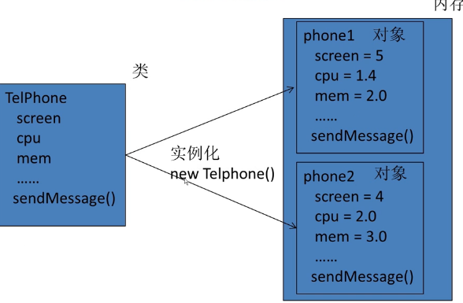
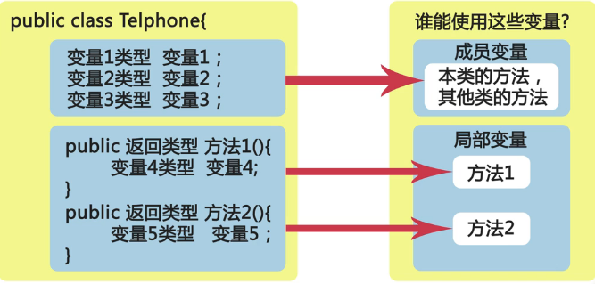
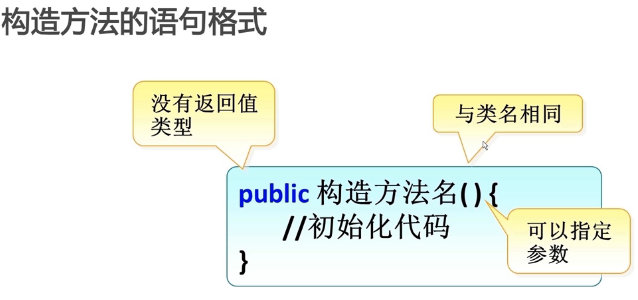
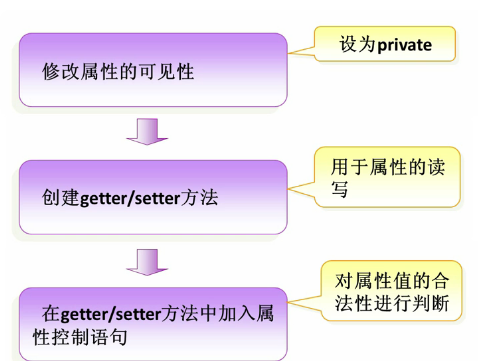

## Java 基础知识点---语法类

### 第一个程序

HelloWorld.java

```
public class HelloWorld {
    public static void main(String[] args){
        System.out.println("hello world");
    }
}
```

Java 开发工具包 (Java Development Kit), 简称 JDK


### Java 开发编辑器

IntellJ IDEA

### 程序的移植

### Java 中的关键字

Java 语言中有一些具有特殊用途的词被称为关键字

- abstract
- boolean
- braek
- byte
- case
- catch
- char
- class
- continue
- default
- do
- double
- else
- extends
- false
- final
- finally
- float
- for
- if
- implements
- import
- instanceof
- in
- interface
- long
- native
- new
- null
- package
- private
- protected
- public
- return
- short
- static
- super
- switch
- synchronized
- this
- throw
- throws
- transient
- true
- try
- void
- volatile
- while

java 关键字是区分大小写的

### Java 标识符

标识符就是用于给 java 程序中 变量，类，方法等命名的符号

```
public class HelloWorld {
    public static void main(String[] args){
        System.out.println("hello world");
    }
}
```

如上面程序所示, HelloWorld 就是一个类的标识符

#### 标识符规则

- 标识符可以由字母、数字、下划线（_）、美元符（$）组成, 不能以数字开头
- 标识符不能是 Java 关键字和保留字
- 标识符是严格区分大小写的
- 标识符的命名最好能反映出其作用，做到见名知意


### 变量

在 java 中通过三个元素描述变量:
- 变量类型
- 变量名
- 变量值

```
public class HelloWorld {
    public static void main(String[] args){
        String love = "hello java";  //定义变量
        System.out.println("hello world " + love);
        love = "java and golang";   //为变量重新赋值
        System.out.println("Hi " + love);
    }
}
```

从上面程序可以看出 java 程序使用 `+` 进行字符串拼接

### java 变量命名规则

- 变量名由多单词组成时，第一个单词的首字母小写，其后单词的首字母大写，俗称骆驼式命名法
- 变量命名时，尽量简短且能清楚的表达变量的作用，做到见名知意
- Java 变量名的长度没有限制，但 Java 语言是区分大小写的，所以 price 和 Price 是两个完全不同的变量


### Java 中的数据类型

**Java 语言是一种强类型语言。通俗点说就是，在 Java 中存储的数据都是有类型的，而且必须在编译时就确定其类型**

数据类型, 分为基本数据类型和引用数据类型:

- 整数类型
- 浮点类型
- 字符型
- 布尔型
- 类
- 接口
- 数组

在 Java 的领域里，**基本数据类型变量存的是数据本身，而引用类型变量存的是保存数据的空间地址**


### Java 中变量的使用规则

- Java 中的变量需要先声明后使用
- 变量使用时，可以声明变量的同时进行初始化
- main 方法中定义的变量必须先赋值，然后才能输出


### Java 中的自动类型转换

在 Java 程序中，不同的基本数据类型的数据之间经常需要进行相互转换

- 目标类型能与源类型兼容，如 `double` 型兼容 `int` 型，但是 `char` 型不能兼容 `int` 型
- 目标类型大于源类型，如 `double` 类型长度为 8 字节， `int` 类型为 4 字节，因此 `double` 类型的变量里直接可以存放 `int` 类型的数据，但反过来就不可以了

```
public class HelloWorld{
    public static void main(String[] args) {
		double avg1=78.5;
		int rise=5;
		double avg2=avg1+rise;
		System.out.println("考试平均分："+avg1);
		System.out.println("调整后的平均分："+avg2);
	}
}
```

### Java 中的强制类型转换

当程序中需要将 double 型变量的值赋给一个 int 型变量，该如何实现呢？显然，这种转换是不会自动进行的！因为 int 型的存储范围比 double 型的小。此时就需要通过强制类型转换来实现了。

```
public class HelloWorld{
    public static void main(String[] args) {
		double heightAvg1=176.2;
		int heightAvg2=(int)heightAvg1;
		System.out.println(heightAvg1);
		System.out.println(heightAvg2);
	}
}
```

`int heightAvg2=(int)heightAvg1;`, 强制类型转换可能会造成数据的丢失


### Java 常量的应用

所谓常量，我们可以理解为是一种特殊的变量，它的值被设定后，在程序运行过程中不允许改变

语法：`final 常量名 = 值;`

```
public class HelloWorld{
    public static void main(String[] args) {
		final char MAN_SEX = '男';
		final char WOMAN_SEX = '女';
		System.out.println(MAN_SEX);
		System.out.println(WOMAN_SEX);
	}
}
```

程序中使用常量可以提高代码的可维护性。例如，在项目开发时，我们需要指定用户的性别，此时可以定义一个常量 SEX，赋值为 "男"，在需要指定用户性别的地方直接调用此常量即可，避免了由于用户的不规范赋值导致程序出错的情况

**常量名一般使用大写字符**


### Java 中如何使用注释

在编写程序时，经常需要添加一些注释，用以描述某段代码的作用

Java 中注释有三种类型:
- 单行注释
- 多行注释
- 文档注释


### Java 运算符

运算符是一种**功能**符号，用以通知 Java 进行相关的运算

- 算术运算符
- 赋值运算符
- 比较运算符
- 逻辑运算符
- 条件运算符


### 算术运算符

- `+`
- `-`
- `*`
- `/`
- `%`
- `++`
- `--`

`++` 和 `--` 既可以出现在操作数的左边，也可以出现在右边，但结果是不同的

自增和自减运算符只能用于**操作变量**，不能直接用于操作数值或常量！例如 `5++` 、 `8--` 等写法都是错误的

```
public class HelloWorld{
    public static void main(String[] args) {
		int age1=24;
		int age2=18;
		int age3=36;
		int age4=27;
		
		int sum = age1 + age2 + age3 + age4;
		double avg = sum/4;
		int minus = age1 - age2;
		int newAge = --age1;
		
	    System.out.println("年龄总和："+sum);
    	System.out.println("平均年龄："+avg);
		System.out.println("年龄差值："+minus);
		System.out.println("自减后的年龄："+newAge);

	}
}
```


### 赋值运算符

- `=`
- `+=`
- `-=`
- `*=`
- `/=`
- `%=`


### 比较运算符

- `>`
- `<`
- `>=`
- `<=`
- `==`
- `!=`


 `> 、 < 、 >= 、 <=` 只支持左右两边操作数是数值类型

 `== 、 !=` 两边的操作数既可以是数值类型，也可以是引用类型

 ### 逻辑运算符

 - `&&`, 与
 - `||`, 或
 - `!`, 非, 取反的意思
 - `~`, 异或, 如果 a, b 有且只有一个 true, 则返回 true


当使用逻辑运算符时，我们会遇到一种很有趣的**短路**现象, 要注意


### 条件运算符

- `? : `

也称为三元运算符

语法形式：`布尔表达式 ？ 表达式1 ：表达式2`

运算过程：**如果布尔表达式的值为 true ，则返回 表达式1 的值，否则返回 表达式2 的值**

```
String str = (8>5) ? "8>5" : "8<5";
System.out.println(str);
```


### Java 运算符的优先级


### Java 条件语句

`if ...`
```
int score = 92;
if(score>90){
    System.out.println("good");
}
```

如果 if 条件成立时的执行语句只有一条，是可以省略大括号的！但如果执行语句有多条，那么大括号就是不可或缺的

`if ...else ...`
```
int score = 85;
if(score>90){
    System.out.println("Good");
}else{
    System.out.println("Bad");
}
```

`if ...else if ...else ...`

```
int score = 85;
if (score>90){
    System.out.println("Good");
}else if (score>70){
    System.out.println("OK");
}else{
    System.out.println("Bad");
}
```

**条件判断语句可以多次嵌套**


`switch`

```
int num = 1;
switch(num){
    case 1:
        System.out.println("1");
        break;
    case 2:
        System.out.println("2");
        break;
    case 3:
        System.out.println("3");
        break;
    default:
        System.out.println("ok");
}
```

当 `switch` 后表达式的值和 `case` 语句后的值相同时，从该位置开始向下执行，直到遇到 `break` 语句或者 `switch` 语句块结束；如果没有匹配的 `case` 语句则执行 `default` 块的代码

- `switch` 后面小括号中表达式的值必须是整型或字符型
- `case` 后面的值可以是常量数值，如 1、2；也可以是一个常量表达式，如 2+2 ；但不能是变量或带有变量的表达式，如 a * 2
- `case` 匹配后，执行匹配块里的程序代码，如果没有遇见 `break` 会继续执行下一个的 `case` 块的内容，直到遇到 `break` 语句或者 `switch` 语句块结束
- 可以把功能相同的 `case` 语句合并起来
- default 块可以出现在任意位置，也可以省略


```
case 1:
case 2:
    Syetem.out.println("ok");
```

### Java 循环语句

java 常用的三种循环

- while
- do ... while
- for

`while`, 先判断,后执行
```
int i = 1;
while(i < 1000){
    System.out.println("Hello java");
    i++;
}
```

`do ...while`, 先执行一次, 在做判断

```
int i = 1;
do {
    System.out.println("ok");
    i++;
} while(i < 100);
```

**do...while 语句保证循环至少被执行一次**

`for`

```
for (int i = 1; i <= 1000; i++) {
    System.out.println("ok " + i);
    i++;
}
```

`for` 关键字后面括号中的三个表达式必须用 `;` 隔开，三个表达式都可以省略，但 `;` 不能省略

for 循环变量初始化和循环变量变化部分，可以是使用 “,” 同时初始化或改变多个循环变量的值
```
for (int i = 1, j = 5; i < 5; i++, j--) {
    System.out.println("ok " + (i+j));
}
```

循环条件部分可以使用逻辑运算符组合的表达式，表示复杂判断条件
```
for (int i = 1; i < 10 && i != 5; i++) {
    System.out.println(i);
}
```

### java 循环跳转语句
- break
- continue

在 Java 中，我们可以使用 `break` 语句退出指定的循环，直接执行循环后面的代码

```
for(int i = 1; i <= 10; i++){
    if ((i>2) && (i%3 == 0)){
        break;
    }
}
```

`continue` 的作用是跳过循环体中剩余的语句执行下一次循环

```
for(int i = 1; i <= 10; i++) {
    if (i%2 == 0){
        continue;
    }
    System.out.println(i);
}
```

**循环体中包含循环语句的结构称为多重循环。三种循环语句可以自身嵌套，也可以相互嵌套，最常见的就是二重循环。在二重循环中，外层循环每执行一次，内层循环要执行一圈**


### 数组

```
int[] sorce = {76, 45, 87, 98};
```

数组中的元素都可以通过下标来访问，下标从 0 开始

语法: `数据类型[] 数组名;`, `数据类型 数组名[];`

```
int[] scores;
double height[];
String[] names;
```

分配空间:

`数组名 = new 数组类型[数组长度]`

```
scores = new int[5];
height = new double[5];
names = new String[5];
```

也可以将上面两个步骤合并: `int[] scores = new int[5];`

赋值: `scores[0] = 89;`


在 Java 中还提供了另外一种直接创建数组的方式，它将声明数组、分配空间和赋值合并完成:
```
int[] scores = {56, 45, 76, 98};
等价于:
int[] scores = new int[]{56, 45, 76, 98};
```

`scores.length`  用于获取数组的长度


### Java 常用工具类


--------------------------------------


### 类和对象

万物皆对象，一切客观存在的事物都可以称为对象

**类是模子，确定对象拥有的特征(属性)和行为(方法)**

- 类是对象的类型
- 具有相同属性和方法的一组对象的集合


对象就是一个具体的事物，而类是这个事物的一个类型，或者说是一个抽象的表达


1. 属性，对象具有的各种特征
2. 方法，对象执行的操作，对象能干什么


**类是抽象的概念，仅仅是个模板，对象是一个具体的实体**


### 定义类

所有的 java 程序以类 `class` 为组织单元

#### 类的组成

- 属性
- 方法


```
public class Temp {
    属性1;
    属性2;
    属性3;

    方法1;
    方法2;
    方法3;
}
```

`class` 是定义类的关键字, 类的首字母大写

```
public class Phone {
    //属性, 代表类有什么
    float screen;
    float cpu;
    float mem;

    //方法, 代表可以干什么
    void call() {
        System.out.println("call");
    }

    void sendMessage() {
        System.out.println("send message");
    }
}
```


### java 对象

#### 创建对象

`类名 对象名 = new 类名();`

```
Phone phone = new Phone();
```




#### 使用对象

- 引用对象的属性: `对象名.属性`
- 引用对象的方法: `对象名.方法名()`

```
phone.screen = 5;  //给 screen 属性赋值 5
phone.sendMessage(); //调用 sendMessage() 方法
```


### 成员变量 & 局部变量

- 成员变量, 在类中定义, 就是属性
- 局部变量, 在类的方法中定义, 方法中临时保存数据





局部变量的作用域仅限于定义它的方法, 成员变量的作用域在整个类内部都是可见的

**成员变量和局部变量同名时，局部变量具有更高的优先级**


### Java 中的构造方法

- 使用 `new + 构造方法` 创建一个新的对象, 例 `Phone phone = new Phone();`
- 构造方法是定义在java类中的一个用来初始化对象的方法
- 构造方法与类同名, 且没有返回值




```
public class Phone {
    public Phone() {
        System.out.println("无参构造方法");
    }
}
```

带参构造方法, 初始化对象成员变量的值

```
public class Phone {
    float screen;
    float cpu;
    float mem;

    //无参构造方法
    public Phone() {
        System.out.println("无参构造方法");
    }

    //有参构造方法
    public Phone(float newScreen, float newCpu, float newMem) {
        screen = newScreen;
        cpu = newCpu;
        mem = newMem;
    }

    //使用无参构造方法创建对象
    Phone phone1 = new Phone();

    //使用有参构造方法初始化对象
    Phone phone = new Phone(5.0f, 1.4f, 2.0f);
}
```

无参构造方法和有参构造方法可以共存


**当没有指定构造方法时，系统会自动添加无参的构造方法**

当程序指定构造方法时，系统不会自动添加无参的构造方法，需要在初始化对象时自行选择添加自定义的构造方法

构造方法的重载, 方法名相同，单参数不同的多个方法，调用时会自动根据不同的参数选择相应的方法


### Java 中的 static 之静态变量

我们可以基于一个类创建多个该类的对象，每个对象都拥有自己的成员，互相独立。然而在某些时候，我们更希望该类所有的对象共享同一个成员。此时就是 `static` 大显身手的时候了

Java 中被 `static` 修饰的成员称为静态成员或类成员。它属于整个类所有，而不是某个对象所有，即被类的所有对象所共享。静态成员可以使用类名直接访问，也可以使用对象名进行访问

**使用 static 可以修饰变量、方法和代码块**

```
public class HelloWorld {
    //static 修饰的变量为静态变量，所有该类的对象共享该静态变量
    static String ifcalm = "java";

    public static void main(String[] args) {
        //静态变量可以直接用类名来访问，无需创建类的对象
        System.out.println(HelloWorld.ifcalm);
        //创建类的对象
        HelloWorld hello = new HelloWorld();
        //使用对象名来访问静态变量
        System.out.println(hello.ifcalm);
        //使用对象名访问的形式修改静态变量的值
        hello.ifcalm = "golang";
        //再次使用类名访问该静态变量，值已经被修改
        System.out.println(HelloWorld.ifcalm);
    }
}
```

**静态成员属于整个类，当系统第一次使用该类时，就会为其分配内存空间**


### Java 中的 static 之静态方法

**与静态变量一样，我们也可以使用 static 修饰方法，称为静态方法或类方法。其实之前我们一直写的 main 方法就是静态方法**

```
public calss HelloWorld {
    //使用 static 关键字声明静态方法
    public static void print() {
        System.out.println("static method");
    }

    public static void main(String [] args) {
        //直接使用类名来调用静态方法
        HelloWorld.print();

        //通过对象名调用静态方法
        HelloWorld hello = new HelloWorld();
        hello.print();
    }
}
```

#### 关于 static 需要注意的几点

- 静态方法中可以直接调用同类中的静态成员，但不能直接调用非静态成员
- 如果希望在静态方法中调用非静态变量，可以通过创建类的对象，然后通过对象来访问非静态变量
- 在普通成员方法中，则可以直接访问同类的非静态变量和静态变量
- 静态方法中不能直接调用非静态方法，需要通过对象来访问非静态方法


### Java 中的 static 之静态初始化块

在类的声明中，可以包含多个初始化块，当创建类的实例时，就会依次执行这些代码块。如果使用 static 修饰初始化块，就称为静态初始化块

**静态初始化块只在类加载时执行，且只会执行一次，同时静态初始化块只能给静态变量赋值，不能初始化普通的成员变量**

```
public class HelloWorld() {
    int num1;
    int num2;
    static int num3;  //声明静态变量 num3

    //构造方法
    public HelloWorld() {
        num1 = 91;
        System.out.println("通过构造方法为变量 num1 赋值");

        //初始化块
        {
            num2 = 74;
            System.out.println("通过初始化块为变量 num2 赋值");
        }

        //静态初始化块
        static {
            num3 = 83;
            System.out.println("通过静态初始化块为静态变量 num3 赋值");
        }
    }

    public static void main(String[] args) {
        //创建类的对象 hello
        HelloWorld hello = new HelloWorld();
        System.out.println(hello.num1);
        System.out.println(hello.num2);

        System.out.println(num3);

        //再次创建类的对象 hello2
        HelloWorld hello2 = new HelloWorld();
    }
}
```

**程序运行时静态初始化块最先被执行，然后执行普通初始化块，最后才执行构造方法。由于静态初始化块只在类加载时执行一次，所以当再次创建对象 hello2 时并未执行静态初始化块**


------------------------------------

### 封装

将类的某些信息隐藏在类内部，不允许外部程序直接访问，而是通过该类提供的方法来实现对隐藏信息的操作和访问

- 只能通过规定的方法访问数据
- 隐藏类的实例细节，方便修改和实现


#### 封装的实现步骤



```
public class Phone {
    private float screen;
    private float cpu;
    private float mem;

    //获取一个属性值，返回类型是 float
    public float getScreen() {
        return screen;
    }

    public void setScreen(float newScreen) {
        screen = newScreem;
    }

    //通过方法来获取属性值
    public static void main(String[] args) {
        Phone phone = new Phone();
        phone.setScreen(6.0f);
        System.out.println(phone.getScreen());
    }
}
```

### 使用包管理 Java 中的类

#### 包的作用

- 管理 java 文件
- 解决同名文件冲突

#### 定义包

`package 包名`

- 必须放在java源程序的第一行
- 包名间可以使用 `.` 号隔开
- eg: `com.ifcalm.Muclass`


#### 包的使用

- 可以通过 `import` 关键字, 在某个文件中使用其他文件中的类, `import com.ifcalm.movie.Myclass`
- java 中，包的命名规范是全小写字母拼写
- 使用的时候可以加载某个包下的所有文件, `com.ifcalm.*`
- 也可以加载某个具体子包下的所有文件, `com.ifcalm.movie.*`


### java 中的访问修饰符

可以修饰属性和方法的访问范围

- `private`, 本类
- `protected`, 本类，同包，子类
- `public`, 本类，同包，子类，其他
- 默认是 本类和同包


### Java 中的 this 关键字

- this 关键字代表当前对象
- this.属性，操作当前对象的属性
- this.方法，调用当前对象的方法
- 封装对象的时候，经常会使用 this 关键字

```
public class Phone {
    private float screen;
    private float cpu;
    private float mem;

    public void sendMessage() {
        System.out.println("send msg");
    }

    public float getScreen() {
        return screen;
    }

    public void setScreen(float screen) {
        this.screen = screen;
        this.sendMessage();
    }
}
```


### 什么是 java 中的内部类

内部类就是定义在一个类里面的类。与之对应，包含内部类的类被称为外部类

#### 内部类的主要作用如下

- 内部类提供了更好的封装，可以把内部类隐藏在外部类之内，不允许同一个包中的其他类访问该类
- 内部类的方法可以直接访问外部类的所有数据，包括私有的数据
- 内部类所实现的功能使用外部类同样可以实现，只是有时使用内部类更方便


#### 内部类可以分为以下几种

- 成员内部类
- 静态内部类
- 方法内部类
- 匿名内部类


#### 成员内部类

```
public class Outer {
    private int a = 99;

    //内部类
    public class Inner {
        int b = 2;
        public void test() {
            System.out.println(a);
            System.out.println(b);
        }
    }

    public static void main(String[] args) {
        //创建外部类对象
        Outer o = new Outer();
        //创建内部类对象
        Inner i = o.new Inner();
        i.test();
    }
}
```

定义了成员内部类后，必须使用外部类对象来创建内部类对象，而不能直接去 new 一个内部类对象，即：`内部类 对象名 = 外部类对象.new 内部类( );`


#### 静态内部类

静态内部类是 static 修饰的内部类

```
public class Outer {
    private int a = 99;
    static int b = 1;

    //内部类
    public static class Inner {
        int b = 2;
        public void test() {
            //访问外部类中的b
            System.out.println(Outer.b);
            System.out.println(b);
        }
    }

    public static void main(String[] args) {
        //直接创建内部类对象
        Inner i = new Inner();
        i.test();
    }
}
```

创建静态内部类的对象时，不需要外部类的对象，可以直接创建 `内部类 对象名= new 内部类();`


#### 方法内部类

方法内部类就是内部类定义在外部类的方法中，方法内部类只在该方法的内部可见，即只在该方法内可以使用

```
public class Outer {
    //外部类的方法
    public void show() {
        final int a = 25;  //常量·
        int b  = 13;

        //方法内部类
        class Inner {
            int c = 2;
            public void print() {
                System.out.println(a);
                System.out.println(c);
            }
        }
        //创建方法内部类的对象
        Inner i = new Inner();
        i.print();
    }

    public static void main(String[] args) {
        Outer o = new Outer();
        o.show();
    }
}
```

**由于方法内部类不能在外部类的方法以外的地方使用，因此方法内部类不能使用访问控制符和 static 修饰符**


### Java 中的继承

继承是类与类的一种关系，是 `is a` 的关系

狗类是一种动物类

继承的好处:

- 子类拥有父类的所有属性和方法
- 实现代码复用

```
class Son extend Father {
    ...
}
```

继承的关键字 `extends`

```
public class Animal {
    public int age;
    public String name;

    public void eat() {
        System.out.println("eat food");
    }
}

public class Dog extends Animal {
    Dog dog = new Dog();
    dog.age = 10;
    dog.name = "ifcalm";
    dog.eat();
}
```

### java 中方法的重写

如果子类对继承父类的方法不满意，是可以重写父类继承的方法的，当调用方法时会优先调用子类的方法

`返回值类型，方法名，参数类型及个数` 都要与父类继承的方法相同，才叫方法的重写


```
public class Animal {
    public int age;
    public String name;

    public void eat() {
        System.out.println("eat food");
    }
}

public class Dog extends Animal {
    Dog dog = new Dog();
    dog.age = 10;
    dog.name = "ifcalm";

    //重写父类的eat() 方法
    public void eat() {
        System.out.println("dog eat food");
    }
}
```

### java 中继承的初始化顺序

先初始化父类在初始化子类

### final 关键字

final 可以修饰类，方法，属性和变量

- final 修饰类，则该类不允许被继承
- final 修饰方法，则该方法不允许被重写
- final 修饰属性，则该属性的值只能赋一次
- final 修饰变量，即变为常量

```
final public class Animal {
    final public int age;
    public String name;

    final public void eat() {
        System.out.println("eat food");
    }
}

public class Dog extends Animal {
    Dog dog = new Dog();
    dog.age = 10;
    dog.name = "ifcalm";
}
```

### super 关键字

在对象的内部使用，可以代表父类对象

- super.age 访问父类的属性
- super.eat() 访问父类的方法


```
public class Animal {
    public int age;
    public String name;

    public void eat() {
        System.out.println("eat food");
    }
}

public class Dog extends Animal {
    public int age 20;
    Dog dog = new Dog();
    dog.age = 10;
    dog.name = "ifcalm";

    //重写父类的eat() 方法
    public void eat() {
        System.out.println("dog eat food");
    }

    //调用父类的属性
    public void method() {
        //获取父类的 age 属性值
        System.out.println(super.age);

        //获取子类的 age 属性
        System.out.println(age);
    }

    //调用父类的方法
    public void func() {
        super.eat();
    }
}
```

**子类的构造过程当中必须调用其父类的构造方法**


### Object 类

Object类 是所有类的父类，如果一个类没有使用 extends 关键字，那这个类默认继承 Object类

#### toString() 方法


#### equals() 方法


### 多态

对象的多种形态


### java 中的抽象类

抽象类前使用 `abstract` 关键字修饰，则该类为抽象类


#### 抽象类的应用常见


### java 中的接口

类是一种具体实现体，而接口定义了某一批类所需要遵守的规范，接口不关心这些类的内部数据，也不关心这些类里面方法的实现细节，它只规定这些类里面必须提供某些方法

定义接口使用的是 `interface` 关键字

接口就是用来被继承，被实现的，修饰符一般用 `public`, 不能使用 `private`, `protected` 修饰接口

```
public interface Animal {
    //常量
    //抽象方法
}
```

接口可以继承多个父接口

- 类是单继承的，接口是可以多继承的

#### 使用接口

一个类可以实现一个或多个接口，实现接口使用 `implements` 关键字


### UML 简介

### java 异常处理

