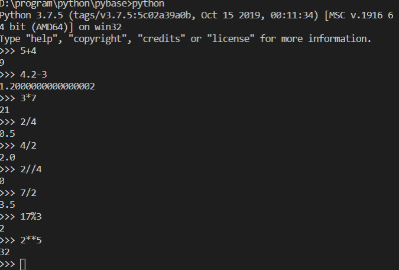

## Python 入门

### Python 语言的特点

- 语法简单
- 类库丰富
- 开放源码
- 跨平台
- 可扩展

### Python 版本

Python 最流行的发行版Anaconda

- iPython
- jupyter notebook
- pip


### Python 保留字

```
import keyword
keyword.kwlist
```

保留字即关键字，我们不能把它们用作任何标识符名称。Python 的标准库提供了一个 `keyword` 模块，可以输出当前版本的所有关键字


### 注释

Python 中单行注释以 `#` 开头

多行注释可以用多个 `#`

多行注释还可以使用 `'''` 和 `"""`

```
print("ifcalm")

'''
多行注释
'''

"""
多行注释
"""
```

### 行与缩进

python最具特色的就是使用缩进来表示代码块，不需要使用大括号 `{}`

### 多行语句

Python 通常是一行写完一条语句，但如果语句很长，我们可以使用反斜杠`\`来实现多行语句

```
total = "item_one" + \
    "item_two" + \
    "item_three"

print(total)
```

### Python 数字类型

- int
- bool
- float
- complex


### Python 字符串

**python中单引号和双引号使用完全相同**

转义字符 `\`

反斜杠可以用来转义，使用`r`可以让反斜杠不发生转义

```
str = "if calm ok \n gmail com"
str_2 = r"if calm ok \n gmail com"

print(str)
print(str_2)
```

- 字符串可以用 `+` 运算符连接在一起
- 用 `*` 运算符重复
- Python 中的字符串有两种索引方式，从左往右以 0 开始，从右往左以 -1 开始
- Python 没有单独的字符类型，一个字符就是长度为 1 的字符串
- 字符串的截取的语法格式为: `变量[头下标:尾下标:步长]`


```
str = "ifcalm.ok@gmail.com"

print(str)
print(str[0:-1])
print(str[0])
print(str[2:5])
print(str[2:])
print(str[1:8:2])        #输出从第二个开始到第五个且每隔两个的字符
print(str * 2)           #输出字符串两次
print("email: " + str)   #拼接字符串
```

### 等待用户输入

`input("请输入")`


### 同一行显示多条语句

```
import sys; x = "ifcalm"; sys.stdout.write(x + "\n")
```

Python可以在同一行中使用多条语句，语句之间使用分号`;`分割


### print 输出

`print` 默认输出是换行的, 如果要实现不换行需要在变量末尾加上 `end=""`

```
print("ifcalm", end = "")
print("gmail", end = "")
```

### import 和 from ... import

在 python 用 `import` 或者 `from...import` 来导入相应的模块

- 将整个模块导入，格式为： `import somemodule`
- 从某个模块中导入某个函数,格式为： `from somemodule import somefunction`
- 从某个模块中导入多个函数,格式为： `from somemodule import firstfunc, secondfunc, thirdfunc`
- 将某个模块中的全部函数导入，格式为： `from somemodule import *`


### 变量

Python 中的变量不需要声明。每个变量在使用前都必须赋值，变量赋值以后该变量才会被创建

在 Python 中，变量就是变量，它没有类型，我们所说的类型是变量所指的内存中对象的类型

等号`=` 用来给变量赋值

### 多个变量赋值

Python允许你同时为多个变量赋值

```
# 创建一个整型对象，值为 1，从后向前赋值，三个变量被赋予相同的数值
a = b = c = 1
print(a)
print(b)
print(c)

x, y, z = 3, "ifcalm", True
print(x)
print(y)
print(z)
```

### 标准数据类型

- 数字
- 字符串
- 列表
- 元组
- 集合
- 字典

不可变数据: 数字, 字符串, 元组

可变数据: 列表, 字典, 集合(set)


### 数字类型

Python3 支持 `int、float、bool、complex（复数）`

在Python 3里，只有一种整数类型 `int`，表示为长整型

内置的 `type()` 函数可以用来查询变量所指的对象类型

```
x, y, z = 3, "ifcalm", True
print(x)
print(y)
print(z)
print(type(x))
print(type(y))
print(type(z))
```

输出的内容为:

```
3
ifcalm
True
<class 'int'>
<class 'str'>
<class 'bool'>
```

还可以用 `isinstance` 来判断类型:

```
x, y, z = 3, "ifcalm", True
v = isinstance(x, int)
print(v)
```

### isinstance 和 type 的区别

待补充


```
class A:
    pass

class B(A):
    pass

v_1 = isinstance(A(), A)
print(v_1)

if (type(A()) == A):
    print(True)
else:
    print(False)

v_2 = isinstance(B(), A)
print(v_2)

if (type(B() == A)):
    print(True)
else:
    print(False)
```


**以使用`del`语句删除一些对象引用**

```
x, y, z = 3, "ifcalm", True
del x     # 删除单个对象
del x, y  # 删除多个对象
```


### 数值运算

- `+`, 加法
- `-`, 减法
- `*`, 乘法
- `/`, 除法，得到一个浮点数
- `//`, 除法，得到一个整数
- `%`, 取余
- `**`, 乘方




数值的除法包含两个运算符：`/` 返回一个浮点数，`//` 返回一个整数

在混合计算时，Python会把整型转换成为浮点数


### 字符串

- Python中的字符串用单引号 `'` 或双引号 `"` 括起来，同时使用反斜杠 `\` 转义特殊字符
- 字符串的截取的语法格式: `变量[头下标:尾下标]`
- 索引值以 0 为开始值，-1 为从末尾的开始位置
- 加号 `+` 是字符串的连接符， 星号 `*` 表示复制当前字符串，与之结合的数字为复制的次数


```
str = "ifcalm.ok@gmail.com"

print(str)
print(str[0:-1])
print(str[0])
print(str[2:5])
print(str[2:])
print(str * 2)
print(str + ": email")
```


Python 使用反斜杠 `\` 转义特殊字符，如果你不想让反斜杠发生转义，可以在字符串前面添加一个 `r`，表示原始字符串

```
str = "emial: \n ifcalm.ok@gmail.com"

print(str)
print(r'emial: \n ifcalm.ok@gmail.com')
print(r"emial: \n ifcalm.ok@gmail.com")
```

**Python 没有单独的字符类型，一个字符就是长度为1的字符串**


**与 C 字符串不同的是，Python 字符串不能被改变。向一个索引位置赋值，比如`word[0] = 'm'`会导致错误**

#### 字符串总结

- 反斜杠可以用来转义，使用`r`可以让反斜杠不发生转义
- 字符串可以用`+`运算符连接在一起，用`*`运算符重复
- Python中的字符串有两种索引方式，从左往右以0开始，从右往左以-1开始
- Python中的字符串不能改变


