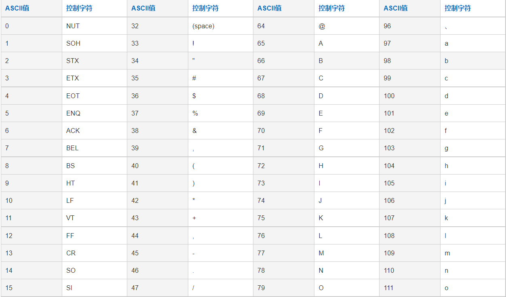
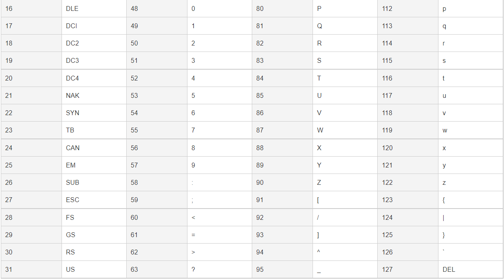

### Go 初始化二维切片

```
package main

import "fmt"

func main() {
	s := make([][]string, 5)
	for i := 0; i < 5; i++ {
		s[i] = make([]string, 5)  //把内层切片也进行初始化
	}
	fmt.Println(s)
}
```

**初始化二维切片的时候，也需要使用循环把内层的切片进行初始化**

**数组初始化的时候必须使用数字，不能够用变量代替**


### 函数作为值

函数也是值。它们可以像其它值一样传递。 函数值可以用作函数的参数或返回值

```
package main
import (
     "fmt"
     "math"
)

func compute(fn func(float64, float64) float64) float64 {
     return fn(3, 4)
}

func main() {
     hypot := func(x, y float64) float64 {
         return math.Sqrt(x*x + y*y)
     }
     fmt.Println(hypot(5, 12))

     fmt.Println(compute(hypot))
     fmt.Println(compute(math.Pow))
}
```

#### LeetCoode 17

```
func letterCombinations(digits string) []string {
    if len(digits) == 0 {
        return []string{}
    }
    mp := map[string]string {
        "2": "abc",
        "3": "def",
        "4": "ghi",
        "5": "jkl",
        "6": "mno",
        "7": "pqrs",
        "8": "tuv",
        "9": "wxyz",
    }

    con := []string{}
    var hs func(int, string)

    hs = func(i int, path string) {
        if i >= len(digits) {
            con = append(con, path)
            return
        }

        for _, v := range mp[string(digits[i])] {
            hs(i+1, path + string(v))
        }
    }
    hs(0, "")
    return con
}
```

### 函数的闭包

Go 函数可以是一个闭包。闭包是一个函数值，它引用了其函数体之外的变量。该函数可以访问并赋予其引用的变量的值，换句话说，该函数被“绑定”在了这些变量上。 例如，函数 adder 返回一个闭包。每个闭包都被绑定在其各自的 sum 变量上

```
package main
import "fmt"

func adder() func(int) int {
     sum := 0
     return func(x int) int {
         sum += x
         return sum
     }
}

func main() {
     pos, neg := adder(), adder()
     for i := 0; i < 10; i++ {
         fmt.Println(
             pos(i),
             neg(-2*i),
         )
     }
}
```

### 判断 key 是否在 map 中

```
if _, ok := m[key], ok {
    //存在
}

```

通过双赋值检测某个键是否存在： `elem, ok = m[key]` 若 key 在 m 中，ok 为 `true` ；否则，ok 为 `false`。 若 key 不在映射中，那么 elem 是该映射元素类型的零值。 同样的，当从映射中读取某个不存在的键时，结果是映射的元素类型的零值。 注 ：若 elem 或 ok 还未声明，你可以使用短变量声明： `elem, ok := m[key]`


### 切片的初始化

```
s := []string{}   //创建一个空切片
s_2 := make([]string, 5)   //使用 make 创建切片
var s_3 []string
```

### 字典的初始化

```
var m map[string]string

m_1 := map[string]string{
    "name": "lss",
    "age": "25",
}
```

### golang 计算四舍五入

```
package main
 
import (
    "fmt"
    "math"
)
 
func main() {
    var s float64
    for {
        _, err := fmt.Scanln(&s)
        if err != nil {
            break
        }
        fmt.Println(int(math.Floor(s+0.5)))
    }
}
```

go官方的math 包中提供了取整的方法:
- `math.Ceil()`, 向上取整
- `math.Floor()`, 向下取整

golang没有类似python的round()函数，可以让原数字先+0.5，然后向下取整


----------------------------------------------

### 初始化切片的两种方式

- make([]int, 5)
- make([]int, 0)

初始化切片的时候，指定大于0的长度时，切片会初始化指定长度的数据，例如`make([]int, 5) => [0 0 0 0 0]`, 而`make([]int, 0) => []`

所以在 使用 `append()` 的时候，指定长度的切片会从长度以后的位置开始添加，即 `[0 0 0 0 0 2]`, 而长度为0的切片为 `[2]`

所以在使用切片的时候要注意`初始化时指定长度的默认值`对使用的影响

-------------------------------------------------------

### 链表定义

```
//链表中的节点数据，包含一个数据域，一个指针域，指向下一个节点
type Node struct {
    Data interface{}
    Next *Node
}

//链表，包含链表的头指针和链表的长度
type List struct {
    Head *Node
    Length int
}

//创建一个节点
func CreateNode(v interface{}) *Node {
    return &Node{v, nil}
}

//创建一个链表
func CreateList() *List {
    head := CreateNode(nil)
    return &List{head, 0}
}

//往链表头增加一个节点
func (l *List) AddNode(data interface{}) {
    newNode := CreateNode(data)
    //链表长度+1
    defer func() {
        l.Length++
    }()

    //设置新的头节点
    if l.Length == 0 {
        l.Head = newNode
    } else {
        newNode.Next = l.Head
        l.Head = newNode
    }
}

//往链表尾加一个节点
func (l *List) AppendNode(data interface{}) {
    newNode := CreateNode(data)
    //链表长度+1
    defer func() {
        l.Length++
    }()

    if l.Length == 0 {
        l.Head = newNode
    } else {
        current := l.Head
        for current.Next != nil {  //循环找到最后一个节点
            current = current.Next
        }
        current.Next = newNode   //把新节点地址赋给最后一个节点的Next
    }
}
```

#### 链表的一些复杂操作

- 往i位置插入一个节点
- 删除第i个节点
- 遍历链表

```
//往i位置插入一个节点
func (l *List) Insert(i int, data interface{}) {
    defer func() {
        l.Length++
    }()

    if i >= l.Length {
        l.AppendNode(data)
        return
    }

    newNode := CreateNode(data)

    //找到第i个节点和 i+1 位置的节点
    base := 1
    pre := l.Head
    for base != i {
        pre = pre.Next
        base++
    }
    //交换节点的指针指向
    after := pre.Next
    pre.Next = newNode
    newNode.Next = after
}

//删除第 i 个节点
func (l *List) Delete(i int) {
    defer func() {
        l.Length--
    }

    //删除第一个节点，把head指向第二个节点即可
    if i == 1 {
        l.Head = l.Head.Next
    }

    //找到第 i-1 位置的节点, 找到第 i+1 位置的节点, 修改 i-1 节点的Next即可
    current := l.Head
    j := 0
    for j != i-1 {
        current = current.Next
        j++
    }
    after := current.Next.Next
    current.Next = after
}

//遍历链表
func (l *List) Scan() {
    //临时保存头节点，避免丢失
    current := l.Head
    i := 1
    for current.Next != nil {
        fmt.Printf("第%d的节点是%d\n", i, current.Data)
        current = current.Next
        i++
    }
    //最后一个节点
    fmt.Printf("第%d的节点是%d\n", i, current.Data)
}
```

---------------------------------------------------

### 二叉树定义

```
type TreeNode struct {
    Data interface{}
    LeftChild *TreeNode
    RightChild *TreeNode
}

func NewTreNode() *TreeNode {
    return &TreeNode{}
}
```


--------------------------------------------

### go []rune和[]byte 的区别

```
type byte = uint8
type rune = int32
```

 `byte` 表示一个字节，`rune` 表示四个字节

 ```
first := "社区"
fmt.Println([]rune(first))
fmt.Println([]byte(first))

//输出结果为:
[31038 21306]
[231 164 190 229 140 186]
 ```

 可以看出中文字符每个占三个字节

 Go 语言切割**中文**字符串，Go 的字符串截取和切片是一样的 `s [n:m]` 左闭右开的原则, 注意要选择 `[]rune` 来截取中文字符

 ------------------------------------------------

 ### string 和 []byte 的转换

```
//string to []byte
s1 := "ifcalm"
b := []byte(s1)

//[]byte to string
s2 := string(b)
```

**因为无法修改`string`中的某个字符，需要粒度小到操作一个字符时，用`[]byte`**


----------------------------------------------------

### ASCII 表




ASCII 在处理 byte 是会用到

- 'A'-'Z', 65-90
- 'a'-'z', 97-122

相同字母的大小写之间相差 32

----------------------------------------------------

### 字符大小写的判断

**unicode包**
- unicode.IsLower(rune(v)), 判断字符 v 是否为小写
- unicode.IsUpper(rune(v)), 判断字符 v 是否为大写

**字符串大小写转换**
- strings.ToLetter(str), 将字符串转换为小写
- strings.ToUpper(str), 将字符串转换为大写

---------------------------------------------------


### go 两个切片合并

```
s1 := []int{1,2,3}
s2 := []int{4,5,6}
s3 := append(s1, s2...)
fmt.Println(s3)
```

--------------------------------------------------------

### go copy()函数

```
s1 := []int{1,2,3,4,5}
s2 := []int{6,7,8}
copy(s2, s1)  //只会复制s1的前3个元素到s2中
copy(s1, s2)  //只会复制s2的3个元素到s1的前3个位置
```

----------------------------------------------------------

