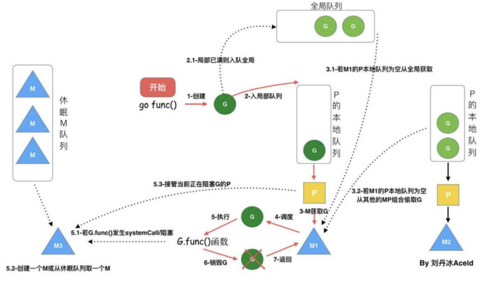
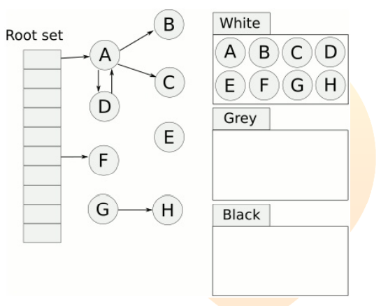

### Linux 进程的内存模型

### 对 10 亿数据进行去重

### redis 的 ZSet 底层数据结构实现原理，跳跃表如何确定插入数据的层级

### HTTP 是如何实现协议的？头和体怎么区分

### TCP 进行连接的时候，linux 中需要实现多少种方法？关联的方法有哪些

### 谈谈微服务

### 服务治理中做了些什么

### HTTP 的状态有哪些分别代表什么？302 403 404 502

### 创建一个大内存，是堆还是栈


--------------------------------

### 链表有环的判断，写伪代码

### GPM 调度模型

### 浏览器的前进后退使用的数据结构

### TCP 的三次握手，第一次握手的 ack 包含哪些信息，什么时候会有 Time_Wait

### 栈保存的是什么，堆呢？地址生长方向是什么？为什么这么设计？

### Go 的栈大小是多少？最大值是多少？

### 两个链表像拉链一样相交，获取这些交点

### 后顺遍历树结构，如何释放树结构的内存信息

### Linux 的网络拥堵如何排查

### TCP 连接，服务端发现丢包之后是怎么处理的

### 贪心算法

### 队列如何保证先进先出，栈呢

### linux 权限控制是如何区分的


-----------------------------------------


### 谈一下Go的GC机制

### 说下三色标记算法的原理

### 判断链表是否有回环

### 介绍下自己的项目

### 开发的流程规范是什么

### 半连接是什么

### 粘包是什么？怎么发送的

### 怎么创建索引

### 怎么避免缓存击穿，还有其他的什么方法吗

### go的mutx怎么使用，乐观和悲观锁分别怎么实现，使用场景是什么

### 服务器受到攻击怎么定位服务器问题

### rpc的具体实现

### 怎么反转树的左右节点

### 谈谈epoll和select


-------------------------------------------

回答问题要有深度和广度，一个问题要由此及彼的回答，并且和多语言之间进行对比


---------------------------------------------


```
对于 func add(args ...int) int {} 调用方式正确的选项有（）
A. add(1, 2)
B. add(1, 3, 7)
C. add([]int{1, 2})
D. add([]int{1, 3, 7}…)
```

```
变量的初始化，下面正确的使用方式是（）
A. var i int = 10
B. var i = 10
C. i := 10
D. i = 10
```

```
golang 中的引用类型包括（）
A. string
B. map
C. channel
D. interface
```

```
关于整型切片的初始化，下面正确的是（）
A. s := make([]int)
B. s := make([]int, 0)
C. s := make([]int, 5, 10)
D. s := []int{1, 2, 3, 4, 5}
```

```
关于 channel，下面语法正确的是（）
A. var ch chan int
B. ch := make(chan int)
C. <- ch
D. ch <-
```

```
关于无缓冲和有缓冲的 channel，下面说法正确的是（）
A. 无缓冲的 channel 是默认的缓冲为 1 的 channel
B. 无缓冲的 channel 和有缓冲的 channel 都是同步的
C. 无缓冲的 channel 和有缓冲的 channel 都是非同步的
D. 无缓冲的 channel 是同步的，而有缓冲的 channel 是非同步的
```

### 简要描述下变量逃逸

变量逃逸就是变量的作用域的改变

- [Go变量逃逸](https://www.cnblogs.com/itbsl/p/10476674.html)


### 简要描述下 slice 在 append 时发生了什么

### 给定一个整数数组 nums 和一个目标值 target，请你在该数组中找出和为目标值的那两个整数，并返回他们的数组下标

### 给定两个数组，编写一个函数来计算它们的交集、以及差集


### 简单谈下 defer 的应用场景及注意事项

### 简单谈下 chan 的应用场景及注意事项

### 简述进程、线程、协程的含义及区别

### 往一个对象里写入 10w 条数据，怎样保证数据的准确性

chan、mutex 之类的胡扯就对了

### 简单介绍下 interface 的应用场景

### 线上 cpu 和内存突然飙高后应该怎么排错

### 哪些操作会导致内存泄漏

### 哪些操作会导致 io 开销大幅上升


-----------------------------------------------------

### `slice`, `map`, `channel` 函数传参形式

### gc 垃圾回收机制，三色标记法

垃圾回收(Garbage Collection，简称GC)是编程语言中提供的内存管理功能

在传统的系统级编程语言（主要指C/C++）中，程序员定义了一个变量，就是在内存中开辟了一段相应的空间来存值。由于内存是有限的，所以当程序不再需要使用某个变量的时候，就需要销毁该对象并释放其所占用的内存资源，好重新利用这段空间。在C/C++中，释放无用变量内存空间的事情需要由程序员自己来处理。就是说当程序员认为变量没用了，就手动地释放其占用的内存。但是这样显然非常繁琐，如果有所遗漏，就可能造成资源浪费甚至内存泄露。当软件系统比较复杂，变量多的时候程序员往往就忘记释放内存或者在不该释放的时候释放内存了


### `channel` 的实现

### `context`

### 分布式事务

### `new` `make` 的区别，`make` 为什么不能返回指针

### 什么情况下go runtime 会创建一个协程

### `slice` 自动扩容，`map` 自动扩容


### `main` 函数 和 `init` 函数的区别

main 对应本包，init 对应所有包

### 什么是内存逃逸，什么情况下触发

### 多协程同步机制

- 锁
- `waitgroup`
- `channel`
- `context`

### 切片和数组的区别

### GMP 模型

### `defer`

### 协程负载高排查方法

### go 指针与 c指针 的区别

### map 找不到key 会怎样

### `channel` 线程安全吗，为什么

首先channel是协程不是线程。channel不会产生新的线程，自然不会涉及到新的进程或者线程调度。所以就不存在线程安全这个概念了

Golang的Channel,发送一个数据到Channel 和从Channel接收一个数据都是原子性的。这个可以看源码就知道channel内部维护了一个互斥锁，来保证线程安全

而且Go的设计思想就是:不要通过共享内存来通信，而是通过通信来共享内存，前者就是传统的加锁，后者就是Channel。也就是说，设计Channel的主要目的就是在多任务间传递数据的，这当然是安全的.因为channel底层实现出队入队时也加锁了

### `interface`

### 函数闭包

-----------------------------------------------------

### 什么是 goroutine，如何停止它

Go 协程是与其他函数同时运行的函数。 可以认为Go 协程是轻量级的线程，由Go 运行时来管理。 在函数调用前加上`go` 关键字，这次调用就会在一个新的goroutine 中并发执行。 当被调用的函数返回时，这个goroutine 也自动结束

- goroutine 是Go语言中并发的执行单位
- channel是Go语言中各个并发goroutine之前的通信机制

要创建 goroutine，在函数前加关键字 `go` 即可 `go f(x, y, z)`

可以通过向 Goroutine 发送一个信号通道来停止它
```
package main
func main() {
    quit := make(chan bool)
    go func() {
        for {
            select {
                case <-quit:
                return
                default:
                ...
            }
        }
    }()
    ...
    quit <-true
}
```

### 如何在运行时检查变量类型

**类型开关(Type Switch)**

类型开关(Type Switch)是在运行时检查变量类型的最佳方式。类型开关按类型而不是值来评估变量。每个 Switch 至少包含一个 case 用作条件语句，如果没有一个 case 为真，则执行 default


通常我们可能会有一连串的 `if … else` 结构来判断接口类型，以便于做出不同的决策
```
var e interface{}

if e == nil {
    ...
} else if v, ok := e.(int); ok {
    ...
} esle if v, ok := e.(float32); ok {
    ...
} else if v, ok := e.(string); ok {
    ...
} esle if v, ok := e.(bool); ok {
    ...
}
```

如果每次都这样写，相当费劲。Golang 关键字 `swtich` 支持一种非常便捷的写法，你可以这样:
```
var e interface{}

switch v := e.(type) {
    case nil:
        ...
    case int, uint, int32, uint32:
        ...
    case string:
        ...
    case bool:
        ...
    default:
        ...
}
```

注意上面的语法：`e.(type)` 只能用在 `switch` 关键字后面，它会返回 e 接口中的值部分

### Go 两个接口之间可以存在什么关系

如果两个接口有相同的方法列表，那么他们就是等价的，可以相互赋值。如果
接口 A 的方法列表是接口 B 的方法列表的子集，那么接口 B 可以赋值给接口A。接口查询是否成功，要在运行期才能够确定

### Go 当中同步锁有什么特点？作用是什么

Go 语言包中的 sync 包提供了两种锁类型：sync.Mutex 和 sync.RWMutex，前者是互斥锁，后者是读写锁

互斥锁是传统的并发程序对共享资源进行访问控制的主要手段，在 Go 中，似乎更推崇由 channel 来实现资源共享和通信

当一个 Goroutine（协程）获得了 Mutex 后，其他 Goroutine就只能乖乖的等待，除非该 Goroutine 释放了该 Mutex。RWMutex 在读锁占用的情况下，会阻止写，但不阻止读 RWMutex。 在写锁占用情况下，会阻止任何其他Goroutine（无论读和写）进来，整个锁相当于由该 Goroutine 独占同步锁的作用是保证资源在使用时的独有性，不会因为并发而导致数据错乱，保证系统的稳定性

建议：同一个互斥锁的成对锁定和解锁操作放在同一层次的代码块中。
使用锁的经典模式：
```
var lck sync.Mutex
func foo {
    lck.Lock()
    defer lck.Unlock()
    ...
}
```

`lck.Lock()` 会阻塞直到获取锁，然后利用 `defer` 语句在函数返回时自动释放锁

### go 读写锁

读写锁是分别针对读操作和写操作进行锁定和解锁操作的互斥锁。在 Go 语言中，读写锁由结构体类型 `sync.RWMutex` 代表

- 写锁定情况下，对读写锁进行读锁定或者写锁定，都将阻塞；而且读锁与写锁之间是互斥的

RWMutex 提供四个方法:
```
func (*RWMutex) Lock      //写锁
func (*RWMutex) Unlock    //写解锁
func (*RWMutex) RLock()   //读锁
func (*RWMutex) RUnlock() //读解锁
```

```
package main

import (
    "fmt"
    "sync"
    "time"
)

var m *sync.RWMutex
func main() {
    wg := sync.WaitGroup{}
    wg.Add(20)
    data := 0
    for i := 0; i < 10; i++ {
        go func(t int) {
            m.RLock()
            defer m.RUnlock()
            fmt.Println(data)
            wg.Done()
            time.Sleep(2 * time.Second)
        }(i)

        go func(t int) {
            m.Lock()
            defer m.Unlock()
            data += t
            fmt.Println(data, t)
            wg.Done()
            time.Sleep(2 * time.Second)
        }(i)
    }
    wg.Wait()
}
```

### Go 语言当中 Channel（通道）有什么特点，需要注意什么

- 如果从一个 nil 的 channel 中接收数据，会造成阻塞
- 给一个已经关闭的 channel 发送数据， 会引起 panic
- 从一个已经关闭的 channel 接收数据， 如果缓冲区中为空，则返回零值

### Go 语言当中 Channel 缓冲有什么特点

无缓冲的 channel 是同步的，而有缓冲的 channel 是非同步的

### Go 语言中 cap 函数可以作用于哪些内容

- array
- slice
- channel

### Go Convey 是什么？一般用来做什么

- go convey 是一个支持 Golang 的单元测试框架
- go convey 能够自动监控文件修改并启动测试，并可以将测试结果实时输出到 Web 界面
- go convey 提供了丰富的断言简化测试用例的编写

### Go 语言当中 new 的作用是什么

new 的作用是初始化一个内置类型的指针， new 函数是内建函数

- 使用 new 函数来分配空间
- 传递给 new 函数的是一个**类型**，而不是一个值
- 返回值是指向这个新分配的地址的指针

### Go 语言中 make 的作用是什么

make 的作用是为 slice, map, chan 进行初始化。
make 函数是内建函数

make()函数的目的和 new()不同, make仅仅用于创建 slice, map, channel。 而且返回类型是实例

### Printf()，Sprintf()，FprintF() 都是格式化输出，有什么不同

虽然这三个函数，都是格式化输出，但是输出的目标不一样

- Printf 是标准输出，一般是屏幕，也可以重定向
- Sprintf()是把格式化字符串输出到指定的字符串中
- Fprintf()是把格式化字符串输出到文件中

### Go 语言当中数组和切片的区别是什么

数组固定长度。数组长度是数组类型的一部分，所以`[3]int` 和`[4]int` 是两种不同的数组类型数组需要指定大小，不指定也会根据初始化，自动推算出大小，大小不可改变。数组是通过值传递的

切片可以改变长度。切片是轻量级的数据结构，三个属性，指针，长度，容量
不需要指定大小切片是地址传递可以通过数组来初始化，也可以通过内置函数 make()来初始化

### Go 语言当中值传递和地址传递如何运用？有什么区别

- 值传递只会把参数的值复制一份放进对应的函数，两个变量的地址不同，不可相互修改
- 地址传递会将变量地址传入对应的函数，在函数中可以对该变量进行值内容的修改

### Go 语言当中数组和切片在传递的时候的区别是什么

- 数组是值传递
- 切片是引用传递


### defer 的作用和特点是什么

- defer 语句经常被用于处理成对的操作，如打开、关闭、连接、断开连接、加锁、释放锁
- 通过 defer 机制，不论函数逻辑多复杂，都能保证在任何执行路径下，资源被释放
- 释放资源的 defer 应该直接跟在请求资源的语句后


### Golang Slice 的底层实现

切片是基于数组实现的，它的底层是数组，它自己本身非常小，可以理解为对底层数组的抽象。因为基于数组实现，所以它的底层的内存是连续分配的，效率非常高，还可以通过索引获得数据

切片本身并不是动态数组或者数组指针。它内部实现的数据结构通过指针引用底层数组，设定相关属性将数据读写操作限定在指定的区域内。切片本身是一个只读对象，其工作机制类似数组指针的一种封装

切片对象非常小，是因为它是只有 3 个字段的数据结构：
- 指向底层数组的指针
- 切片的长度
- 切片的容量

### Golang Slice 的扩容机制

### Golang 的参数传递、引用类型

Go 语言中所有的传参都是值传递（传值），都是一个副本，一个拷贝。因为拷贝的内容有时候是非引用类型（int、string、struct 等这些），这样就在函数中就无法修改原内容数据；有的是引用类型（指针、map、slice、chan 等这些），这样就可以修改原内容数据

Golang 的引用类型包括 slice、map 和 channel。它们有复杂的内部结构，除了申请内存外，还需要初始化相关属性。内置函数 new 计算类型大小，为其分配零值内存，返回指针。而 make 会被编译器翻译成具体的创建函数，由其分配内存和初始化成员结构，返回对象而非指针

### Golang Map 底层实现

Golang 中 map 的底层实现是一个散列表，因此实现 map 的过程实际上就是实现散表的过程

### Golang Map 如何扩容

- 双倍扩容：扩容采取了一种称为“渐进式”的方式，原有的 key 并不会一次性搬迁完毕，每次最多只会搬迁 2 个 bucket
- 等量扩容：重新排列，极端情况下，重新排列也解决不了，map 存储就会蜕变成链表，性能大大降低

### Golang Map 查找

Go 语言中 map 采用的是哈希查找表，由一个 key 通过哈希函数得到哈希值，64位系统中就生成一个 64bit 的哈希值，由这个哈希值将 key 对应存到不同的桶（bucket）中，当有多个哈希映射到相同的的桶中时，使用链表解决哈希冲突。

### 介绍一下 Channel

Go 语言中，不要通过共享内存来通信，而要通过通信来实现内存共享。Go 的CSP(Communicating Sequential Process)并发模型，中文可以叫做通信顺序进程，是通过 goroutine 和 channel 来实现的。channel 收发遵循先进先出 FIFO 的原则。分为有缓冲区和无缓冲区

### Go 并发编程

- 锁


### WaitGroup 用法

一个 WaitGroup 对象可以等待一组协程结束。使用方法是：
- main 协程通过调用 wg.Add(delta int) 设置 worker 协程的个数，然后创建 worker 协程
- worker 协程执行结束以后，都要调用 wg.Done()
- main 协程调用 wg.Wait() 且被 block，直到所有 worker 协程全部执行结束后返回

### WaitGroup 实现原理

WaitGroup 主要维护了 2 个计数器，一个是请求计数器 v，一个是等待计数器 w，二者组成一个 64bit 的值，请求计数器占高 32bit，等待计数器占低32bit

每次 Add 执行，请求计数器 v 加 1，Done 方法执行，等待计数器减 1，v 为0 时通过信号量唤醒 Wait()

### 什么是 sync.Once

- Once 可以用来执行且仅仅执行一次动作，常常用于单例对象的初始化场景
- Once 常常用来初始化单例资源，或者并发访问只需初始化一次的共享资源，或者在测试的时候初始化一次测试资源
- sync.Once 只暴露了一个方法 Do，你可以多次调用 Do 方法，但是只有第一次调用 Do 方法时 f 参数才会执行，这里的 f 是一个无参数无返回值的函数

### 什么操作叫做原子操作

原子操作即是进行过程中不能被中断的操作，针对某个值的原子操作在被进行的过程中，CPU 绝不会再去进行其他的针对该值的操作。为了实现这样的严谨性，原子操作仅会由一个独立的 CPU 指令代表和完成。原子操作是无锁的，常常直接通过 CPU 指令直接实现。 事实上，其它同步技术的实现常常依赖于原子操作

### 原子操作和锁的区别

- 原子操作由底层硬件支持，而锁则由操作系统的调度器实现
- 锁应当用来保护一段逻辑，对于一个变量更新的保护
- 原子操作通常执行上会更有效率，并且更能利用计算机多核的优势，如果要更新的是一个复合对象，则应当使用 `atomic.Value` 封装好的实现

### sync.Pool 有什么用

对于很多需要重复分配、回收内存的地方，`sync.Pool` 是一个很好的选择。频繁地分配、回收内存会给 GC 带来一定的负担，严重的时候会引起 CPU 的毛刺。而 `sync.Pool` 可以将暂时将不用的对象缓存起来，待下次需要的时候直接使用，不用再次经过内存分配，复用对象的内存，减轻 GC 的压力，提升系统的性能

### GMP 指的是什么

- G（Goroutine）：我们所说的协程，为用户级的轻量级线程，每个 Goroutine对象中的 sched 保存着其上下文信息
- M（Machine）：对内核级线程的封装，数量对应真实的 CPU 数（真正干活的对象）
- P（Processor）：即为 G 和 M 的调度对象，用来调度 G 和 M 之间的关联关系，其数量可通过 GOMAXPROCS()来设置，默认为核心数


**GMP调度模型：**



调度器把 G 都分配到 M 上，不同的 G 在不同的 M 并发运行时，都需要向系统申请资源，比如堆栈内存等，因为资源是全局的，就会因为资源竞争照成很多性能损耗。为了解决这一的问题 go 从 1.1 版本引入，在运行时系统的时候加入 p对象，让 P 去管理这个 G 对象，M 想要运行 G，必须绑定 P，才能运行 P 所管理的 G

- 每个 P 有个局部队列，局部队列保存待执行的 goroutine，当 M绑定的 P 的的局部队列已经满了之后就会把 goroutine 放到全局队列
- 每个 P 和一个 M 绑定，M 是真正的执行 P 中 goroutine 的实体，M 从绑定的 P 中的局部队列获取 G 来执行
- 当 M 绑定的 P 的局部队列为空时，M 会从全局队列获取到本地队列来执行 G，当从全局队列中没有获取到可执行的 G 时候，M 会从其他 P的局部队列中偷取 G 来执行，这种从其他 P 偷的方式称为`work stealing`
- 当 G 因系统调用（syscall）阻塞时会阻塞 M，此时 P 会和 M 解绑即 hand off，并寻找新的 idle 的 M，若没有 idle 的 M 就会新建一个 M
- 当 G 因 channel 或者 network I/O 阻塞时，不会阻塞 M，M 会寻找其他runnable 的 G；当阻塞的 G 恢复后会重新进入 runnable 进入 P 队列等待执行


### GMP 调度过程中存在哪些阻塞

- I/O，select
- block on syscall
- channel
- 等待锁
- runtime.Gosched()

### 三色标记原理



首先把所有的对象都放到白色的集合中
- 从根节点开始遍历对象，遍历到的白色对象从白色集合中放到灰色集合中
- 遍历灰色集合中的对象，把灰色对象引用的白色集合的对象放入到灰色集合中，同时把遍历过的灰色集合中的对象放到黑色的集合中
- 循环步骤2，直到灰色集合中没有对象
- 步骤3结束后，白色集合中的对象就是不可达对象，也就是垃圾，进行回收

### GC 触发时机

主动触发：调用 runtime.GC

被动触发：使用系统监控，该触发条件由 runtime.forcegcperiod 变量控制，默认为 2 分钟。当超过两分钟没有产生任何 GC 时，强制触发 GC。

### Go 语言中 GC 的流程是什么

- GCMark 标记准备阶段，为并发标记做准备工作，启动写屏障
- STWGCMark 扫描标记阶段，与赋值器并发执行，写屏障开启并发
- GCMarkTermination 标记终止阶段，保证一个周期内标记任务完成，停止写屏障
- GCoff 内存清扫阶段，将需要回收的内存归还到堆中，写屏障关闭
- GCoff 内存归还阶段，将过多的内存归还给操作系统，写屏障关闭

### GC 如何调优

通过 `go tool pprof` 和 `go tool trace` 等工具

- 控制内存分配的速度，限制 Goroutine 的数量，从而提高赋值器对 CPU 的利用率
- 减少并复用内存，例如使用 `sync.Pool` 来复用需要频繁创建临时对象，例如提前分配足够的内存来降低多余的拷贝
- 需要时，增大 GOGC 的值，降低 GC 的运行频率

