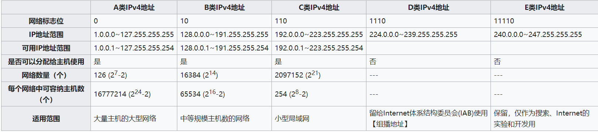
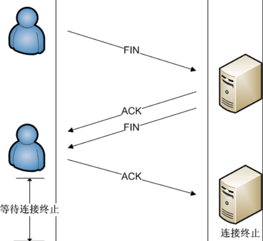
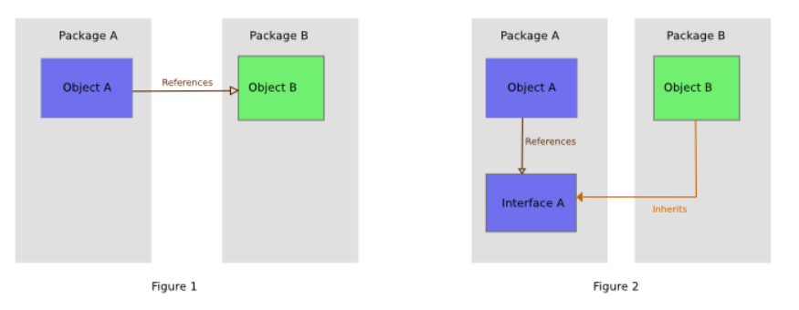

## 操作系统篇

### 进程

**进程是指计算机已运行的程序**，在面向进程设计的系统（早期的 linux2.4 以及更早版本中）, 进程是程序的基本执行实体，在面向线程设计的系统（Linux2.6 及以后的版本中）, **进程本身不是基本运行单位，而是线程的容器**

程序本身只是指令，数据及其组织形式的描述，相当于一个名词，进程才是程序的真正运行实例，是现在进行时

若干进程有可能与同一个程序相关系，且每个进程皆可以**同步或异步**的方式独立运行

现代计算机系统可在同一段时间内以进程的形式将多个程序加载到存储器中，并借由时间共享（或称时分复用），以在一个处理器上表现出同时（平行性）运行的感觉。同样的，使用多线程技术的操作系统或计算机体系结构，同样程序的平行线程，可在多CPU主机或网络上真正同时运行（**在不同的CPU上**）

**用户下达运行程序的命令后，就会产生进程**。同一程序可产生多个进程（一对多关系），以允许同时有多位用户运行同一程序，却不会相冲突

进程需要一些资源才能完成工作，如CPU使用时间、存储器、文件以及I/O设备，且为依序逐一进行，**也就是每个CPU任何时间内仅能运行一项进程**

进程与线程的区别：**进程是计算机管理运行程序的一种方式，一个进程下可包含一个或者多个线程。线程可以理解为子进程**

#### 进程的状态
- 新生
- 运行
- 等待
- 就绪
- 结束

### 线程

**线程是操作系统能够进行运算调度的最小单位**，大部分情况下，它被包含在进程之中，是进程中的实际运行单位

一条线程指的是进程中一个单一顺序的控制流，一个进程中可以并发多个线程，每条线程并行执行不同的任务

**线程是独立调度和分配的基本单位**

**同一进程中的多条线程将共享该进程中的全部系统资源**

### 调度

调度，是将任务分配至资源的过程，在计算机或生产处理中尤为重要

### 函数调用创建栈

调用栈最经常被用于存放子程序的返回地址。在调用任何子程序时，主程序都必须暂存子程序运行完毕后应该返回到的地址。因此，如果被调用的子程序还要调用其他的子程序，其自身的返回地址就必须存入调用栈，在其自身运行完毕后再行取回。在递归程序中，每一层次递归都必须在调用栈上增加一条地址，因此如果程序出现无限递归（或仅仅是过多的递归层次），调用栈就会产生栈溢出

### 堆栈溢出

是指使用过多的存储器时导致调用堆栈产生的溢出，也是**缓冲区溢出**中的一种。堆栈溢出的产生是由于过多的函数调用，导致使用的调用堆栈大小超过事先规划的大小，覆盖其他存储器内的资料，一般在递归中产生。堆栈溢出很可能由无限递归产生，但也可能仅仅是过多的堆栈层级

**无限递归是堆栈溢出的最常见原因**

### 缓存区溢出

向程序输入缓冲区写入使之溢出的内容（通常是超过缓冲区能保存的最大数据量的数据），从而破坏程序运行、趁著中断之际并获取程序乃至系统的控制权

缓冲区溢出指当某个数据超过了处理程序回传堆栈地址限制的范围时，程序出现的异常操作

### CPU分时共享系统

- 时间片: 是把计算机的系统资源（尤其是CPU时间）进行时间上的分割，每个时间段称为一个时间片，每个用户依次轮流使用时间片
- 分时技术: 把处理机的运行时间分为很短的时间片，按时间片轮流把处理机分给各联机作业使用
- 设计目标: 对用户的请求及时响应，并在可能条件下尽量提高系统资源的利用率

### 5.进程和线程的生命周期

### 6.进程中的多线程

### 7.线程安全

线程安全就是多线程访问时，采用了**加锁机制**，当一个线程访问该类的某个数据时，进行保护，其他线程不能进行访问直到该线程读取完，其他线程才可使用。 不会出现数据不一致或者数据污染。 线程不安全就是不提供数据访问保护，有可能出现多个线程先后更改数据造成所得到的数据是脏数据

**指某个函数、函数库在多线程环境中被调用时，能够正确地处理多个线程之间的共享变量，使程序功能正确完成**

假设有间银行只有 1000 元，而两个人同时提领 1000 元时就可能会拿到总计 2000 元的金额。为了避免这个问题，该间银行提款时应该使用互斥锁，即意味着针对同一个资源处理时，前一个人提领交易完成后才处理下一笔交易。但这种手法会使得效能降低

### 互斥锁

互斥锁是一种用于多线程编程中，防止两条线程同时对同一公共资源（比如全局变量）进行读写的机制

### 临界区域

在同步的程序设计中，临界区段指的是一个访问共享资源的**程序片段**，而这些共享资源又无法同时被多个线程访问的特性

当有线程进入临界区段时，其他线程或是行程必须等待，有一些同步的机制必须在临界区段的进入点与离开点实现，以确保这些共享资源是被异或的使用

### 8.临界区加锁

### 9.高并发-->响应变慢-->分布式系统架构

高并发通常是指，通过设计保证系统能够同时并行处理很多请求

### 并发与并行

- 并发: 有处理多个任务的能力，不一定同时（CPU 轮询）
- 并行: 有同时处理多个任务的能力（多个CPU 同时执行任务）

### 10.锁是如何实现的，如何保证自己是线程安全的

### 内存管理

内存管理是指软件运行时对计算机内存资源的分配和使用的技术。其最主要的目的是如何高效，快速的分配，并且在适当的时候释放和回收内存资源

### 12.文件系统

### 13.分布式文件系统

### 14.进程间的并发，同步，通信

### 垃圾回收

垃圾回收（`英语：Garbage Collection，缩写为GC`）是指一种自动的存储器管理机制。当某个程序占用的一部分内存空间不再被这个程序访问时，这个程序会借助垃圾回收算法向操作系统归还这部分内存空间。垃圾回收器可以减轻程序员的负担，也减少程序中的错误

-----------------------------

## 数据结构篇

### 数组

数组数据结构，简称数组，是由相同类型的元素（element）的集合所组成的数据结构，分配一块连续的内存来存储。利用元素的索引可以计算出该元素对应的存储地址，数组第一个元素的存储器地址称为第一地址或基础地址

数组是最早期和最重要的数据结构之一，很多程序都会用到数组。它们也用于实现许多其他数据结构

### 链表（重要）

链表（Linked list）是一种常见的基础数据结构，是一种线性表，但是并不会按线性的顺序存储数据，而是在每一个节点里存到下一个节点的指针(Pointer)

由于不必须按顺序存储，链表在插入的时候可以达到`O(1)`的复杂度，比另一种线性表数组快得多，但是查找一个节点或者访问特定编号的节点则需要`O(n)`的时间，而数组相应的时间复杂度分别是`O(logn)`和`O(1)`

使用链表结构可以克服数组需要预先知道数据大小的缺点，链表结构可以充分利用计算机内存空间，实现灵活的内存动态管理。但是链表失去了数组随机读取的优点，同时链表由于增加了结点的指针域，空间开销比较大。

**链表作为一种基础的数据结构可以用来生成其它类型的数据结构**

链表通常由一连串节点组成，每个节点包含任意的实例数据和一或两个用来指向上一个/或下一个节点的位置的链接

### Hash 表

散列表（Hash table，也叫哈希表），是根据键而直接访问在内存储存位置的数据结构。也就是说，它通过计算一个关于键值的函数，将所需查询的数据映射到表中一个位置来访问记录，这加快了查找速度。这个映射函数称做**散列函数**，存放记录的数组称做散列表

### 栈

堆栈（stack）又称为栈或堆叠，是计算机科学中的一种抽象资料类型，只允许在有序的线性资料集合的一端进行加入数据和移除数据的运算。因而按照后进先出（LIFO, Last In First Out）的原理运作

**栈常用一维数组或链表来实现**

堆栈使用两种基本操作:
- 推入
- 弹出

### 队列

队列是先进先出的线性表。在具体应用中通常用链表或者数组来实现。队列只允许在后端进行插入操作，在前端进行删除操作。

队列的操作方式和堆栈类似，唯一的区别在于队列只允许新数据在后端进行添加

### 树

二叉树是每个节点最多只有两个分支的树结构。通常分支被称作左子树或右子树。二叉树的分支具有左右次序，不能随意颠倒

### 7.Hash表数组长度不足怎么办

### 8.如何使Hash表中的数据分布更加均匀

### 9.写一个一致性Hash算法的实现

### 10.多线程并发修改Hash表怎么办？如何保证线程安全？

### 一致性 Hash算法

----------------

### java虚拟机原理（JVM）

### JVM的垃圾回收

### 内存溢出和内存泄漏有什么区别

-------------------------

## 网络通信篇

### IP协议

### IP地址

IP地址，是网际协议中用于标识发送或接收数据报的**设备**的一串数字

当设备连接网络，设备将被分配一个IP地址，用作标识。通过IP地址，设备间可以互相通讯，如果没有IP地址，我们将无法知道哪个设备是发送方，无法知道哪个是接收方

IP地址有两个主要功能:

- 标识设备或网络,标识其网络接口，并且提供主机在网络中的位置
- 网络寻址,将 数据报 从一个网络模块 送到 目的地。在发送的整个过程，IP地址充当着目的地的位置

**每个IP数据包的标头包含了发送主机的IP地址和目的主机的IP地址**

### IPv4 

IP地址由32位二进制数组成，为便于使用，常以XXX.XXX.XXX.XXX形式表现，每组XXX代表小于或等于255的10进制数，该表示方法称为点分十进制

IPv4 地址分类:

- A 类
- B 类
- C 类
- D 类
- E 类

IP地址是唯一的，目前IPv4技术可能使用的IP地址最多可有4294967296个，即 `2^32`

在A类、B类、C类IP地址中，如果主机号是全1，那么这个地址为直接广播地址，它是用来使路由器将一个分组以广播形式发送给特定网络上的所有主机。32位全为1的IP地址`255.255.255.255`为受限广播地址，用来将一个分组以广播方式发送给本网络中的所有主机，路由器则阻挡该分组通过，将其广播功能限制在本网内部

IP地址是在主机加入网络时动态分配的，还是通过主机硬件/软件的配置永久分配给主机的。永久性的配置也称为使用**静态IP地址**。相反，在每次重新启动时分配的IP地址，称为使用**动态IP地址**

### 动态主机配置协议 (DHCP)

### IPv6

`IPv6`是网际协议的最新版本，用作互联网的协议。用它来取代IPv4主要是为了解决IPv4地址枯竭问题，同时它也在其他方面对于IPv4有许多改进

IPv6的设计目的是取代IPv4，然而长期以来IPv4在互联网流量中仍占据主要地位，IPv6的使用增长缓慢

全球上网人数已达40.21亿，IPv4仅能提供约42.9亿个IP位置。虽然目前的**网络地址转换及无类别域间路由**等技术可延缓网络位置匮乏之现象，但为求解决根本问题, 正式提议IPv6发展计划

IPv6具有比IPv4大得多的编码地址空间。这是因为IPv6采用128位的地址，而IPv4使用的是32位。因此新增的地址空间支持`2^128`

网络地址转换是目前减缓IPv4地址耗尽最有效的方式，而IPv6的地址消除了对它的依赖，被认为足够在可以预测的未来使用

IPv6从IPv4到IPv6最显著的变化就是网络地址的长度, IPv6地址有128位长；IPv6地址的表达形式一般采用32个十六进制数

IPv6二进位制下为128位长度，以16位为一组，每组以冒号`:`隔开，可以分为8组，每组以4位十六进制方式表示。例如：`2001:0db8:86a3:08d3:1319:8a2e:0370:7344` 是一个合法的IPv6地址

### 无类型域间选路(CIDR)

### MAC地址

MAC地址，直译为媒体访问控制地址，也称为局域网地址，以太网地址或物理地址，它是一个用来确认网络设备位置的地址。在OSI模型中，第三层网络层负责IP地址，第二层数据链接层则负责MAC地址。MAC地址用于在网络中唯一标示一个网卡，一台设备若有一或多个网卡，则每个网卡都需要并会有一个唯一的MAC地址

MAC地址共48位（6个字节），以十六进制表示。第`1Bit`为广播地址(0)/群播地址(1)，第`2Bit`为广域地址(0)/区域地址(1)。前`3~24`位由IEEE决定如何分配给每一家制造商，且不重复，后24位由实际生产该网络设备的厂商自行指定且不重复

### 动态主机配置协议(DHCP)

### 物理层

### 数据链路层

### CRC （循环冗余检测）

### ARP 协议

### 局域网

### 交换机

### 拓扑结构

### 环路问题

### STP （生成树）

### VLAN (虚拟局域网)

### ICMP 协议 （互联网控制报文协议）

### MAC头 与 IP头

### 网关（路由器）

### 路由

路由就是通过互联的网络把信息从源地址传输到目的地址的活动。路由发生在`OSI网络参考模型`中的第三层即`网络层`

路由引导分组转送，经过一些中间的节点后，到它们最后的目的地。作成硬件的话，则称为路由器。路由通常根据路由表【一个存储到各个目的地的最佳路径的表】来引导分组转送。因此为了有效率的转送分组，创建存储在路由器存储器内的路由表是非常重要的

较小的网络通常可以手动设置路由表，但较大且拥有复杂拓扑的网络可能常常变化

`动态路由`尝试按照由路由协议所携带的信息来自动创建路由表以解决这个问题，也让网络能够近自主地避免网络断线或失败

### 路由协议

路由协议是一种指定数据包转送方式的网络协议。Internet网络的主要节点设备是路由器，路由器通过路由表来转发接收到的数据

#### 常见的路由协议

- RIP
- BGP

### NET (网络地址转换)

网络地址转换（缩写: NAT,又称网络掩蔽、IP掩蔽）在计算机网络中是一种在IP数据包通过路由器或防火墙时重写来源IP地址或目的IP地址的技术。这种技术被普遍使用在**有多台主机但只通过一个公有IP地址访问互联网的私有网络中**。它是一个方便且得到了广泛应用的技术。当然，NAT也让主机之间的通信变得复杂，导致了通信效率的降低

`NAT`是作为一种解决`IPv4`地址短缺以避免保留IP地址困难的方案而流行起来的

1. 在一个典型的配置中，一个本地网络使用一个专有网络的指定子网（比如192.168.x.x或10.x.x.x）和连在这个网络上的一个路由器。这个路由器占有这个网络地址空间的一个专有地址（比如192.168.0.1），同时它还通过一个或多个因特网服务提供商提供的公有的IP地址连接到因特网上

2. 当信息由本地网络向因特网传递时，源地址从专有地址转换为公用地址

3. 由路由器跟踪每个连接上的基本数据，主要是目的地址和端口。当有回复返回路由器时，它通过输出阶段记录的连接跟踪数据来决定该转发给内部网的哪个主机

4. 如果有多个公用地址可用，当数据包返回时，TCP或UDP客户机的端口号可以用来分解数据包。对于因特网上的通信，路由器本身充当源和目的

### 端口映射

### UDP 协议

### 套接字Socket

- select
- epoll

### HTTPS 协议

### 流媒体协议

### P2P 协议

### FTP 协议

### DHT 去中心化网络

### 多线 BGP

### 数据中心

### VPN 虚拟专用网

### 容器网络

### RPC 协议 （服务之间的互相调用）

### SOAP 协议（基于 XML）

### 基于 json的 RESTful 接口协议

### GRPC

### Protocol Buffers

### DNS协议

域名系统（Domain Name System，缩写：DNS）是互联网的一项服务。它作为**将域名和IP地址相互映射的一个分布式数据库**，能够使人更方便地访问互联网。DNS使用TCP和UDP端口53。当前，对于每一级域名长度的限制是63个字符，域名总长度则不能超过253个字符

#### 记录类型

- 主机记录（A记录）：A记录是用于名称解析的重要记录，它将特定的主机名映射到对应主机的IP地址上
- 别名记录（CNAME记录）：CNAME记录用于将某个别名指向到某个A记录上，这样就不需要在为某个新名字另外创建一条新的记录
- IPV6主机记录（AAAA记录）：与A记录对应，用于将特定的主机名映射到一个主机的IPv6地址
- 域名服务器地址（NS记录）：用来指定该域名由哪个DNS服务器来进行解析。您注册域名时，总有默认的DNS服务器，每个注册的域名都是由一个DNS域名服务器来进行解析的，DNS服务器NS记录地址一般以以下的形式出现： `ns1.domain.com、ns2.domain.com`等。 简单的说，NS记录是指定由哪个DNS服务器解析你的域名
- NAPTR记录: 它提供了正则表达式方式去映射一个域名

**DNS通过允许一个名称服务器把它的一部分名称服务（zone）委托给子服务器而实现了一种层次结构的名称空间**

任何一个使用IP的计算机网络可以使用DNS来实现它自己的私有名称系统

#### 域名解析

`zh.wikipedia.org` 作为一个域名就和IP地址`198.35.26.96` 相对应。DNS就像是一个自动的电话号码簿，我们可以直接拨打`198.35.26.96` 的名字`zh.wikipedia.org` 来代替电话号码（IP地址）。DNS在我们直接调用网站的名字以后就会将像`zh.wikipedia.org` 一样便于人类使用的名字转化成像`198.35.26.96` 一样便于机器识别的IP地址

DNS查询有两种方式:

- 递归, DNS客户端设置使用的DNS服务器一般都是递归服务器，它负责全权处理客户端的DNS查询请求，直到返回最终结果
- 迭代, DNS服务器之间一般采用迭代查询方式

**以查询 zh.wikipedia.org 为例**

1. 客户端发送查询报文`query zh.wikipedia.org`至DNS服务器，DNS服务器首先检查自身缓存，如果存在记录则直接返回结果, 如果不存在，则走下面步骤
2. DNS服务器向根域名服务器发送查询报文`query zh.wikipedia.org`，根域名服务器返回顶级域 `.org` 的权威域名服务器地址
3. DNS服务器向 `.org` 域的权威域名服务器发送查询报文`query zh.wikipedia.org`，得到二级域 `.wikipedia.org` 的权威域名服务器地址
4. DNS服务器向 `.wikipedia.org` 域的权威域名服务器发送查询报文`query zh.wikipedia.org`，得到主机 `zh` 的A记录，存入自身缓存并返回给客户端

### CDN--内容分发网络

内容分发网络（Content Delivery Network 缩写 CDN）是指一种透过互联网互相连接的电脑网络系统，利用最靠近每位用户的服务器，更快、更可靠地将音乐、图片、视频、应用程序及其他文件发送给用户，来提供高性能、可扩展性及低成本的网络内容传递给用户

内容分发网络的总承载量可以比单一骨干最大的带宽还要大,同时，将服务器放到不同地点，可以减少互连的流量，进而降低带宽成本

对于TCP传输而言，TCP的速度会受到延迟时间与数据包漏失率影响。为了改善这些负面因素，内容分发网络通常会指派较近、较顺畅的服务器节点将资料传输给用户

内容分发网络另外一个好处在于有异地备援。当某个服务器故障时，系统将会调用其他邻近地区的服务器服务，进而提供接近100%的可靠度

### HTTP协议

超文本传输协议（HyperText Transfer Protocol，缩写：HTTP）是一种用于分布式、协作式和超媒体信息系统的应用层协议。HTTP是万维网的数据通信的基础

设计HTTP最初的目的是为了提供一种发布和接收HTML页面的方法

通过HTTP或者HTTPS协议请求的资源由统一资源标识符（Uniform Resource Identifiers，URI）来标识

#### 协议简介

HTTP是一个客户端（用户）和服务端（网站）之间请求和应答的标准，通常使用TCP协议。通过使用网页浏览器、网络爬虫或者其它的工具，客户端发起一个HTTP请求到服务器上指定端口（默认端口为80）。我们称这个客户端为用户代理程序（user agent）。应答的服务器上存储着一些资源，比如HTML文件和图像。我们称这个应答服务器为源服务器（origin server）。在用户代理和源服务器中间可能存在多个**中间层**，比如代理服务器、网关或者隧道

#### 请求方法

- GET, 向指定的资源发出读取请求
- HEAD, 与GET方法一样，都是向服务器发出指定资源的请求。只不过服务器将不传回资源的本文部分。它的好处在于，使用这个方法可以在不必传输全部内容的情况下，就可以获取其中“关于该资源的信息”（元信息或称元数据）
- POST, 向指定资源提交数据，请求服务器进行处理,数据被包含在请求本文中。这个请求可能会创建新的资源或修改现有资源，或二者皆有。每次提交，表单的数据被浏览器用编码到`HTTP`请求的`body`里
- PUT, 向指定资源位置上传其最新内容
- DELETE, 请求服务器删除Request-URI所标识的资源
- TRACE, 回显服务器收到的请求，主要用于测试或诊断
- OPTIONS, 这个方法可使服务器传回该资源所支持的所有HTTP请求方法
- CONNECT, HTTP/1.1协议中预留给能够将连接改为隧道方式的代理服务器。通常用于SSL加密服务器的链接

#### HTTP 版本

1. HTTP/0.9
   已过时。只接受GET一种请求方法，没有在通讯中指定版本号，且不支持请求头。由于该版本不支持POST方法，因此客户端无法向服务器传递太多信息
2. HTTP/1.0
   这是第一个在通讯中指定版本号的HTTP协议版本
3. HTTP/1.1
   默认采用持续连接（Connection: keep-alive），能很好地配合代理服务器工作。还支持以管道方式在同时发送多个请求，以便降低线路负载，提高传输速度

   HTTP/1.1相较于HTTP/1.0协议的区别主要体现在：
   - 缓存处理
   - 带宽优化及网络连接的使用
   - 错误通知的管理
   - 消息在网络中的发送
   - 互联网地址的维护
   - 安全性及完整性

4. HTTP/2
   当前版本，于2015年5月作为互联网标准正式发布

#### HTTP 状态码

所有HTTP响应的第一行都是状态行，依次是当前HTTP版本号，3位数字组成的状态代码，以及描述状态的短语，彼此由空格分隔

- 1XX, 请求已被服务器接收，继续处理
- 2xx, 【成功】请求已成功被服务器接收、理解、并接受
- 3xx, 【重定向】需要后续操作才能完成这一请求
- 4xx, 【请求错误】请求含有词法错误或者无法被执行
- 5xx, 【服务器错误】服务器在处理某个正确请求时发生错误

#### 持续连接

在HTTP 0.9和1.0中，TCP连接在每一次请求/回应对之后关闭。在HTTP 1.1中，引入了保持连线的机制，一个连接可以重复在多个请求/回应使用。持续连线的方式可以大大减少等待时间，因为在发出第一个请求后，双方不需要重新运行TCP握手程序

HTTP 1.1引入了分块传输编码，以允许传递内容可以在持续连在线被流传输而不必使用到缓冲器。HTTP管道允许客户端在收到每个回应之前发送多个请求，进一步减少用户感受到的滞后时间。协议的另一个补充是字节服务，允许客户端请求资源的某一部分，服务器仅回应某资源的指明部分

#### 分块传输编码

分块传输编码是超文本传输协议（HTTP）中的一种数据传输机制，允许HTTP由网页服务器发送给客户端应用的数据可以分成多个部分。分块传输编码只在HTTP协议1.1版本中提供

#### 网关

在计算机网络中，网关（Gateway）是转发其他服务器通信数据的服务器，接收从客户端发送来的请求时，它就像自己拥有资源的源服务器一样对请求进行处理。有时客户端可能都不会察觉，自己的通信目标是一个网关

网关的工作机制与代理十分相似。而网关能使通信线路上的服务器提供非 `HTTP` 协议服务

### TCP协议

传输控制协议（Transmission Control Protocol，缩写：TCP）是一种面向连接的、可靠的、基于字节流的传输层通信协议, 在简化的计算机网络`OSI`模型中，它完成第四层传输层所指定的功能

用户数据报协议（UDP）是同一层内另一个重要的传输协议

在因特网协议族中，TCP层是位于IP层之上，应用层之下的中间层。**不同主机的应用层之间经常需要可靠的、像管道一样的连接**，但是IP层不提供这样的流机制，而是提供不可靠的包交换

应用层向TCP层发送用于**网间传输的、用8位字节表示的数据流**，然后TCP把数据流分割成适当长度的报文段, 报文段通常受该计算机连接的网络的数据链路层的最大传输单元（MTU）的限制

之后TCP把结果包传给IP层，由它来透过网络将包传送给接收端实体的TCP层。**TCP为了保证不发生丢包，就给每个包一个序号，同时序号也保证了传送到接收端实体的包的按序接收。然后接收端实体对已成功收到的包发回一个相应的确认信息（ACK）；如果发送端实体在合理的往返时延（RTT）内未收到确认，那么对应的数据包就被假设为已丢失并进行重传。**TCP用一个校验和函数来检验数据是否有错误，在发送和接收时都要计算校验和

#### TCP 运作方式

- 连接创建
- 数据传送
- 连接终止

**操作系统将TCP连接抽象为套接字表示的本地端点，作为编程接口给程序使用**

1. 连接创建
   TCP用三次握手过程创建一个连接

   一对终端同时初始化一个它们之间的连接是可能的。但通常是由一端（服务器端）打开一个套接字（socket）然后监听来自另一方（客户端）的连接，这就是通常所指的被动打开。服务器端被被动打开以后，客户端就能开始创建主动打开

   服务器端执行了`listen`函数后，就在服务器上创建起两个队列:
   - SYN队列：存放完成了二次握手的结果
   - ACCEPT队列：存放完成了三次握手的结果

   三次握手协议的过程：
   - 客户端（通过执行`connect`函数）向服务器端发送一个`SYN`包，请求一个主动打开。该包携带客户端为这个连接请求而设定的随机数`A`作为消息序列号
   - 服务器端收到一个合法的`SYN`包后，把该包放入`SYN`队列中；回送一个`SYN/ACK`。`ACK`的确认码应为`A+1`，`SYN/ACK`包本身携带一个随机产生的序号`B`
   - 客户端收到`SYN/ACK`包后，发送一个`ACK`包，该包的序号被设定为`A+1`，而`ACK`的确认码则为`B+1`。然后客户端的`connect`函数成功返回。当服务器端收到这个`ACK`包的时候，把请求帧从`SYN`队列中移出，放至`ACCEPT`队列中；这时`accept`函数如果处于阻塞状态，可以被唤醒，从`ACCEPT`队列中取出`ACK`包，重新创建一个新的用于双向通信的`sockfd`，并返回

    如果服务器端接到了客户端发的`SYN`后回了`SYN-ACK`后客户端掉线了，服务器端没有收到客户端回来的`ACK`，那么，这个连接处于一个中间状态，既没成功，也没失败。于是，服务器端如果在一定时间内没有收到的TCP会重发`SYN-ACK`

    主机收到一个TCP包时，用两端的IP地址与端口号来标识这个TCP包属于哪个`session`

2. 数据传输
   在TCP的数据传送状态，很多重要的机制保证了TCP的可靠性和强壮性。它们包括：**使用序号，对收到的TCP报文段进行排序以及检测重复的数据；使用校验和检测报文段的错误，即无错传输；使用确认和计时器来检测和纠正丢包或延时；流控制；拥塞控制；丢失包的重传**

   - **可靠传输**, 通常在每个TCP报文段中都有一对序号和确认号。TCP报文发送者称自己的字节流的编号为序号（sequence number），称接收到对方的字节流编号为确认号。TCP报文的接收者为了确保可靠性，在接收到一定数量的连续字节流后才发送确认。这是对TCP的一种扩展，称为选择确认（Selective Acknowledgement）。选择确认使得TCP接收者可以对乱序到达的数据块进行确认。每一个字节传输过后，SN号都会递增1. 通过使用序号和确认号，TCP层可以把收到的报文段中的字节按正确的顺序交付给应用层. TCP协议使用序号标识每端发出的字节的顺序，从而另一端接收数据时可以重建顺序，无惧传输时的包的乱序交付或丢包。在发送第一个包时（SYN包），选择一个随机数作为序号的初值，以克制TCP序号预测攻击.  发送确认包（Acks），携带了接收到的对方发来的字节流的编号，称为确认号，以告诉对方已经成功接收的数据流的字节位置。Ack并不意味着数据已经交付了上层应用程序

   可靠性通过发送方检测到丢失的传输数据并重传这些数据: 超时重传, 重复累计确认
   - **基于重复累计确认的重传**, 如果一个包（不妨设它的序号是100，即该包始于第100字节）丢失，接收方就不能确认这个包及其以后的包，因为采用了累计ack。接收方在收到100以后的包时，发出对包含第99字节的包的确认。这种重复确认是包丢失的信号。发送方如果收到3次对同一个包的确认，就重传最后一个未被确认的包
   - **超时重传**, 发送方使用一个保守估计的时间作为收到数据包的确认的超时上限。如果超过这个上限仍未收到确认包，发送方将重传这个数据包。每当发送方收到确认包后，会重置这个重传定时器
   - **校验和**, TCP的16位的校验和（checksum）的计算和检验过程如下：发送者将TCP报文段的头部和数据部分的和计算出来，再对其求反码（一的补码），就得到了校验和，然后将结果装入报文中传输。（这里用反码和的原因是这种方法的循环进位使校验和可以在16位、32位、64位等情况下的计算结果再叠加后相同）接收者在收到报文后再按相同的算法计算一次校验和。这里使用的反码使得接收者不用再将校验和字段保存起来后清零，而可以直接将报文段连同校验加总。如果计算结果是全部为一，那么就表示了报文的完整性和正确性.  TCP校验和也包括了96位的伪头部，其中有源地址、目的地址、协议以及TCP的长度。这可以避免报文被错误地路由
   - **流量控制**, 流量控制用来避免主机分组发送得过快而使接收方来不及完全收下，一般由接收方通告给发送方进行调控.  TCP使用【滑动窗口协议】实现流量控制。接收方在接收窗口域指出还可接收的字节数量。发送方在没有新的确认包的情况下至多发送【接收窗口】允许的字节数量。接收方可修改接收窗口的值， 当接收方宣布接收窗口的值为0，发送方停止进一步发送数据
   - **拥塞控制**, 拥塞控制是发送方根据网络的承载情况控制分组的发送量，以获取高性能又能避免拥塞崩溃.  发送方与接收方根据确认包或者包丢失的情况，以及定时器，估计网络拥塞情况，从而修改数据流的行为，这称为拥塞控制或网络拥塞避免

3. 连接终止
   连接终止使用了【四次握手】，在这个过程中连接的每一侧都独立地被终止。当一个端点要停止它这一侧的连接，就向对侧发送`FIN`，对侧回复`ACK`表示确认。因此，拆掉一侧的连接过程需要一对`FIN和ACK`，分别由两侧端点发出

   
  

#### 端口

TCP使用了通信端口的概念来标识发送方和接收方的应用层。对每个TCP连接的一端都有一个相关的16位的无符号端口号分配给它们

### socket网络编程

网络套接字, 在计算机科学中是电脑网络中进程间资料流的端点。使用以网际协议为通信基础的网络套接字，称为网际套接字。因为网际协议的流行，现代绝大多数的网络套接字，都是属于网际套接字

socket是一种操作系统提供的进程间通信机制

在操作系统中，通常会为应用程序提供一组应用程序接口（API），称为套接字接口。应用程序可以通过套接字接口，来使用网络套接字，以进行资料交换

### TCP 三次握手

### LB--负载均衡

### RPC远程调用

### 分布式缓存集群

### 搜索引擎集群

--------------------------

## 数据库篇

### 关系型数据库原理

### 索引

### 数据库文件存储原理

--------------------------

## 编程语言篇

### 面向机器编程

### 面向过程编程

### 面向对象编程

### 函数式编程

### 函数作为值传递的意义

### 不同的编程语言在不同的应用场景中，各有自己的优势和劣势，你觉得哪些编程语言更适合用在哪些地方，适合处理哪些问题？

---------------------------

## 软件设计篇（软件建模）

### UML 建模

### 如何进行软件架构设计

### 设计原则与设计模式

### 策略模式

### 适配器模式

### 观察者模式

### 模板方法模式

### 软件分层设计

-----------------------------------

### 面向对象编程和面向对象设计的五个基本原则

#### SOLID

- 单一功能, 认为对象应该仅具有一种单一功能的概念
- 开闭原则, 认为软件体应该是对于扩展开放的，但是对于修改封闭的的概念。
- 里氏替换, 认为程序中的对象应该是可以在不改变程序正确性的前提下被它的子类所替换的的概念
- 接口隔离, 认为多个特定客户端接口要好于一个宽泛用途的接口的概念
- 依赖反转, 认为一个方法应该遵从依赖于抽象而不是一个实例的概念

当这些原则被一起应用时，它们使得一个程序员开发一个容易进行软件维护和扩展的系统变得更加可能

### 依赖倒置原则

在面向对象编程领域中，依赖反转原则是指一种特定的解耦形式，使得高层次的模块不依赖于低层次的模块的实现细节，依赖关系被反转，从而使得低层次模块依赖于高层次模块的需求抽象

- 高层次的模块不应该依赖于低层次的模块，两者都应该依赖于抽象接口
- 抽象接口不应该依赖于具体实现。而具体实现则应该依赖于抽象接口

传统的依赖关系创建在高层次上，而具体的策略设置则应用在低层次的模块上

图1中，高层对象A依赖于底层对象B的实现；图2中，把高层对象A对底层对象的需求抽象为一个接口A，底层对象B实现了接口A，这就是依赖反转

在传统的应用架构中，低层次的组件设计用于被高层次的组件使用，这一点提供了逐步的构建一个复杂系统的可能。在这种结构下，高层次的组件直接依赖于低层次的组件去实现一些任务。这种对于低层次组件的依赖限制了高层次组件被重用的可行性

依赖反转原则的目的是把高层次组件从对低层次组件的依赖中解耦出来，这样使得重用不同层级的组件实现变得可能。把高层组件和低层组件划分到不同的包/库中的方式促进了这种解耦。由于低层组件是对高层组件接口的具体实现，因此低层组件包的编译是依赖于高层组件的，这颠倒了传统的依赖关系

### 软件设计的开闭原则

在面向对象编程领域中，开闭原则规定**软件中的对象（类，模块，函数等等）应该对于扩展是开放的，但是对于修改是封闭的**，这意味着一个实体是允许在不改变它的源代码的前提下变更它的行为。该特性在产品化的环境中是特别有价值的，在这种环境中，改变源代码需要代码审查，单元测试以及诸如此类的用以确保产品使用品质的过程。遵循这种原则的代码在扩展时并不发生改变，因此无需上述的过程

- 一个类的实现只应该因错误而修改，新的或者改变的特性应该通过新建不同的类实现。新建的类可以通过继承的方式来重用原类的代码。衍生的子类可以或不可以拥有和原类相同的接口
- 多态开闭原则的定义倡导对抽象基类的继承。接口规约可以通过继承来重用，但是实现不必重用。已存在的接口对于修改是封闭的，并且新的实现必须，至少，实现那个接口

### 里氏替换原则

在面向对象的程序设计中，里氏替换原则是对子类型的特别定义

里氏替换原则的内容可以描述为：派生类（子类）对象可以在程序中代替其基类（超类）对象

### 单一职责原则

在面向对象编程领域中，单一功能原则规定每个类都应该有一个单一的功能，并且该功能应该由这个类完全封装起来。所有这个类的服务都应该严密的和该功能平行【功能平行，意味着没有依赖】

保持一个类专注于单一功能点上的一个重要的原因是，它会使得类更加的健壮

### 接口隔离原则

接口隔离原则指明客户不应被迫使用对其而言无用的方法或功能。接口隔离原则(ISP)拆分非常庞大臃肿的接口成为更小的和更具体的接口，这样客户将会只需要知道他们感兴趣的方法。这种缩小的接口也被称为角色接口。接口隔离原则的目的是系统解开耦合，从而容易重构，更改和重新部署

在面向对象设计中，接口(interface)提供了便于代码在概念上解释的抽象层，并创建了避免依赖的一个屏障

---------------------------------------

### 封装

封装面向对象程式设计的原则之一

封装，即隐藏对象的属性和实现细节，仅对外公开接口，控制在程序中属性的读和修改的访问级别；将抽象得到的数据和行为（或功能）相结合，形成一个有机的整体，也就是将数据与操作数据的源代码进行有机的结合，形成**类**，其中数据和函数都是类的成员

### 继承

继承就是子类继承父类的特征和行为，使得子类对象（实例）具有父类的属性和方法，或子类从父类继承方法，使得子类具有父类相同的行为

继承可以使得子类具有父类别的各种属性和方法，而不需要再次编写相同的代码。在令子类别继承父类别的同时，可以重新定义某些属性，并重写某些方法，即覆盖父类别的原有属性和方法，使其获得与父类别不同的功能。另外，为子类追加新的属性和方法也是常见的做法

有些编程语言支持多重继承，即一个子类可以同时有多个父类，比如C++编程语言；而在有些编程语言中，一个子类只能继承自一个父类，比如Java编程语言，这时可以透过实现接口来实现与多重继承相似的效果

现今面向对象程序设计技巧中，继承并非以继承类别的`行为`为主，而是继承类别的`类型`，使得组件的类型一致。另外在设计模式中提到一个守则，**多用组合，少用继承**，此守则也是用来处理继承无法在运行期动态扩展行为的遗憾

### 多态

多态按字面的意思就是多种状态。在面向对象语言中，接口的多种不同的实现方式即为多态。多态性是允许你将父对象设置成为一个或更多的他的子对象相等的技术，赋值之后，父对象就可以根据当前赋值给它的子对象的特性以不同的方式运作

计算机程序运行时，相同的消息可能会送给多个不同的类别之对象，而系统可依据对象所属类别，引发对应类别的方法，而有不同的行为。简单来说，所谓多态意指相同的消息给予不同的对象会引发不同的动作

### 设计模式的应用

### 异步编程

异步能够提高系统的可伸缩性，有一种误解:认为异步就会慢于同步，其实异步后才能并行并发，利用多CPU的并行并发处理要比同步串联处理无疑性能要提升多。 异步的目的是从设计上解耦，从执行顺序上进行切分，将串行变成并行

异步编程通常是通过fire and forget方式实现，发射事件后即忘记，做别的事情了，无需立即等待刚才发射的响应结果了

发射事件的地方称为生产者，而将在另外一个地方响应事件的处理者称为消费者

关键问题是我们为什么要等待响应呢？因为希望基于响应再继续执行一些逻辑，换一个思路，将这些逻辑移植到事件的消费者那里去做，而不是在当前生产者实现

基于异步通信的应用程序实现了松耦合的设计，好过于纯粹基于同步的方法调用。生产者和消费者可以各自实现调用，不要关心事件是如何传播的细节，通过接口实现通信。这就易于延伸，发展和维护，带来更多的灵活性，并降低了维护成本

一个非阻塞的异步应用程序在重负载下可以拥有更低的延迟和更高的吞吐量，这将导致更低的运营成本，提高了资源利用率以及良好的终端用户体验

### 高内聚低耦合

高内聚低耦合，是软件工程中的概念，是判断软件设计好坏的标准，主要用于程序的面向对象的设计，主要看类的内聚性是否高，耦合度是否低。 目的是使程序模块的可重用性、移植性大大增强。 通常程序结构中各模块的内聚程度越高，模块间的耦合程度就越低

在软件设计中通常用耦合度和内聚度作为衡量模块独立程度的标准。划分模块的一个准则是高内聚低耦合。从模块粒度来看，高内聚：尽可能类的每个成员方法只完成一件事（最大限度的聚合）； 低耦合：减少类内部，一个成员方法调用另一个成员方法。从类角度来看， 高内聚低耦合：减少类内部，对其他类的调用；从功能块来看 高内聚低耦合：减少模块之间的交互复杂度（接口数量，参数数据）即横向：类与类之间、模块与模块之间；纵向：层次之间；尽可能，内容内聚，数据耦合

#### 降低耦合度的方法

1. 少使用类的继承，多用接口隐藏实现的细节。 Java面向对象编程引入接口除了支持多态外， 隐藏实现细节也是其中一个目的
2. 模块的功能化分尽可能的单一，道理也很简单，功能单一的模块供其它模块调用的机会就少
3. 遵循一个定义只在一个地方出现
4. 少使用全局变量
5. 类属性和方法的声明少用public，多用private关键字
6. 多用设计模式，比如采用MVC的设计模式就可以降低界面与业务逻辑的耦合度
7. 尽量不用`硬编码`的方式写程序，同时也尽量避免直接用SQL语句操作数据库
8. 避免直接操作或调用其它模块或类（内容耦合）；如果模块间必须存在耦合，原则上尽量使用数据耦合，少用控制耦合，限制公共耦合的范围，避免使用内容耦合

#### 增强内聚度方法

1. 模块只对外暴露最小限度的接口，形成最低的依赖关系
2. 只要对外接口不变，模块内部的修改，就不得影响其他模块
3. 删除一个模块，应当只影响有依赖关系的其他模块，而不应该影响其他无关部分

### 设计模式的应用场景

### 抽象

在计算机科学中，抽象化是将资料与程序，以它的语义来呈现出它的外观，但是隐藏起它的实现细节。抽象化是用来减少程序的复杂度，使得程序员可以专注在处理少数重要的部分。一个电脑系统可以分割成几个抽象层，使得程序员可以将它们分开处理

抽象就是把一个问题或模型，以不同规则或方法所得出的不同的解（求解方法和解本身即抽象层），这些不同的解可以组合并还原成问题或模型的本身

在程序设计中，高级语言是对机器指令序列的抽象。高级语言的出现，使得程序的编写得以简化，极大提高了程序的编写效率。随着软件技术的发展，组件技术进一步提升了程序抽象的级别

编程语言包含了两种重要的抽象方法:

- 参数化抽象, 参数化抽象是用参数替换资料特征来进行抽象。这样能够归纳出模块，从而使其可以用于更多的情况。例如，可以定义一个排序抽象，既能够实现对实数数组的排序，又能够实现对整型数组的排序，或者甚至对数组类型这类一般结构都有用
- 规范化抽象, 规范化抽象是将运行细节（即模块如何实现）抽象为用户所需求的行为（即模块做什么）。这是从具体实现中抽象出模块，需要的仅仅是模块的实现能够符合我们所依赖的表述形式。每当将一个过程与一个注释（这个注释提供了充分的信息，是其他人不用看过程主体就能使用该过程）关系起来，我们就会使用规范化抽象

--------------------------

## 架构篇

### 分布式架构

### 面对同样的高并发用户的访问请求压力

### 分布式缓存

### 负载均衡

负载平衡服务通常是由专用软件和硬件来完成。 主要作用是将大量作业合理地分摊到多个操作单元上进行执行，用于解决互联网架构中的高并发和高可用的问题

### 反向代理

反向代理（reverse proxy）：是指以代理服务器来接受internet上的连接请求，然后将请求转发给内部网络上的服务器，并将从服务器上得到的结果返回给internet上请求连接的客户端，此时代理服务器对外就表现为一个反向代理服务器

反向代理在电脑网络中是代理服务器的一种。服务器根据客户端的请求，从其关系的一组或多组后端服务器上获取资源，然后再将这些资源返回给客户端，客户端只会得知反向代理的IP地址，而不知道在代理服务器后面的服务器集群的存在

反向代理的主要作用为:

- 对客户端隐藏服务器（集群）的IP地址
- 安全：作为应用层防火墙，为网站提供对基于Web的攻击行为（例如DoS/DDoS）的防护，更容易排查恶意软件等
- 为后端服务器（集群）统一提供加密和SSL加速（如SSL终端代理）
- 负载均衡，若服务器集群中有负荷较高者，反向代理通过URL重写，根据连线请求从负荷较低者获取与所需相同的资源或备援
- 对于静态内容及短时间内有大量访问请求的动态内容提供缓存服务

### CDN

内容分发网络（Content Delivery Network 缩写：CDN）是指一种透过互联网互相连接的电脑网络系统，利用最靠近每位用户的服务器，更快、更可靠地将音乐、图片、视频、应用程序及其他文件发送给用户，来提供高性能、可扩展性及低成本的网络内容传递给用户

- 内容分发网络的总承载量可以比单一骨干最大的带宽还要大。这使得内容分发网络可以承载的用户数量比起传统单一服务器多
- 将服务器放到不同地点，可以减少互连的流量，进而降低带宽成本
- 对于TCP传输而言，TCP的速度会受到延迟时间与数据包漏失率影响。为了改善这些负面因素，内容分发网络通常会指派较近、较顺畅的服务器节点将资料传输给用户
- 内容分发网络另外一个好处在于有异地备援。当某个服务器故障时，系统将会调用其他邻近地区的服务器服务，进而提供接近100%的可靠度

内容分发网络节点会在多个地点，多个不同的网络上摆放。这些节点之间会动态的互相传输内容，对用户的下载行为优化，并借此减少内容供应者所需要的带宽成本，改善用户的下载速度，提高系统的稳定性

服务器的运作方式一般是基于nginx的模式，也就是仅仅缓存网站的静态内容，不过，随着2017年世界各地CDN服务商纷纷推出HTTPS加速功能，运作方式也变得略有不同，变成了nginx+SNI（一个CDN节点上可以借此技术绑定N个域名）

### 分布式消息队列

### 分布式数据库

分布式数据库是用计算机网络将物理上分散的多个数据库单元连接起来组成的一个逻辑上统一的数据库。每个被连接起来的数据库单元称为站点或节点。分布式数据库有一个统一的数据库管理系统来进行管理，称为分布式数据库管理系统

由于分布式数据库的结构特性，根据分布式系统的**CAP定理**，实现ACID事务需要付出很大的成本来维护可用性，所以为了保障可用性而总结出一套弱化的事务特性

- 基本可用(Basically Available): 系统能够基本运行、一直提供服务
- 软状态(Soft-state): 系统不要求一直保持强一致状态
- 最终一致性(Eventual consistency): 系统需要在某一时刻后达到一致性要求

简称BASE，与ACID相对应

#### CAP 定理

在理论计算机科学中，CAP定理（CAP theorem），又被称作布鲁尔定理，它指出对于一个分布式计算系统来说，不可能同时满足以下三点:

- 一致性(Consistency): 等同于所有节点访问同一份最新的数据副本
- 可用性(Availability): 每次请求都能获取到非错的响应, 但是不保证获取的数据为最新数据
- 分区容错性(Partition tolerance): 以实际效果而言，分区相当于对通信的时限要求。系统如果不能在时限内达成数据一致性，就意味着发生了分区的情况，必须就当前操作在C和A之间做出选择

根据定理，分布式系统只能满足三项中的两项而不可能满足全部三项

理解CAP理论的最简单方式是想象两个节点分处分区两侧。允许至少一个节点更新状态会导致数据不一致，即丧失了C性质。如果为了保证数据一致性，将分区一侧的节点设置为不可用，那么又丧失了A性质。除非两个节点可以互相通信，才能既保证C又保证A，这又会导致丧失P性质

#### 最终一致性

最终一致性(Eventual consistency)是分布式计算里的一种**内存一致性模型**，它指对于已改变写的数据的读取，最终都能获取已更新的数据，但不完全保证能立即获取已更新的数据。这种模型通常可以实现较高的可用性. 最终一致性，通过乐观复制，或称延迟复制（lazy replication）实现

**内存一致性模型**描述的是程序在执行过程中内存操作正确性的问题

### ACID

ACID，是指数据库管理系统在写入或更新资料的过程中，为保证事务（transaction）是正确可靠的，所必须具备的四个特性:

- 原子性（atomicity，或称不可分割性）, 一个事务（transaction）中的所有操作，或者全部完成，或者全部不完成，不会结束在中间某个环节。事务在执行过程中发生错误，会被回滚（Rollback）到事务开始前的状态，就像这个事务从来没有执行过一样。即，事务不可分割、不可约简
- 一致性, 在事务开始之前和事务结束以后，数据库的完整性没有被破坏。这表示写入的资料必须完全符合所有的预设约束、触发器、级联回滚等
- 隔离性（isolation，又称独立性）, 数据库允许多个并发事务同时对其数据进行读写和修改的能力，隔离性可以防止多个事务并发执行时由于交叉执行而导致数据的不一致。事务隔离分为不同级别，包括未提交读（Read uncommitted）、提交读（read committed）、可重复读（repeatable read）和串行化（Serializable）
- 持久性（durability）, 事务处理结束后，对数据的修改就是永久的，即便系统故障也不会丢失

在数据库系统中，一个事务是指：由一系列数据库操作组成的一个完整的逻辑过程。例如银行转帐，从原账户扣除金额，以及向目标账户添加金额，这两个数据库操作的总和，构成一个完整的逻辑过程，不可拆分。这个过程被称为一个事务，具有ACID特性

### NoSQL 数据库

NOSQL(Not Only SQL)是对不同于传统的关系数据库的数据库管理系统的统称

对NOSQL最普遍的解释是**非关联型的**，强调`键-值`存储和面向文档数据库的优点

目前最受欢迎的NOSQL数据库是MongoDB，Apache Cassandra和Redis

当代典型的关系数据库在一些数据敏感的应用中表现了糟糕的性能，例如为巨量文档创建索引、高流量网站的网页服务，以及发送流式媒体。关系型数据库的典型实现主要被调整用于执行规模小而读写频繁，或者大批量读而极少写访问的事务

### 分布式文件

### 微服务

微服务是一种软件架构风格，它是以专注于单一责任与功能的小型功能区块为基础，利用模块化的方式组合出复杂的大型应用程序，各功能区块使用与语言无关的API集相互通信

微服务是由以单一应用程序构成的小服务，自己拥有自己的行程与轻量化处理，服务依业务功能设计，以全自动的方式部署，与其他服务使用HTTP API通信。同时服务会使用最小的规模的集中管理 (例如 Docker) 能力，服务可以用不同的编程语言与数据库等组件实现

微服务是一种以业务功能为主的服务设计概念，每一个服务都具有自主运行的业务功能，对外开放不受语言限制的 API (最常用的是 HTTP)，应用程序则是由一个或多个微服务组成

微服务的另一个对比是单体式应用程序。单体式应用表示一个应用程序内包含了所有需要的业务功能，并且使用像主从式架构或是多层次架构实现，虽然它也是能以分布式应用程序来实现，但是在单体式应用内，每一个业务功能是不可分割的

若要对单体式应用进行扩展则必须将整个应用程序都放到新的运算资源内

但事实上应用程序中最吃耗费资源、需要运算资源的仅有某个业务部分，例如跑分析报表或是数学算法分析，但因为单体式应用无法分割该部分，因此无形中会有大量的资源浪费的现象

微服务运用了以业务功能的设计概念，应用程序在设计时就能先以业务功能或流程设计先行分割，将各个业务功能都独立实现成一个能自主运行的个体服务，然后再利用相同的协议将所有应用程序需要的服务都组合起来，形成一个应用程序

若需要针对特定业务功能进行扩展时，只要对该业务功能的服务进行扩展就好，不需要整个应用程序都扩展

由于微服务是以业务功能导向的实现，因此不会受到应用程序的干扰，微服务的管理员可以视运算资源的需要来配置微服务到不同的运算资源内，或是布建新的运算资源并将它配置进去

虽然使用一般的服务器虚拟化技术就能应用于微服务的管理，但容器技术如 Docker 会更加地适合发展微服务的运算资源管理技术

微服务的规划与单体式应用程序十分不同，微服务中每个服务都需要避免与其他服务有所牵连，且都要能够自主，并在其他服务发生错误时不受干扰

微服务理念中有数个数据库的规划方式：

- 每个服务都各有一个数据库，同属性的服务可共享同个数据库
- 所有服务都共享同个数据库，但是不同表格，并且不会跨域访问
- 每个服务都有自己的数据库，就算是同属性的服务也是，数据库并不会共享

#### 沟通与事件广播

微服务中最重要的就是每个服务的独立与自主，因此服务与服务之间也不应该有所沟通

若真有沟通，也应采用异步沟通的方式来避免紧密的相依性问题

微服务可以用不同的编程语言实现，也可以使用不同的基础设施。因此，最重要的技术选择是微服务之间的通信方式（同步、异步、UI集成）以及用于通信的协议（RESTful HTTP、消息）。在传统系统中，大多数技术选择，如编程语言，都会影响整个系统。因此，选择技术的方法是完全不同的

### 搜索引擎

### 缓存架构

### 异步加购

### 消息队列的异步架构

### 同步与异步

### 发布订阅模式

### 负载均衡架构

### DNS 负载均衡

### 反向代理负载均衡

### IP 负载均衡

### 数据链路层负载均衡

### 负载均衡算法

### 数据存储架构

### 数据库主从复制

### 数据库分片

### NoSQL 数据库

### CAP原理

### 高性能架构

### 性能指标

### 性能测试

### 性能优化

### 高可用架构

### 安全性架构

### 数据加解密

### HTTP 攻击与防护

### 大数据架构

--------------------------

Q: 为什么有些数据结构的内存空间不要求是连续的？都是连续的内存空间不好吗。既然连续和不连续的内存空间都可以实现这些数据结构，使用不连续的内存空间实现有什么好处呢，利用率更高吗。为什么利用率更高呢，不都是以字节为基本单位吗

A: 程序运行过程中，内存不断被申请、释放，内存的空闲空间呈碎片化，本身就是不连续的

Q: 负载均衡就是将不同的网络请求数据分发到多台服务器上，每台服务器承担一部分请求负载压力，多台服务器共同承担外部并发请求的压力，负载均衡实现方案你了解哪些呢？

在软件设计开发这个领域，好的设计和坏的设计最大的差别就体现在应对需求变更的能力上。

**数据的搜索与查找技术是计算机软件的核心算法**

-----------------------------------------

### Debug 方法

### 抽象

### 递归

### 静态类型和动态类型的区别

### 缺省参数

### 泛型

