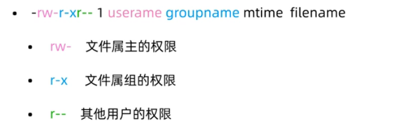
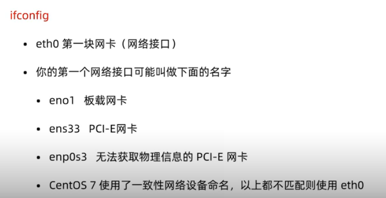
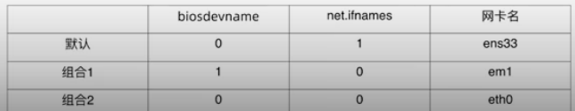
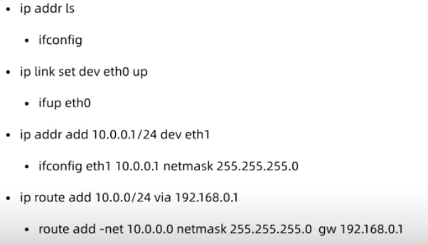

## Linux 常用功能总结

### Linux 常见目录介绍

- /                 根目录
- /root             root用户的家目录
- /home/username    普通用户的家目录
- /etc              配置文件目录
- /bin              命令目录
- /sbin             管理命令目录
- /usr/bin          系统预装的其他命令
- /usr/sbin         系统预装的其他命令


### 帮助命令 man, help, info

1. man 是 manual 的缩写
   
   man 的用法: `man ls`, `man 1 passwd`, `man 5 passwd`

2. help 帮助命令:

    shell 自带的命令称为**内部命令**，其他的是**外部命令**

    内部命令使用 help 帮助: `help cd`, 外部命令使用 help 帮助: `ls --help`

3. info 帮助: info 帮助比 help 更详细，作为 help 的补充

    info 用法: `info ls`

### 如何判断一个命令为内部或外部命令

`type ls`, 输出: ls is aliased to `ls --color=auto'

`type cd`, 输出: cd is a shell builtin


**在Linux 中一切皆文件，所以对文件的操作非常重要**

### 显示当前的目录名称

使用 `pwd` 命令

### 更改当前的操作目录

`cd` 命令

ep: `cd /path/file`

### 查看当前目录下的文件

`ls` 命令

ep: `ls -l`

常用参数:

- -l , 长格式显示文件
- -a , 显示隐藏文件
- -r , 逆序显示文件
- -t , 按照时间顺序显示
- -R , 递归显示   ep: `ls -R`

同时查询多个目录: `ls /dev /etc`


### 如何切换用户

`su root` 从普通用户切换到 root 用户

`su lss` 切换到 lss 用户


### 命令解释器 bash


### 创建和删除目录

`mkdir` 创建目录

ep: `mkdir test`

创建多个目录: `mkdir test1 test2 test3`

创建多级目录: `mkdir -p a/b/c/d`

查看多级目录: `ls -R a`

删除目录: `rmdir d`, `rmdir` 命令只能删除空目录

删除非空目录: `rm -rf a` 或者 `rm -r a` 递归删除目录，并会进行提示

### 复制和移动目录

复制命令: `cp`

`cp test1 test2` cp 命令只能复制文件, 复制目录时需要加 `-r` 参数: `cp -r test1 test2`

`cp -v test1/a.txt test2`, `-v` 参数可以显示复制过程

`cp -p test1/a.txt test3`, `-p` 参数可以保留源文件的时间和用户操作权限等信息

`cp -a test1/a.txt test3`, `-a` 参数可以复制更多的信息，包括文件的属主等，是 `-p` 参数的加强版


`mv` 命令的两个功能:
- 移动文件目录
- 重命名

`mv test test4`, 把 test 目录更名为 test4. (同级目录更名)

`mv test1/a.txt test2`, 把 a.txt 文件移动到 test2 目录下

`mv * /test4`, 把当前目录所有内容移动到 /test4 目录下


### 新建空白文件

`touch a.txt`


### 通配符

`*`, 任意多个字符匹配

`?`, 单个字符匹配


### Linux 文件查看

- cat   文本内容显示到终端
- head  默认查看文件开头10行, `head -5 a.txt` 查看文件前五行
- tail  查看文件结尾，常用参数 `-f`, `tail -f a.txt` 可以同步查看到信息的变化, 常用于调试时查看日志的变化信息
- wc    统计文件内容信息, 常用参数 `-l`，`wc -l a.txt` 查看文件的行数，根据行数可以确定使用 `head` 和 `tail` 来进行文件查看
- more
- less


### 打包压缩和解压缩

`tar` 打包命令, 常用参数有:
- c 打包
- x 解包
- f 指定操作类型为文件
  

`tar` 将文件打包, 打包后可以进行压缩存储, 压缩命令有:
- gzip, 经常使用的扩展名是 .tar.gz
- bzip2, 经常使用的扩展名是 .tar.bz2

---------------------------------

1. 打包
   
   `tar cf test1/a.tar test4`, 把 test4 目录打包为一个文件, 命令为a.tar, 参数 `f` 表示打包为文件, 参数 `c` 表示打包

2. 打包并压缩
   
   `tar czf test1/a.tar.gz /etc`, 把 目录 /etc 打包并压缩为 a.tar.gz 文件, 参数 `z` 表示压缩为 gzip 格式, 为了便于区分, 我们把只打包的文件后缀命名为 `.tar`, 打包并压缩的文件后缀命名为 `.tar.gz`

   `tar cjf test1/a.tar.bz2 /etc`, 把目录 /etc 打包并压缩为 a.tar.bz2 文件, 参数 `j` 表示压缩为 bzip2 格式

3. 解压
   
   `tar xf a.tar -C /root`, 把 a.tar 解包到 /root 目录下, 参数 `x` 为解包操作

   `tar xzf a.tar.gz -C /root`, 解压 .tar.gz 的包（gzip 格式）

   `tar xjf a.tar.bz2 -C /root`, 解压 .tar.bz2 格式的包 (bzip2 格式)
   


### Vim 编辑器

Vim 的四种模式:
- 正常模式
- 插入模式
- 命令模式
- 可视模式

-------------------
#### Vim 正常模式常用操作


`i` 进入插入模式, 可以进行输入内容

`v` 进入可视模式

`h g k l` 光标 上下左右 移动

`yy` 复制, `p` 粘贴

`3yy` 复制光标向下的3行

`y$` 复制本行光标到结尾的内容

`dd` 截切一整行, `p` 粘贴

`5dd` 截切5 行

`d$` 截切本行光标到结尾的内容

`u` 撤销上一步操作

`ctrl + r` 撤销 **撤销操作**，用于 `u` 操作使用过多的回撤

`x` 单个字符删除

`r` 替换当前光标所在位置的内容，（需要输入替换的内容）

`:set nu` 显示行号

`13 G` 光标快速移动到第 13 行

`g` 移动到第一行（首行）

`G` 移动到末尾（最后一行）

`^` 移动到一行的开头

`$` 移动到一行的末尾


----------------------------

#### Vim 命令模式

`esc` 退出输入模式之后，会进入的正常模式， 输入 `:` 后进入命令模式，也叫做 末行模式

`:w` 保存文件

`:w /home/lss/test3/vim.txt`  将内容保存到指定文件

`:q!` 不保存退出

`:! + linux命令`, `:! ip addr`, `:! pwd`

`/x` 查找文本中的 x

`:s/old/new` 查找到 old 之后 替换为 new, 只针对光标所在行进行搜索替换

`:%s/old/new` 针对全局文本进行搜索替换, 只替换一个

`:%s/old/new/g`, `g` 表示 global , 全局替换的意思, 会把文件中所有 old 字符 替换为 new 字符 

`:3,5s/old/new/g` 对3-5 行的内容进行全部替换

`:set nu` 显示行号, `:set nonu` 取消显示行号

vim 软件所在的配置文件 `/etc/vimrc` , 相当于修改软件的配置，一次修改，全局生效

------------------------

#### 可视模式

用于块的重复性操作

进入可视模式的方式:
- v          字符可视模式
- V          行可视模式
- ctrl + v   块可视模式


-----------------------

### 用户与用户组管理

Linux 是个多用户操作系统

需要对用户进行管理，以及对用户所属的文件进行管理

--------------------

#### 用户管理常用命令

- `useradd`  新建用户
- `userdel`  删除用户
- `passwd`   修改用户密码
- `usermod`  修改用户属性
- `chage`    修改用户属性


`useradd test_user_1`, 添加一个 `test_user_1` 的用户

`id root`, `id test_user_1`, 使用 `id` 命令查看系统中是否有该用户

创建用户的时候会为用户创建一个家目录, 具体目录为 `/home/test_user_1`, 目录名与用户名相同

创建用户的时候还会在 `/etc/passwd` 文件中添加一行相关信息 `test_user_1:x:1001:1001::/home/test_user_1:/bin/sh`

创建用户的时候还会在 `/etc/shadow` 文件下添加一条相关信息 `test_user_1:!:18555:0:99999:7:::`, 这个是密码相关的文件

**在创建用户的时候，若不指定组，会默认创建与用户名同名的一个组，并把该用户纳入该组**  `uid=1001(test_user_1) gid=1001(test_user_1) groups=1001(test_user_1)`


`passwd test_user_1` 为用户 `test_user_1` 设置密码

若要修改当前用户的密码, 直接使用 `passwd`

`userdel test_user_1`, 删除一个用户, 但会保留用户的家目录

`userdel -r test_user_1`, 连同用户的家目录一块删除


`useradd w`, `usermod -d /home/wl w`, 修改用户的家目录为 `/home/wl`

`chage` 用与设置用户的生命周期, （设置密码过期时间，用户失效时间等）

-------------------

#### 组管理命令

- groupadd  新建用户组
- groupdel  删除用户组


```
groupadd group1  //新建用户组
useradd user1    //新建用户
usermod -g group1 user1  //将用户 user1 的组修改为 group1

-----------------------

root@ifcalm:~# groupadd group1
root@ifcalm:~# useradd user1
root@ifcalm:~# usermod -g group1 user1
root@ifcalm:~# id user1
uid=1003(user1) gid=1003(group1) groups=1003(group1)

```

`useradd -g group1 user2`, 新建的用户 user2 直接加入 group1 组


### 切换用户的两种方法

1. `su user1`, 不完全切换
2. `su - user1`, 完全切换


### su 和 sudo 的区别和使用

- su  切换用户
  
  `su - username`

- sudo  使用本用户 以其他用户身份执行命令

  sudo 给普通用户授权，让普通用户可以操作某些高危命令，而不需要获取 root 密码

  `visudo` 设置需要使用 sudo 的用户(组)


### 用户和用户组的配置文件

`/etc/passwd` 用户配置文件，共有 7 个字段，如下示例所示:（手动编辑该文件也可以增加一个用户）
```
root:x:0:0:root:/root:/bin/bash
daemon:x:1:1:daemon:/usr/sbin:/usr/sbin/nologin
bin:x:2:2:bin:/bin:/usr/sbin/nologin
sys:x:3:3:sys:/dev:/usr/sbin/nologin

```

第一个字段代表 用户的名称

第二个字段表示 该用户登录是否需要密码

第3个字段和第4个字段 表示 用户的 uid（用户id，用户的唯一标识） 和 gid （表示用户属于哪一个组的）

第五个字段 表示 注释

第六个 字段表示用户的家目录在 哪一个位置

第七个字段表示 用户使用的命令解释器


----------------------

`/etc/shadow` 文件保存用户和用户密码相关信息的

```
root:$6$YLEvGcqbrZBGVx0t$6sa1XhLT.C109G0pNEI2L/9cSmQmEK5Jsp1tHcgUZlZezpnJbUUQqd/xa3a1Q/qCJPCEoFMCFrEt6LMMNJCsU.:18555:0:99999:7:::
daemon:*:18474:0:99999:7:::
bin:*:18474:0:99999:7:::
sys:*:18474:0:99999:7:::

```

第一个字段表示用户名称

第二个字段表示 用户加密过的密码


-----------------------

`/etc/group` 用户组相关的文件

```
root:x:0:
daemon:x:1:
bin:x:2:
sys:x:3:
adm:x:4:syslog,lss
tty:x:5:
```

第一个字段表示 组的名称

第二个字段表示 是否需要密码验证

第三个字段表示 组的 gid

第四个字段 表示 其他组


### 文件与目录的权限


文件类型:
1. `-`  普通文件
2. `d`  目录文件
3. `b`  块特殊文件
4. `c`  字符特殊文件
5. `l`  符号链接，快捷方式
6. `f`  命名管道
7. `s`  套接字文件

文件权限的表示方法:
1. `r` 读
2. `w` 写
3. `x` 执行

数字权限的表示方法:
1. r = 4
2. w = 2
3. x = 1




目录权限的表示方法:
- `x`  进入目录
- `rx`  显示目录内的文件名
- `wx`  修改目录内的文件名


### 修改权限命令

`chmod`  修改文件，目录权限

`chmod u+x /tmp/testfile`, `chmod 755 /tmp/testfile`

`chown`  更改属主，属组

`chgrp`  可以单独更改属组，不常用

```
chown user1 /test   //更改目录 test 的属主 为 user1

chown :gropu1 /test   //更改目录 test 的属组 为 group1

chgrp group2 /test   //更改目录 test 的属组为 group2
```

### 修改文件和文件夹的权限

`chmod` + `u / g / o / a`

- u  修改用户部分的权限
- g  修改用户组部分的权限
- o  修改其他用户的权限
- a  修改所有部分的权限


- `chmod u+`  增加权限
- `chmod u-`  减少权限
- `chmod u=`  设置权限


```
chmod u+x a.txt  //为属主增加执行权限

chmod g-r a.txt   //为属组减少读权限

chmod o=w a.txt   //为其他用户只设置读权限

chmod a+r a.txt   //为所有用户增加读权限

-------------------------

chmod 446 a.txt   //通过数字设置权限
```

`umask` 命令


### 权限管理

`chmod 777 a.txt`  设置最大权限

`chown user1:group1 a.txt`  属主和属组同时修改


`echo` 输出命令 `echo 123`


#### 特殊权限
- SUID   用于二进制可执行文件
- SGID   用于目录
- SBIT   用于目录
  
特殊权限的设置 `chmod 4xxx a.txt`

----------------------------------

## 系统管理

### 网络管理

- 网络状态查看
- 网络配置
- 路由命令
- 网络故障排除
- 网络服务管理
- 常用配置文件


### 网络状态查看工具

1. net-tools 工具集
   
   `ifconfig`

   `route`

   `netstat`

2. iproute2 工具集

   `ip`

   `ss`



### 网络接口命名修改

网卡命名规则受 `biosdevname` 和 `net.ifnames` 两个参数影响, 编辑 `/etc/default/grub` 文件, 增加 `biosdevname=0` 和 `net.ifnames=0`, 然后更新 grub, `grub2-mkconfig -o /boot/grub2/grubcfg`, 然后重启 `reboot`




### 查看网络配置

以下是网卡信息示例:

```
docker0: flags=4099<UP,BROADCAST,MULTICAST>  mtu 1500
        inet 172.17.0.1  netmask 255.255.0.0  broadcast 172.17.255.255
        ether 02:42:0e:0d:b9:ad  txqueuelen 0  (Ethernet)
        RX packets 0  bytes 0 (0.0 B)
        RX errors 0  dropped 0  overruns 0  frame 0
        TX packets 0  bytes 0 (0.0 B)
        TX errors 0  dropped 0 overruns 0  carrier 0  collisions 0

ens33: flags=4163<UP,BROADCAST,RUNNING,MULTICAST>  mtu 1500
        inet 192.168.180.140  netmask 255.255.255.0  broadcast 192.168.180.255
        inet6 fe80::20c:29ff:fe99:a4d9  prefixlen 64  scopeid 0x20<link>
        ether 00:0c:29:99:a4:d9  txqueuelen 1000  (Ethernet)
        RX packets 62619  bytes 81103112 (81.1 MB)
        RX errors 0  dropped 0  overruns 0  frame 0
        TX packets 17560  bytes 1156166 (1.1 MB)
        TX errors 0  dropped 0 overruns 0  carrier 0  collisions 0

lo: flags=73<UP,LOOPBACK,RUNNING>  mtu 65536
        inet 127.0.0.1  netmask 255.0.0.0
        inet6 ::1  prefixlen 128  scopeid 0x10<host>
        loop  txqueuelen 1000  (Local Loopback)
        RX packets 255  bytes 21120 (21.1 KB)
        RX errors 0  dropped 0  overruns 0  frame 0
        TX packets 255  bytes 21120 (21.1 KB)
        TX errors 0  dropped 0 overruns 0  carrier 0  collisions 0

```

#### 查看网卡物理连接情况（网线是否插好）:

`mii-tool eth0`

`mii-tool ens33`

```
root@ifcalm:~# mii-tool ens33
ens33: negotiated 1000baseT-FD flow-control, link ok
```

#### 查看网关命令

`route`

`route -n`, 使用 `-n` 参数不解析主机名

```
root@ifcalm:~# route -n
Kernel IP routing table
Destination     Gateway         Genmask         Flags Metric Ref    Use Iface
0.0.0.0         192.168.180.2   0.0.0.0         UG    100    0        0 ens33
172.17.0.0      0.0.0.0         255.255.0.0     U     0      0        0 docker0
192.168.180.0   0.0.0.0         255.255.255.0   U     0      0        0 ens33
192.168.180.2   0.0.0.0         255.255.255.255 UH    100    0        0 ens33
root@ifcalm:~# route
Kernel IP routing table
Destination     Gateway         Genmask         Flags Metric Ref    Use Iface
default         _gateway        0.0.0.0         UG    100    0        0 ens33
172.17.0.0      0.0.0.0         255.255.0.0     U     0      0        0 docker0
192.168.180.0   0.0.0.0         255.255.255.0   U     0      0        0 ens33
_gateway        0.0.0.0         255.255.255.255 UH    100    0        0 ens33
```

### 修改网络配置

设置网卡 ip 地址: 

`ifconfig eth0 192.168.0.3 netmask 255.255.255.0`

`ifconfig <接口> <ip地址> [netmask 子网掩码]`


网卡启用: `ifup eth0`

网卡禁用: `ifdown eth0`


#### 网关配置命令

添加网关:
- route add default gw <网关ip>
- route add -host <指定ip> gw <网关ip>  //为某个ip指定网关
- route add -net <指定网段> netmask <子网掩码> gw <网关ip>   //为某个网段指定网关

删除网关：
- route del default gw <网关ip>





### 网络故障排除命令

1. ping
2. traceroute
3. mtr
4. nslookup
5. telnet
6. tcpdump
7. netstat
8. ss


#### 检测主机：

`ping` 检测当前主机和目标主机是否畅通

`traceroute`, `mtr` 检测当前主机到目标主机的状况，辅助 `ping` 命令来使用

`traceroute` 路由追踪，查看当前主机到目标主机的每一跳路由，`traceroute -w 1 qq.com`

`mtr` 查看当前主机到目标主机之间是否有数据包丢失, 显示数据更详细

`nslookup` 命令来通过域名来查看 ip, `nslookup qq.com`

#### 检测端口：

`telnet` 检测端口的连接状态, `telnet qq.com 80` : 检测该域名的 80 端口是否开放

#### 检测数据包：

`tcpdump` 命令 分析数据包

`tcpdump -i any -n port 80` 检测所有网卡的80端口的数据包

`tcpdump -i any -n host 192.168.0.3` 捕获指定主机的数据包

`tcpdump -i any -n host 192.168.0.3 and port 80` 同时指定主机和端口


#### 检测监听范围：

`netstat`, `ss` 查看监听服务范围

`netstat -ntpl`

`ss -ntpl`


### 网络服务管理

网络服务管理程序分为两种:
- SysV
- systemd

```
service network start|stop|restart
chkconfig -list network

systemctl list-unit-files NetworkManager.service
systemctl start|stop|restart NetworkManager
systemctl enable|disable NetworkManager
```

管理服务的工具是 `service` 和 `systemctl`


网络配置文件:

- /etc/hosts
- ifcfg-eth0  //网卡 eth0 的配置文件


*网卡文件位置*

查看主机名: `hostname`

修改主机名: `hostname ifcalmtest`


### 软件包管理

软件包管理器，是方便软件安装，卸载，解决软件依赖关系的重要工具

1. CentOS, RedHat 使用 `yum` 包管理器，软件安装包格式为 rpm
2. Debian, Ubuntu 使用 `apt` 包管理器，软件安装包格式为 deb


rpm常用命令参数:
- -q, 查询软件保
- -i, 安装软件包
- -e, 卸载软件包


`mount` 设备挂载命令


#### yum 命令常用选项

#### apt 命令常用选项

`apt list`

`apt install`

`apt update`


### 通过源代码编译安装软件包

1. 二进制安装
2. 源代码编译安装


源代码编译安装:
1. `wget https://openresty.org/download/openresty-1.17.8.2.tar.gz`, 下载源代码
2. `tar zxf openresty-1.17.8.2.tar.gz`, 解压
3. `cd openresty-1.17.8.2`, 进入解压后的目录
4. `./configure --prefix=/usr/local/openresty`, 配置相关参数，指定安装目录(--prefix)
5. `make`, 编译
6. `make install`, 编译好之后安装


### 如何进行内核升级

`uname -r`, 查看内核版本

**依赖问题**


查看 cpu: `lscpu`

### grub 配置文件

`etc/default/grub`

`/etc/grub.d`

`/boot/grub2/grub.cfg`


### 使用 ps 和 top 命令查看进程

进程管理：
- 进程的概念与进程查看
- 进程的控制命令
- 进程的通信方式----信号
- 守护进程和系统日志
- 服务管理工具, `systemctl`
- SELinux 简介


#### 进程的概念

进程就是运行中的程序，从程序开始运行到终止的整个生命周期是可管理的

#### 进程的查看命令

- `ps`, p代表进程, s代表状态
- `pstree`, 查看进程的树形结构
- `top`, 动态的查看进程的一些信息

进程也是树形结构

进程和权限有着密不可分的关系

```
root@ifcalm:~# ps
    PID TTY          TIME CMD
   1577 pts/0    00:00:00 su
   1581 pts/0    00:00:00 bash
  10036 pts/0    00:00:00 ps

`PID` 进程的唯一标识

单独执行 `ps` 的时候，查看的是当前终端可以看到的进程

`ps -e` 查看不同终端的所有进程

root@ifcalm:~# ps -e
    PID TTY          TIME CMD
      1 ?        00:00:04 systemd
      2 ?        00:00:00 kthreadd
      3 ?        00:00:00 rcu_gp
      4 ?        00:00:00 rcu_par_gp
      6 ?        00:00:00 kworker/0:0H-kblockd
      7 ?        00:00:01 kworker/0:1-mm_percpu_wq
      9 ?        00:00:00 mm_percpu_wq
     10 ?        00:00:00 ksoftirqd/0
     11 ?        00:00:07 rcu_sched
     12 ?        00:00:00 migration/0
     13 ?        00:00:00 idle_inject/0
     14 ?        00:00:00 cpuhp/0
     15 ?        00:00:00 cpuhp/1
     16 ?        00:00:00 idle_inject/1
     17 ?        00:00:00 migration/1
     18 ?        00:00:00 ksoftirqd/1
     20 ?        00:00:00 kworker/1:0H-kblockd


常用ps命令:
ps -e
ps -ef, 可以查看进程属于哪个用户的(uid), 父进程(pid)
ps -eLf, 可以查看线程
```

```
root@ifcalm:~# pstree
systemd─┬─VGAuthService
        ├─accounts-daemon───2*[{accounts-daemon}]
        ├─atd
        ├─cron
        ├─dbus-daemon
        ├─dockerd─┬─containerd───10*[{containerd}]
        │         └─11*[{dockerd}]
        ├─irqbalance───{irqbalance}
        ├─login───bash
        ├─multipathd───6*[{multipathd}]
        ├─networkd-dispat
        ├─polkitd───2*[{polkitd}]
        ├─redis-server───3*[{redis-server}]
        ├─rsyslogd───3*[{rsyslogd}]
        ├─snapd───12*[{snapd}]
        ├─sshd─┬─sshd───sshd───bash───su───bash───pstree
        │      └─sshd───sshd───bash───su───bash
        ├─2*[systemd───(sd-pam)]
        ├─systemd-journal
        ├─systemd-logind
        ├─systemd-network
        ├─systemd-resolve
        ├─systemd-timesyn───{systemd-timesyn}
        ├─systemd-udevd
        ├─unattended-upgr───{unattended-upgr}
        └─vmtoolsd───2*[{vmtoolsd}]

```

```
Tasks: 217 total,   2 running, 215 sleeping,   0 stopped,   0 zombie
%Cpu(s):  0.2 us,  0.3 sy,  0.0 ni, 99.5 id,  0.0 wa,  0.0 hi,  0.0 si,  0.0 st
MiB Mem :   1959.9 total,    647.0 free,    320.3 used,    992.7 buff/cache
MiB Swap:   2048.0 total,   2048.0 free,      0.0 used.   1461.3 avail Mem 

    PID USER      PR  NI    VIRT    RES    SHR S  %CPU  %MEM     TIME+ COMMAND       
    469 root      19  -1   73340  25780  24644 S   0.3   1.3   0:03.64 systemd-journ+
    739 root       0 -20  161148   7160   6036 S   0.3   0.4   0:11.38 vmtoolsd      
    893 redis     20   0   50188   4768   3460 S   0.3   0.2   0:18.87 redis-server  
  10346 root      20   0    9360   3952   3160 R   0.3   0.2   0:00.11 top           
      1 root      20   0  102028  11568   8456 S   0.0   0.6   0:04.11 systemd       
      2 root      20   0       0      0      0 S   0.0   0.0   0:00.02 kthreadd      
      3 root       0 -20       0      0      0 I   0.0   0.0   0:00.00 rcu_gp        
      4 root       0 -20       0      0      0 I   0.0   0.0   0:00.00 rcu_par_gp    
      6 root       0 -20       0      0      0 I   0.0   0.0   0:00.00 kworker/0:0H-+
      7 root      20   0       0      0      0 I   0.0   0.0   0:01.18 kworker/0:1-m+
      9 root       0 -20       0      0      0 I   0.0   0.0   0:00.00 mm_percpu_wq  
     10 root      20   0       0      0      0 S   0.0   0.0   0:00.16 ksoftirqd/0   
     11 root      20   0       0      0      0 R   0.0   0.0   0:07.76 rcu_sched     
     12 root      rt   0       0      0      0 S   0.0   0.0   0:00.04 migration/0   
     13 root     -51   0       0      0      0 S   0.0   0.0   0:00.00 idle_inject/0 
     14 root      20   0       0      0      0 S   0.0   0.0   0:00.00 cpuhp/0       
     15 root      20   0       0      0      0 S   0.0   0.0   0:00.00 cpuhp/1       
     16 root     -51   0       0      0      0 S   0.0   0.0   0:00.00 idle_inject/1 
     17 root      rt   0       0      0      0 S   0.0   0.0   0:00.34 migration/1   
     18 root      20   0       0      0      0 S   0.0   0.0   0:00.20 ksoftirqd/1   
     20 root       0 -20       0      0      0 I   0.0   0.0   0:00.00 kworker/1:0H-+
     21 root      20   0       0      0      0 S   0.0   0.0   0:00.00 kdevtmpfs     
     22 root       0 -20       0      0      0 I   0.0   0.0   0:00.00 netns         
     23 root      20   0       0      0      0 S   0.0   0.0   0:00.00 rcu_tasks_kth+
     24 root      20   0       0      0      0 S   0.0   0.0   0:00.00 kauditd       
     26 root      20   0       0      0      0 S   0.0   0.0   0:00.01 khungtaskd    
     27 root      20   0       0      0      0 S   0.0   0.0   0:00.00 oom_reaper    
     28 root       0 -20       0      0      0 I   0.0   0.0   0:00.00 writeback     
     29 root      20   0       0      0      0 S   0.0   0.0   0:00.00 kcompactd0    
     30 root      25   5       0      0      0 S   0.0   0.0   0:00.00 ksmd          
     31 root      39  19       0      0      0 S   0.0   0.0   0:00.00 khugepaged    
     78 root       0 -20       0      0      0 I   0.0   0.0   0:00.00 kintegrityd   

```

`ps -ef | grep tail` 查看只包含 tail 关键字的进程


### 进程的控制和进程之间的关系

进程的优先级调整：
- `nice`, 范围从 -20 到 19，值越小优先级越高，抢占资源就越多
- `renice` 重新设置优先级

进程的作业控制：
- `jobs`
- `&` 

`top -p 10841` 查看进程 `10841` 的运行状况

`nice -n 10 ./a.sh` 把程序 a.sh 的进程优先级调整为 10


`./a.sh &`, 让程序在后台运行

如何把程序调回前台：
1. 执行 `jobs` 命令
2. `fg 1` 即可把 为 1 的后台程序调回前台

（`fg` 前台，`bg` 后台）


### 进程间通信

信号是进程间通信方式的一种
- 信号机制
- 管道

ep：终端用户输入中断命令，通过信号机制停止一个程序的运行

`kill -l` 查看所有信号


### 守护进程

使用 `nohup` 和 `&` 配合运行一个命令

`nohup` 命令

守护进行与一般进程有什么差别？

### screen 命令和系统日志

`screen` 工具

### 服务管理工具 systemctl

服务管理工具：
- service
- systemctl

`systemctl` 是 `service` 的强化版工具

`init` 命令

systemctl 常见操作:

`systemctl status|start|stop|restart|reload|enable|disable 服务名称`


### SELinux 简介
安全增强式Linux（SELinux，Security-Enhanced Linux）是一个Linux内核的安全模块，其提供了访问控制安全策略机制，包括了强制访问控制（Mandatory Access Control，MAC）

查看 SELinux 的命令: `getenforce`

关闭 SELinux: `setenforce 0`


### 内存与磁盘管理

- 内存和磁盘使用率查看
- ext4 文件系统
- 磁盘配额的使用
- 磁盘的分区与挂载
- 交换分区（虚拟内存）的查看与创建
- 软件 RAID 的使用
- 逻辑卷管理
- 系统综合状态查看


### 内存查看命令

- `free`
- `top`

### 磁盘使用率查看

- `fdisk`
- `df`
- `du`

`du` 与 `ls` 的区别

--------------------

```
free -g

free -m

fdisk -l

parted -l

df -h

dd : 转换和复制文件命令
```

### 文件系统管理

linux 支持多种文件系统:

- ext4 文件系统，重点了解
- xfs  文件系统
- NTFS 文件系统


### i节点和数据块操作

### 软连接

命令 `ln`

### 磁盘的分区和挂载

常用命令:
- fdisk
- mkfs
- parted
- mount

常见配置文件:
- /etc/fstab

### 用户磁盘配额

### 交换分区swap 的查看与创建

增加交换分区的大小:
- mkswap
- swapon

使用文件制作交换分区:

`dd if=/dev/zero bs=4M count=1024 of=/swapfile`


### RAID 软件

### 逻辑卷管理

- 逻辑卷与文件系统的关系
- 为 Linux 创建逻辑卷
- 动态扩容逻辑卷


`pvs` 命令

`pvcreate`

`vgcreate`

`vgs`

`lvcreate`

### 系统综合状态查看

- `sar` 命令
- 第三方工具


## Shell 编程

### 什么是 shell

shell 是命令解释器, 用于解释用户对操作系统的操作

shell 有很多:
```
root@ifcalm:~# cat /etc/shells 
# /etc/shells: valid login shells
/bin/sh
/bin/bash
/usr/bin/bash
/bin/rbash
/usr/bin/rbash
/bin/dash
/usr/bin/dash
/usr/bin/tmux
/usr/bin/screen
```

CentOS, Ununtu 默认使用的是 bash

### Linux 的启动过程

