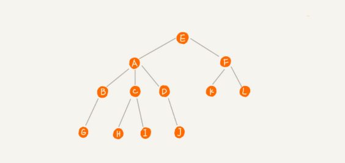
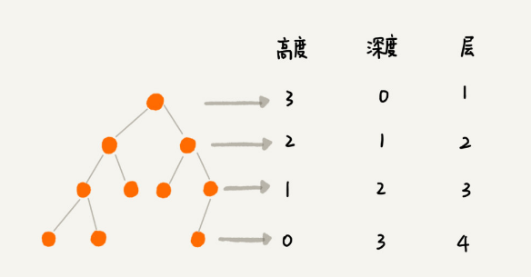
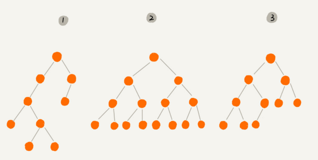
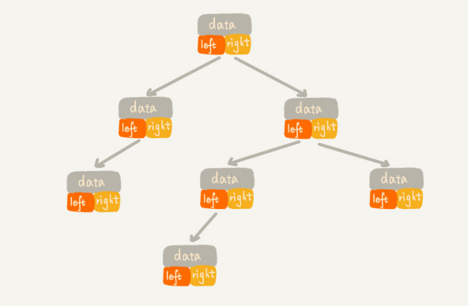
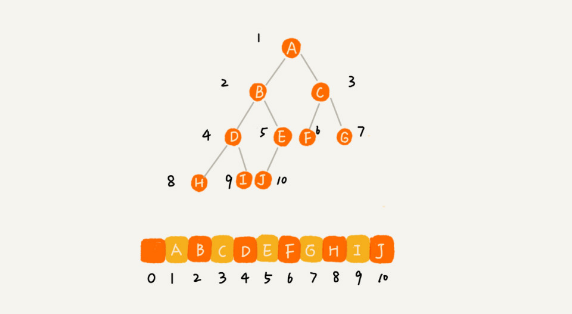
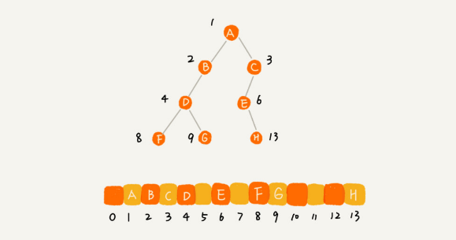
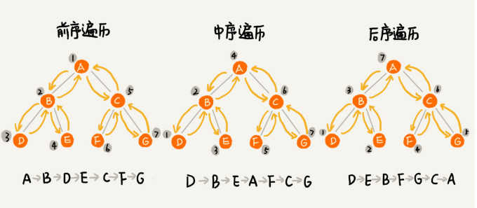

树这种数据结构很像我们现实生活中的树，这里面每个元素我们叫做**节点**；用来连接相邻节点之间的关系，我们叫做**父子关系**



A 节点就是 B 节点的父节点，B 节点是 A 节点的子节点。B、C、D 这三个节点的父节点是同一个节点，所以它们之间互称为兄弟节点。我们把没有父节点的节点叫做根节点，也就是图中的节点 E。我们把没有子节点的节点叫做叶子节点或者叶节点，比如图中的 G、H、I、J、K、L 都是叶子节点

关于树，还有三个比较相似的概念:
- 高度
- 深度
- 层



### 二叉树
树结构多种多样，不过我们最常用还是二叉树

二叉树，每个节点最多有两个叉，也就是两个子节点，分别是左子节点和右子节点。不过，二叉树并不要求每个节点都有两个子节点，有的节点只有左子节点，有的节点只有右子节点



编号 2 的二叉树中，叶子节点全都在最底层，除了叶子节点之外，每个节点都有左右两个子节点，这种二叉树就叫做**满二叉树**

编号 3 的二叉树中，叶子节点都在最底下两层，最后一层的叶子节点都靠左排列，并且除了最后一层，其他层的节点个数都要达到最大，这种二叉树叫做**完全二叉树**

为什么偏偏把最后一层的叶子节点靠左排列的叫完全二叉树？如果靠右排列就不能叫完全二叉树了吗？

### 如何表示（或者存储）一棵二叉树
想要存储一棵二叉树，我们有两种方法:
- 基于指针或者引用的二叉链式存储法
- 基于数组的顺序存储法

**链式存储法**:

每个节点有三个字段，其中一个存储数据，另外两个是指向左右子节点的指针。我们只要拎住根节点，就可以通过左右子节点的指针，把整棵树都串起来。这种存储方式我们比较常用。大部分二叉树代码都是通过这种结构来实现的



**基于数组的顺序存储法**

我们把根节点存储在下标 `i = 1` 的位置，那左子节点存储在下标 `2 * i = 2` 的位置，右子节点存储在 `2 * i + 1 = 3` 的位置。以此类推，B 节点的左子节点存储在 `2 * i = 2 * 2 = 4` 的位置，右子节点存储在 `2 * i + 1 = 2 * 2 + 1 = 5` 的位置



我刚刚举的例子是一棵完全二叉树，所以仅仅“浪费”了一个下标为 0 的存储位置。如果是非完全二叉树，其实会浪费比较多的数组存储空间



所以，**如果某棵二叉树是一棵完全二叉树，那用数组存储无疑是最节省内存的一种方式。因为数组的存储方式并不需要像链式存储法那样，要存储额外的左右子节点的指针**

**堆其实就是一种完全二叉树，最常用的存储方式就是数组**

### 二叉树的遍历

如何将所有节点都遍历打印出来呢:
- **前序遍历**,先打印这个节点，然后再打印它的左子树，最后打印它的右子树
- **中序遍历**,先打印它的左子树，然后再打印它本身，最后打印它的右子树
- **后序遍历**,先打印它的左子树，然后再打印它的右子树，最后打印这个节点本身




**二叉树的前、中、后序遍历就是一个递归的过程**

写递归代码的关键，就是看能不能写出递推公式，而写递推公式的关键就是，如果要解决问题 A，就假设子问题 B、C 已经解决，然后再来看如何利用 B、C 来解决 A。所以，我们可以把前、中、后序遍历的递推公式都写出来

代码实现:
```
// 二叉树节点定义
type TreeNode struct {
    Val   int
    Left  *TreeNode  // 左子树
    Right *TreeNode // 右子树
}

// 前序遍历
func PreOrderTraversal(tree *TreeNode) {
    if tree == nil {
        return
    }

    fmt.Printf(" %d -> ", tree.Val)
    PreOrderTraversal(tree.Left)
    PreOrderTraversal(tree.Right)
}

// 中序遍历
func MidOrderTraversal(tree *TreeNode) {
    if tree == nil {
        return
    }

    MidOrderTraversal(tree.Left)
    fmt.Printf(" %d -> ", tree.Val)
    MidOrderTraversal(tree.Right)
}

// 后序遍历
func PostOrderTraversal(tree *TreeNode) {
    if tree == nil {
        return
    }

    PostOrderTraversal(tree.Left)
    PostOrderTraversal(tree.Right)
    fmt.Printf(" %d -> ", tree.Val)
}
```

**二叉树遍历的时间复杂度**: 每个节点最多会被访问两次，所以遍历操作的时间复杂度，跟节点的个数 `n` 成正比，也就是说二叉树遍历的时间复杂度是 `O(n)`

**二叉树既可以用链式存储，也可以用数组顺序存储。数组顺序存储的方式比较适合完全二叉树，其他类型的二叉树用数组存储会比较浪费存储空间。除此之外，二叉树里非常重要的操作就是前、中、后序遍历操作，遍历的时间复杂度是 O(n)，需要理解并能用递归代码来实现**


二叉树按层遍历:
```
func LevelOrderTraversal(tree *TreeNode) {
    if tree == nil {
        return
    }

    // 采用队列实现
    queue := make([]*TreeNode, 0)
    queue = append(queue, tree) // queue push
    for len(queue) > 0 {
        tree = queue[0]
        fmt.Printf(" %d -> ", tree.Val)

        queue = queue[1:] // queue pop

        if tree.Left != nil {
            queue = append(queue, tree.Left)
        }
        if tree.Right != nil {
            queue = append(queue, tree.Right)
        }
    }
}
```

