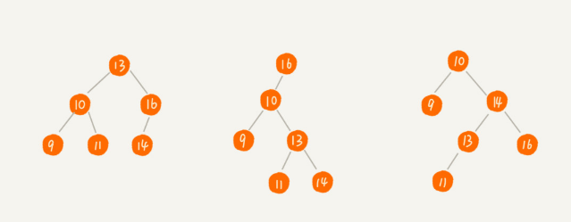
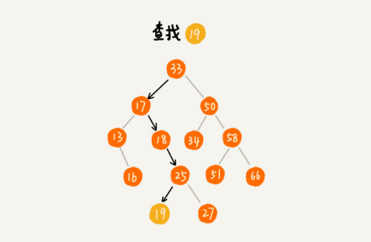
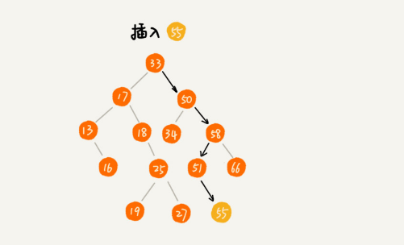
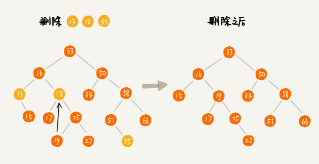
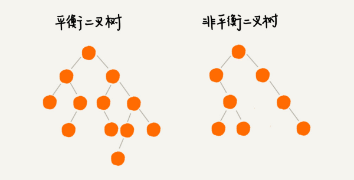

树这种数据结构很像我们现实生活中的树，这里面每个元素我们叫做**节点**；用来连接相邻节点之间的关系，我们叫做**父子关系**


A 节点就是 B 节点的父节点，B 节点是 A 节点的子节点。B、C、D 这三个节点的父节点是同一个节点，所以它们之间互称为兄弟节点。我们把没有父节点的节点叫做根节点，也就是图中的节点 E。我们把没有子节点的节点叫做叶子节点或者叶节点，比如图中的 G、H、I、J、K、L 都是叶子节点

关于树，还有三个比较相似的概念:
- 高度
- 深度
- 层


### 二叉树
树结构多种多样，不过我们最常用还是二叉树

二叉树，每个节点最多有两个叉，也就是两个子节点，分别是左子节点和右子节点。不过，二叉树并不要求每个节点都有两个子节点，有的节点只有左子节点，有的节点只有右子节点


编号 2 的二叉树中，叶子节点全都在最底层，除了叶子节点之外，每个节点都有左右两个子节点，这种二叉树就叫做**满二叉树**

编号 3 的二叉树中，叶子节点都在最底下两层，最后一层的叶子节点都靠左排列，并且除了最后一层，其他层的节点个数都要达到最大，这种二叉树叫做**完全二叉树**

为什么偏偏把最后一层的叶子节点靠左排列的叫完全二叉树？如果靠右排列就不能叫完全二叉树了吗？

### 如何表示（或者存储）一棵二叉树
想要存储一棵二叉树，我们有两种方法:
- 基于指针或者引用的二叉链式存储法
- 基于数组的顺序存储法

**链式存储法**:

每个节点有三个字段，其中一个存储数据，另外两个是指向左右子节点的指针。我们只要拎住根节点，就可以通过左右子节点的指针，把整棵树都串起来。这种存储方式我们比较常用。大部分二叉树代码都是通过这种结构来实现的


**基于数组的顺序存储法**

我们把根节点存储在下标 `i = 1` 的位置，那左子节点存储在下标 `2 * i = 2` 的位置，右子节点存储在 `2 * i + 1 = 3` 的位置。以此类推，B 节点的左子节点存储在 `2 * i = 2 * 2 = 4` 的位置，右子节点存储在 `2 * i + 1 = 2 * 2 + 1 = 5` 的位置


我刚刚举的例子是一棵完全二叉树，所以仅仅“浪费”了一个下标为 0 的存储位置。如果是非完全二叉树，其实会浪费比较多的数组存储空间


所以，**如果某棵二叉树是一棵完全二叉树，那用数组存储无疑是最节省内存的一种方式。因为数组的存储方式并不需要像链式存储法那样，要存储额外的左右子节点的指针**

**堆其实就是一种完全二叉树，最常用的存储方式就是数组**

### 二叉树的遍历

如何将所有节点都遍历打印出来呢:
- **前序遍历**,先打印这个节点，然后再打印它的左子树，最后打印它的右子树
- **中序遍历**,先打印它的左子树，然后再打印它本身，最后打印它的右子树
- **后序遍历**,先打印它的左子树，然后再打印它的右子树，最后打印这个节点本身


**二叉树的前、中、后序遍历就是一个递归的过程**

写递归代码的关键，就是看能不能写出递推公式，而写递推公式的关键就是，如果要解决问题 A，就假设子问题 B、C 已经解决，然后再来看如何利用 B、C 来解决 A。所以，我们可以把前、中、后序遍历的递推公式都写出来

代码实现:
```
// 二叉树节点定义
type TreeNode struct {
    Val   int
    Left  *TreeNode  // 左子树
    Right *TreeNode // 右子树
}

// 前序遍历
func PreOrderTraversal(tree *TreeNode) {
    if tree == nil {
        return
    }

    fmt.Printf(" %d -> ", tree.Val)
    PreOrderTraversal(tree.Left)
    PreOrderTraversal(tree.Right)
}

// 中序遍历
func MidOrderTraversal(tree *TreeNode) {
    if tree == nil {
        return
    }

    MidOrderTraversal(tree.Left)
    fmt.Printf(" %d -> ", tree.Val)
    MidOrderTraversal(tree.Right)
}

// 后序遍历
func PostOrderTraversal(tree *TreeNode) {
    if tree == nil {
        return
    }

    PostOrderTraversal(tree.Left)
    PostOrderTraversal(tree.Right)
    fmt.Printf(" %d -> ", tree.Val)
}
```

**二叉树遍历的时间复杂度**: 每个节点最多会被访问两次，所以遍历操作的时间复杂度，跟节点的个数 `n` 成正比，也就是说二叉树遍历的时间复杂度是 `O(n)`

**二叉树既可以用链式存储，也可以用数组顺序存储。数组顺序存储的方式比较适合完全二叉树，其他类型的二叉树用数组存储会比较浪费存储空间。除此之外，二叉树里非常重要的操作就是前、中、后序遍历操作，遍历的时间复杂度是 O(n)，需要理解并能用递归代码来实现**


二叉树按层遍历:
```
func LevelOrderTraversal(tree *TreeNode) {
    if tree == nil {
        return
    }

    // 采用队列实现
    queue := make([]*TreeNode, 0)
    queue = append(queue, tree) // queue push
    for len(queue) > 0 {
        tree = queue[0]
        fmt.Printf(" %d -> ", tree.Val)

        queue = queue[1:] // queue pop

        if tree.Left != nil {
            queue = append(queue, tree.Left)
        }
        if tree.Right != nil {
            queue = append(queue, tree.Right)
        }
    }
}
```

### 二叉查找树

二叉查找树是二叉树中最常用的一种类型，也叫二叉搜索树。顾名思义，二叉查找树是为了实现快速查找而生的。不过，它不仅仅支持快速查找一个数据，还支持快速插入、删除一个数据

**二叉查找树要求，在树中的任意一个节点，其左子树中的每个节点的值，都要小于这个节点的值，而右子树节点的值都大于这个节点的值**



### 二叉查找树的查找操作

我们先取根节点，如果它等于我们要查找的数据，那就返回。如果要查找的数据比根节点的值小，那就在左子树中递归查找；如果要查找的数据比根节点的值大，那就在右子树中递归查找



```
type Node struct {
	value Item	// 节点存储的值
	left  *Node	// 左子节点
	right *Node	// 右子节点
}

func search(node *Node, key int) bool {
	if node == nil {
		return false
	}
	// 向左搜索更小的值
	if key < node.key {
		return search(node.left, key)
	}
	// 向右搜索更大的值
	if key > node.key {
		return search(node.right, key)
	}
	return true
}
```

### 二叉查找树的插入操作

**二叉查找树的插入过程有点类似查找操作。新插入的数据一般都是在叶子节点上，所以我们只需要从根节点开始，依次比较要插入的数据和节点的大小关系**

如果要插入的数据比节点的数据大，并且节点的右子树为空，就将新数据直接插到右子节点的位置；如果不为空，就再递归遍历右子树，查找插入位置。同理，如果要插入的数据比节点数值小，并且节点的左子树为空，就将新数据插入到左子节点的位置；如果不为空，就再递归遍历左子树，查找插入位置



```

public void insert(int data) {
  if (tree == null) {
    tree = new Node(data);
    return;
  }

  Node p = tree;
  while (p != null) {
    if (data > p.data) {
      if (p.right == null) {
        p.right = new Node(data);
        return;
      }
      p = p.right;
    } else { // data < p.data
      if (p.left == null) {
        p.left = new Node(data);
        return;
      }
      p = p.left;
    }
  }
}
```

### 二叉查找树的删除操作

1. 如果要删除的节点没有子节点，我们只需要直接将父节点中，指向要删除节点的指针置为 `nil`
2. 如果要删除的节点只有一个子节点（只有左子节点或者右子节点），我们只需要更新父节点中，指向要删除节点的指针，让它指向要删除节点的子节点就可以了
3. 如果要删除的节点有两个子节点，这就比较复杂了。我们需要找到这个节点的右子树中的最小节点，把它替换到要删除的节点上。然后再删除掉这个最小节点，因为最小节点肯定没有左子节点（如果有左子结点，那就不是最小节点了），所以，我们可以应用上面两条规则来删除这个最小节点



```

public void delete(int data) {
  Node p = tree; // p指向要删除的节点，初始化指向根节点
  Node pp = null; // pp记录的是p的父节点
  while (p != null && p.data != data) {
    pp = p;
    if (data > p.data) p = p.right;
    else p = p.left;
  }
  if (p == null) return; // 没有找到

  // 要删除的节点有两个子节点
  if (p.left != null && p.right != null) { // 查找右子树中最小节点
    Node minP = p.right;
    Node minPP = p; // minPP表示minP的父节点
    while (minP.left != null) {
      minPP = minP;
      minP = minP.left;
    }
    p.data = minP.data; // 将minP的数据替换到p中
    p = minP; // 下面就变成了删除minP了
    pp = minPP;
  }

  // 删除节点是叶子节点或者仅有一个子节点
  Node child; // p的子节点
  if (p.left != null) child = p.left;
  else if (p.right != null) child = p.right;
  else child = null;

  if (pp == null) tree = child; // 删除的是根节点
  else if (pp.left == p) pp.left = child;
  else pp.right = child;
}
```

除了插入、删除、查找操作之外，二叉查找树中还可以支持快速地查找**最大节点和最小节点、前驱节点和后继节点**

**二叉查找树除了支持上面几个操作之外，还有一个重要的特性，就是中序遍历二叉查找树，可以输出有序的数据序列，时间复杂度是 `O(n)`，非常高效。因此，二叉查找树也叫作二叉排序树**

### 支持重复数据的二叉查找树

那如果存储的两个对象键值相同，这种情况该怎么处理呢？

1. 二叉查找树中每一个节点不仅会存储一个数据，因此我们通过链表和支持动态扩容的切片等数据结构，把值相同的数据都存储在同一个节点上
2. 每个节点仍然只存储一个数据。在查找插入位置的过程中，如果碰到一个节点的值，与要插入数据的值相同，我们就将这个要插入的数据放到这个节点的右子树，也就是说，把这个新插入的数据当作大于这个节点的值来处理，当要查找数据的时候，遇到值相同的节点，我们并不停止查找操作，而是继续在右子树中查找，直到遇到叶子节点，才停止。这样就可以把键值等于要查找值的所有节点都找出来，对于删除操作，我们也需要先查找到每个要删除的节点，然后再按前面讲的删除操作的方法，依次删除


### 二叉查找树的时间复杂度分析

待补充

## 红黑树

在工程中，很多用到平衡二叉查找树的地方都会用红黑树

### 什么是平衡二叉查找树
平衡二叉树的严格定义是这样的：**二叉树中任意一个节点的左右子树的高度相差不能大于 1**



平衡二叉查找树不仅满足上面平衡二叉树的定义，还满足二叉查找树的特点。最先被发明的平衡二叉查找树是**AVL 树**，它严格符合我刚讲到的平衡二叉查找树的定义，即任何节点的左右子树高度相差不超过 1，是一种高度平衡的二叉查找树

**发明平衡二叉查找树这类数据结构的初衷是，解决普通二叉查找树在频繁的插入、删除等动态更新的情况下，出现时间复杂度退化的问题**

**平衡二叉查找树中平衡的意思，其实就是让整棵树左右看起来比较对称、比较平衡，不要出现左子树很高、右子树很矮的情况。这样就能让整棵树的高度相对来说低一些，相应的插入、删除、查找等操作的效率高一些**

### 如何定义一棵红黑树

红黑树中的节点，一类被标记为黑色，一类被标记为红色。除此之外，一棵红黑树还需要满足这样几个要求:
- 根节点是黑色的
- 每个叶子节点都是黑色的空节点，也就是说，叶子节点不存储数据
- 任何相邻的节点都不能同时为红色，也就是说，红色节点是被黑色节点隔开的
- 每个节点，从该节点到达其可达叶子节点的所有路径，都包含相同数目的黑色节点


### 小结

**我们学习数据结构和算法，要学习它的由来、特性、适用的场景以及它能解决的问题**

### 红黑树实现

待补充

