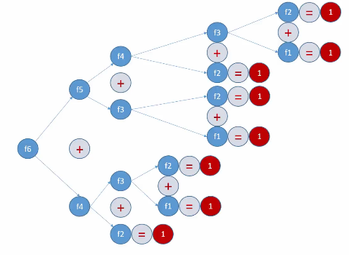
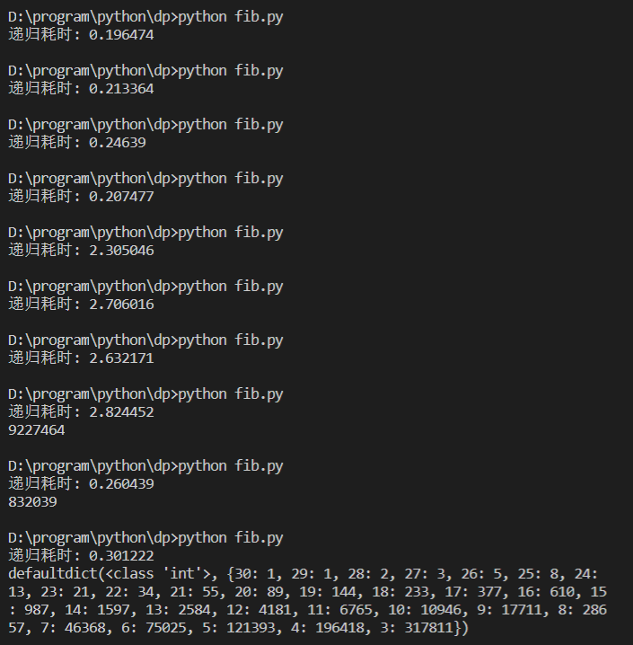
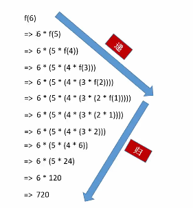
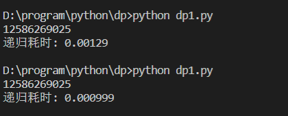
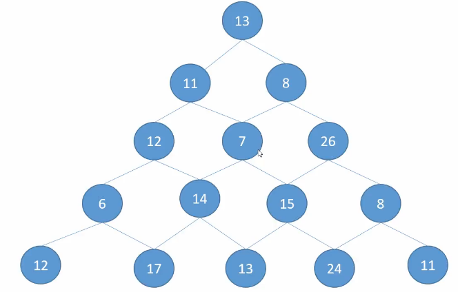

## 动态规划 Python 实现

**几个重要思想:**

- 递归
- 回溯法
- 动态规划

----------------------------------------------

### 什么是递归

**递归的定义: 函数内部调用函数本身**

**递归技术在很多算法中存在:**

- 回溯法
- 分治法
- 动态规划

递归分为两个过程:**递** 和 **归**, 这两个都是自动完成的

**递归一定要有终止条件**

无限递归会发生栈溢出

#### 递归实现斐波拉契数列

指的是这样一个数列: `1 1 2 3 5 8 13 21 34 ...`, 后面的数都等于前面两个数的和

**递归代码实现:**
```
def fib(k):
    if k in [1, 2]:
        return 1
    return fib(k-1) + fib(k-2)
```

**通过非递归代码实现:**
```
def fib_fdg(k):
    assert k > 0, "k > 0"
    if k in [1, 2]:
        return 1
    k_1 = 1
    k_2 = 1
    for i in range(3, k+1):
        tmp = k_1
        k_1 = k_1 + k_2
        k_2 = tmp
    return k_1
```

#### 递归求解示意图:



从递归过程图来看，内部执行重复量是非常大的，很多计算是重复的



从递归的耗时我们可以看出，fib_dp(30) 所需的时间是 0.2 秒左右，但 fib_dp(35) 所需的时间是 2 秒左右，计算量增加是惊人的

#### 二分查找

1. 二分查找，也叫折半查找
2. 二分查找针对有序数组
3. 算法很多时候考察的是对边界的了解

非递归代码实现:

```
def search(data_list, target):
    left = 0
    right = len(data_list) - 1
    while left <= right:
        # 找到 [left, right] 中间的值
        mid = int((left+right)/2)
        # 判断中间值与目标值的大小
        if data_list[mid] == target:
            print("select ok: {}".format(mid))
            break
        elif data_list[mid] < target:
            # 如果中间值小于目标值，则在右侧继续二分查找
            left = mid + 1
        else:
            # 如果中间值大于目标值，则在左侧继续二分查找
            right = mid - 1
```

递归实现二分查找:

```
def dg_search(left, right, data_list, target):
    if left > right:
        return -1
    mid = int((left + right) / 2)
    if data_list[mid] == target:
        return mid
    elif data_list[mid] < target:
        # 在右侧继续递归查找
        return dg_search(mid+1, right, data_list, target)
    else:
        # 在左侧继续递归查找
        return dg_search(left, mid-1, data_list, target)
```

#### 汉诺塔实现



**递归是一个栈的调用过程，先进后出**

阶乘递归实现:
```
def jc(n):
    if n == 1:
        return 1
    else:
        return n*jc(n-1)
```

**汉诺塔递归实现**

```
def move(index, start, mid, end):
    if index == 1:
        print("{}-->{}".format(start, end))
        return
    else:
        move(index-1, start, end, mid)
        print("{}-->{}".format(start, end))
        move(index-1, mid, start, end)

if __name__ == "__main__":
    move(3, "A", "B", "C")
```

#### 递归总结

- 写法简单
- 递归都能通过非递归的方法实现
- 递归由于是函数调用自身，而函数调用是有时间和空间的消耗，每一次函数调用，都需要在内存中分配空间来保存参数，返回地址以及临时变量，而往栈中压入数据和弹出数据都需要时间，所以效率不高
- 递归很多计算都是重复的，由于其本质是把一个问题分解成两个或多个小问题，多个小问题存在互相重叠的部分，则存在重复计算
- 调用栈可能会溢出，每一次函数调用会在内存栈中分配空间，而每个进程的栈容量是有限的，当调用的层次太多时，就会超出栈的容量，导致栈溢出

---------------------------------------------------

### 回溯法

回溯法采用试错的思想，它尝试分步的去解决一个问题。在分步解决问题的过程中，当它通过尝试发现现有的分步答案不能得到有效的正确的解答的时候，它将取消上一步甚至是上几步的计算，再通过其它的可能的分步解答再次尝试寻找问题的答案。回溯法通常用最简单的递归方法来实现，在反复重复上述的步骤后可能出现两种情况:
- 找到一个可能存在的正确的答案
- 在尝试了所有可能的分步方法后宣告该问题没有答案


**回溯法就是尝试所以的可能**, 适合求解 `枚举问题的所有可能的答案` 的问题

回溯法是暴搜法的一种，用来枚举所有满足某约束条件的候选解

回溯法的重点在于由候选解的一部分就可以提早判断所延伸出来的完整解是否可能符合约束条件，进而提早结束某些可能的尝试，减少多余的搜寻尝试时间


#### 八皇后问题

八皇后问题是一个以国际象棋为背景的问题：如何能够在8×8的国际象棋棋盘上放置八个皇后，使得任何一个皇后都无法直接吃掉其他的皇后？为了达到此目的，任两个皇后都不能处于同一条横行、纵行或斜线上

**代码实现:**

```
board = [
    [0,0,0,0,0,0,0,0],
    [0,0,0,0,0,0,0,0],
    [0,0,0,0,0,0,0,0],
    [0,0,0,0,0,0,0,0],
    [0,0,0,0,0,0,0,0],
    [0,0,0,0,0,0,0,0],
    [0,0,0,0,0,0,0,0],
    [0,0,0,0,0,0,0,0]
]

total = 0

# 判断(x ,y) 位置能否放置皇后
def can_plane(x, y):
    # 判断 x 行是否有皇后
    for i in range(0, y):
        if board[x][i] == 1:
            return False
    # 判断 y 列是否有皇后
    for i in range(0, x):
        if board[i][y] == 1:
            return False
    # 判断斜线上是否有皇后
    for i in range(0, x):
        if x+y-i <= 7:
            if board[i][x+y-i] == 1:
                return False
    # 判断反斜线上是否有皇后
    for index, i in enumerate(range(x-1, -1, -1)):
        s_y = y-(index+1)
        if s_y >= 0:
            if board[i][s_y] == 1:
                return False

    return True

def put_queen(step):
    if step == 8:
        print_board()
        global total
        total += 1

        print("-------------")
    else:
        for i in range(8):
            # 判断该位置能否放置皇后
            if can_plane(step, i):
                # 设置现场
                board[step][i] = 1
                # 开始递归
                put_queen(step+1)
                # 恢复现场
                board[step][i] = 0

# 打印棋盘
def print_board():
    for i in range(8):
        for j in range(8):
            if board[i][j] == 0:
                print("□ ", end="")
            else:
                print("■ ", end="")
        print()

if __name__ == "__main__":
    put_queen(0)
    print("总共有{}".format(total))
```

#### 全排列问题

全排列的生成算法方法是将给定的序列中所有可能的全排列无重复无遗漏地枚举出来。此处全排列的定义是：从n个元素中取出m个元素进行排列，当`n=m`时这个排列被称为全排列

**代码实现:**

```
data_list = [1, 2, 3, 4]
arranges = []
total = 0

def search(depth, datas):
    if depth == len(data_list)+1:
        print(arranges)
        global total
        total += 1
    else:
        for data in datas:
            # 设置现场
            arranges.append(data)
            # 递归
            next_datas = datas[:]
            next_datas.remove(data)
            search(depth+1, next_datas)
            # 恢复现场
            arranges.pop()

if __name__ == "__main__":
    search(1, data_list)
    print("{}排列方式".format(total))
```

#### 整数拆分

一个正整数可以写成一些正整数的和，4可以用5种方法写成和式：`4, 3+1, 2+2, 2+1+1, 1+1+1+1`。因此 `p(4)=5`

**代码实现:**

```
num = 7
datas = []

def search(rest):
    if rest <= 0:
        print(datas)
    else:
        for i in range(1, rest+1):
            # 设置现场
            datas.append(i)
            # 递归
            search(rest-i)
            # 恢复现场
            datas.pop()

search(num)
```

-----------------------------------------------

### 动态规划

#### 记忆+搜索算法

还是斐波拉契数列，我们采用 **记忆 + 搜素** 的模式，可以把时间降低很多

**在递归的过程中，会存在很多的重复计算，此时，我们可以把计算过的值存储在一个字典表里，下次递归的时候先去查询字典表中是否存在该值，若存在，则直接取用，不在进行重复计算**

```
from collections import defaultdict
total = defaultdict(int)

def fib(k):
    assert k > 0, "k > 0"
    if k in [1, 2]:
        return 1
    global total
    
    # 搜索该值是否被记忆过，若记录过，则直接返回，减少重复计算
    if k in total:
        result = total[k]
    else:
        result = fib(k-1) + fib(k-2)
        total[k] = result
    return result

if __name__ == "__main__":
    # 搜索 + 记忆 算法
    from datetime import datetime
    start_time = datetime.now()
    print(fib(50))
    print("递归耗时: {}".format((datetime.now()-start_time).total_seconds()))
```

从下面结果图可以看出，执行时间明显降低




#### 多阶段决策

- 根据过程的特性可以将过程按空间，时间等标志分为若干个互相联系又互相区别的阶段
- 在每个阶段都需要做出决策，从而使整个过程达到最好的效果
- 各个阶段决策的选取不是任意确定的，它依赖于当前面临的状态，又影响以后的发展
- 当各个阶段的决策确定后，就组成了一个决策序列，因而也就决定了整个过程的一条活动路线，这样的一个前后关联具有链状结构的多阶段过程就称为多阶段决策问题


#### 动态规划

- 对最佳路径（最佳决策过程）所经过的各个阶段，其中每个阶段始点到全过程终点的路径，必定是该阶段始点到全过程终点的一切路径中的最佳路径（最优决策）
- 简言之，一个最优策略的子策略必然也是最优的

**把多阶段决策问题转化为一系列单阶段最优化问题，从而逐个求解**

动态规划方法的关键：**在于正确地写出基本的递推关系式和恰当的边界条件**

要做到这一点，就必须将问题的过程分成几个相互联系的阶段，恰当的选取**状态变量和决策变量以及定义最优值函数**，从而把一个大问题转化成一组同类型的子问题，然后逐个求解

即从边界条件开始，逐段递推寻优，在每一个子问题的求解中，均利用它前面的子问题的最优化结果，依此进行，最后一个子问题所得的最优解，就是整个问题的最优解


#### 动态规划特点

**每个阶段的最优决策过程只与本阶段的初始状态有关**，而与以前各阶段的决策无关，换言之，本阶段之前的状态与决策，只是通过在本阶段所处的初始状态来影响本阶段及以后各个阶段的决策。
具有这种性质的状态称为 **无后效性状态**


**动态规划方法只适用于求解具有无后效性状态的多阶段决策问题**


#### 数字金字塔问题



从上到下找一条路径，使数字的和达到最大


#### 使用回溯法找出所有的解并从中选出最优解

```
数字金字塔问题

# 定义一个数字金字塔
pyramid = [
    [13],
    [11, 8],
    [12, 7, 26],
    [6, 14, 15, 8],
    [12, 17, 13, 24, 11]
]

datas = [13]
total_path = []
def search(depth, x, y):
    if depth == 5:
        total_path.append(datas[:])
    else:
        # 1.选择正下方的值

        # 设置现场
        datas.append(pyramid[depth][y])
        # 递归
        search(depth+1, x+1, y)
        # 恢复现场
        datas.pop()

        # 2.选择右下方的值
        # 设置现场
        datas.append(pyramid[depth][y+1])
        # 递归
        search(depth+1, x+1, y+1)
        # 恢复现场
        datas.pop()

if __name__ == "__main__":
    search(1, 0, 0)
    max = 0
    max_pos = 0
    for index, data in enumerate(total_path):
        if sum(data) > max:
            max = sum(data)
            max_pos = index

    print(total_path[max_pos])
```


#### 使用决策找出最大值

```
# 数字金字塔问题

# 定义一个数字金字塔
pyramid = [
    [13],
    [11, 8],
    [12, 7, 26],
    [6, 14, 15, 8],
    [12, 17, 13, 24, 11]
]

max_value = 0
def search_max(depth, y):
    if depth == 4:
        return pyramid[depth][y]
    # 把正下方的值交给下一个人得到最大值
    left_max = search_max(depth+1, y)
    # 把右下方的值交给下一个人得到最大值
    # 任务下分，最优子结构，决策
    right_max = search_max(depth+1, y+1)

    # 决策，选取最大值
    return pyramid[depth][y] + max(left_max, right_max)

if __name__ == "__main__":
    print(search_max(0, 0))
```

#### 使用 记忆+搜索+决策 方式

```
# 数字金字塔问题

# 定义一个数字金字塔
pyramid = [
    [13],
    [11, 8],
    [12, 7, 26],
    [6, 14, 15, 8],
    [12, 17, 13, 24, 11]
]

max_value = 0
info = {}
def search_max(depth, y):
    if depth == 4:
        return pyramid[depth][y]

    if "{}_{}".format(depth, y) in info:
        return info["{}_{}".format(depth, y)]
    else:
        max_value = pyramid[depth][y] + max(search_max(depth+1, y), search_max(depth+1, y+1))
        info["{}_{}".format(depth, y)] = max_value
        return max_value

if __name__ == "__main__":
    print(search_max(0, 0))
    print(info)
```

