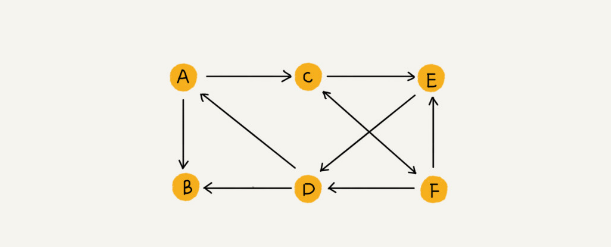

## 图的表示

**图**（Graph）和树比起来，这是一种更加复杂的非线性表结构


我们知道，树中的元素我们称为节点，图中的元素我们就叫做**顶点（vertex）**, 图中的一个顶点可以与任意其他顶点建立连接关系。我们把这种建立的关系叫做**边（edge）**


我们就拿微信举例子吧。我们可以把每个用户看作一个**顶点**。如果两个用户之间互加好友，那就在两者之间建立一条边。所以，整个微信的好友关系就可以用一张图来表示。其中，每个用户有多少个好友，对应到图中，就叫做顶点的**度（degree）**，就是跟顶点相连接的边的条数

微博的社交关系跟微信还有点不一样，或者说更加复杂一点。微博允许单向关注，也就是说，用户 A 关注了用户 B，但用户 B 可以不关注用户 A。那我们如何用图来表示这种单向的社交关系呢？
- 有向图
- 无向图




无向图中有**度**这个概念，表示一个顶点有多少条边。在有向图中，我们把度分为**入度**（In-degree）和**出度**（Out-degree）


顶点的入度，表示有多少条边指向这个顶点；顶点的出度，表示有多少条边是以这个顶点为起点指向其他顶点。对应到微博的例子，入度就表示有多少粉丝，出度就表示关注了多少人


QQ 中的社交关系要更复杂一点。不知道你有没有留意过 QQ 亲密度这样一个功能。QQ 不仅记录了用户之间的好友关系，还记录了两个用户之间的亲密度，如果两个用户经常往来，那亲密度就比较高；如果不经常往来，亲密度就比较低。如何在图中记录这种好友关系的亲密度呢？


这里就要用到另一种图，**带权图**（weighted graph）。在带权图中，每条边都有一个**权重**（weight），我们可以通过这个权重来表示 QQ 好友间的亲密度


三种图:
- 有向图
- 无向图
- 带权图


### 图的存储

- 邻接矩阵存储方法
- 邻接表存储方法

### 邻接矩阵存储方法
图最直观的一种存储方法就是，**邻接矩阵**（Adjacency Matrix）

**邻接矩阵的底层依赖一个二维数组。对于无向图来说，如果顶点 i 与顶点 j 之间有边，我们就将 `A[i][j]`和 `A[j][i]`标记为 1；对于有向图来说，如果顶点 i 到顶点 j 之间，有一条箭头从顶点 i 指向顶点 j 的边，那我们就将 `A[i][j]`标记为 1。同理，如果有一条箭头从顶点 j 指向顶点 i 的边，我们就将 `A[j][i]`标记为 1。对于带权图，数组中就存储相应的权重**


用邻接矩阵来表示一个图，虽然简单、直观，但是比较浪费存储空间。为什么这么说呢？

对于无向图来说，如果 `A[i][j]`等于 1，那 `A[j][i]`也肯定等于 1。实际上，我们只需要存储一个就可以了。也就是说，无向图的二维数组中，如果我们将其用对角线划分为上下两部分，那我们只需要利用上面或者下面这样一半的空间就足够了，另外一半白白浪费掉了

还有，如果我们存储的是**稀疏图**（Sparse Matrix），也就是说，顶点很多，但每个顶点的边并不多，那邻接矩阵的存储方法就更加浪费空间了。比如微信有好几亿的用户，对应到图上就是好几亿的顶点。但是每个用户的好友并不会很多，一般也就三五百个而已。如果我们用邻接矩阵来存储，那绝大部分的存储空间都被浪费了

但这也并不是说，邻接矩阵的存储方法就完全没有优点。首先，邻接矩阵的存储方式简单、直接，因为基于数组，所以在获取两个顶点的关系时，就非常高效。其次，用邻接矩阵存储图的另外一个好处是方便计算。这是因为，用邻接矩阵的方式存储图，可以将很多图的运算转换成矩阵之间的运算


### 邻接表存储方法


邻接表是不是有点像散列表？**每个顶点对应一条链表，链表中存储的是与这个顶点相连接的其他顶点**

图中画的是一个有向图的邻接表存储方式，每个顶点对应的链表里面，存储的是指向的顶点

### 时间、空间复杂度互换的设计思想

**邻接矩阵存储起来比较浪费空间，但是使用起来比较节省时间。相反，邻接表存储起来比较节省空间，但是使用起来就比较耗时间**

就像图中的例子，如果我们要确定，是否存在一条从顶点 2 到顶点 4 的边，那我们就要遍历顶点 2 对应的那条链表，看链表中是否存在顶点 4。而且链表的存储方式对缓存不友好。所以，比起邻接矩阵的存储方式，在邻接表中查询两个顶点之间的关系就没那么高效了

在基于链表法解决冲突的散列表中，如果链过长，为了提高查找效率，我们可以将链表换成其他更加高效的数据结构，比如平衡二叉查找树等。我们刚刚也讲到，邻接表长得很像散列。所以，我们也可以将邻接表同散列表一样进行改进升级

我们可以将邻接表中的链表改成平衡二叉查找树。实际开发中，我们可以选择用红黑树。这样，我们就可以更加快速地查找两个顶点之间是否存在边了。当然，这里的二叉查找树可以换成其他动态数据结构，比如跳表、散列表等。除此之外，我们还可以将链表改成有序动态数组，可以通过二分查找的方法来快速定位两个顶点之间否是存在边


### 如何存储微博、微信等社交网络中的好友关系？

微博、微信是两种图，前者是有向图，后者是无向图

数据结构是为算法服务的，所以具体选择哪种存储方法，与期望支持的操作有关系。针对微博用户关系，假设我们需要支持下面这样几个操作:
1. 判断用户 A 是否关注了用户 B
2. 判断用户 A 是否是用户 B 的粉丝
3. 用户 A 关注用户 B
4. 用户 A 取消关注用户 B
5. 根据用户名称的首字母排序，分页获取用户的粉丝列表
6. 根据用户名称的首字母排序，分页获取用户的关注列表

关于如何存储一个图，前面我们讲到两种主要的存储方法，**邻接矩阵和邻接表**。因为社交网络是一张稀疏图，使用邻接矩阵存储比较浪费存储空间。所以，这里我们采用邻接表来存储


不过，用一个邻接表来存储这种有向图是不够的。我们去查找某个用户关注了哪些用户非常容易，但是如果要想知道某个用户都被哪些用户关注了，也就是用户的粉丝列表，是非常困难的

基于此，我们需要一个**逆邻接表**。邻接表中存储了用户的关注关系，逆邻接表中存储的是用户的被关注关系。对应到图上，邻接表中，每个顶点的链表中，存储的就是这个顶点指向的顶点，逆邻接表中，每个顶点的链表中，存储的是指向这个顶点的顶点。如果要查找某个用户关注了哪些用户，我们可以在邻接表中查找；如果要查找某个用户被哪些用户关注了，我们从逆邻接表中查找


**基础的邻接表不适合快速判断两个用户之间是否是关注与被关注的关系，所以我们选择改进版本，将邻接表中的链表改为支持快速查找的动态数据结构。选择哪种动态数据结构呢？红黑树、跳表、有序动态数组还是散列表呢？**

因为我们需要按照用户名称的首字母排序，分页来获取用户的粉丝列表或者关注列表，用跳表这种结构再合适不过了。这是因为，跳表插入、删除、查找都非常高效，时间复杂度是 `O(logn)`，空间复杂度上稍高，是 `O(n)`。最重要的一点，跳表中存储的数据本来就是有序的了，分页获取粉丝列表或关注列表，就非常高效

如果对于小规模的数据，比如社交网络中只有几万、几十万个用户，我们可以将整个社交关系存储在内存中，上面的解决思路是没有问题的。但是如果像微博那样有上亿的用户，数据规模太大，我们就无法全部存储在内存中了。这个时候该怎么办呢？

我们可以通过**哈希算法等数据分片方式**，将邻接表存储在不同的机器上。你可以看下面这幅图，我们在机器 1 上存储顶点 1，2，3 的邻接表，在机器 2 上，存储顶点 4，5 的邻接表。逆邻接表的处理方式也一样。当要查询顶点与顶点关系的时候，我们就利用同样的哈希算法，先定位顶点所在的机器，然后再在相应的机器上查找


除此之外，我们还有另外一种解决思路，就是利用外部存储（比如硬盘），因为外部存储的存储空间要比内存会宽裕很多。数据库是我们经常用来持久化存储关系数据的，所以我这里介绍一种数据库的存储方式

下面这张表来存储这样一个图。为了高效地支持前面定义的操作，我们可以在表上建立多个索引，比如第一列、第二列，给这两列都建立索引


### 阶段总结

关于图，你需要理解这样几个概念：**无向图、有向图、带权图、顶点、边、度、入度、出度**。除此之外，我们还学习了图的两个主要的存储方式：**邻接矩阵和邻接表**

**邻接矩阵存储方法的缺点是比较浪费空间，但是优点是查询效率高，而且方便矩阵运算。邻接表存储方法中每个顶点都对应一个链表，存储与其相连接的其他顶点。尽管邻接表的存储方式比较节省存储空间，但链表不方便查找，所以查询效率没有邻接矩阵存储方式高。针对这个问题，邻接表还有改进升级版，即将链表换成更加高效的动态数据结构，比如平衡二叉查找树、跳表、散列表等**


## 深度和广度优先搜索

我们知道，算法是作用于具体数据结构之上的，**深度优先搜索算法和广度优先搜索算法都是基于图这种数据结构的**。这是因为，图这种数据结构的表达能力很强，大部分涉及搜索的场景都可以抽象成图

图上的搜索算法，最直接的理解就是，在图中找出从一个顶点出发，到另一个顶点的路径。具体方法有很多，比如今天要讲的两种最简单、最暴力的**深度优先、广度优先搜索**，还有 A*、IDA* 等启发式搜索算法

深度优先搜索算法和广度优先搜索算法，既可以用在无向图，也可以用在有向图上

图的代码实现:
```
package main

import (
	"container/list"
	"fmt"
)

//无向图
type Graph struct {
	v   int          //顶点的个数
	adj []*list.List //邻接表
}

//初始化图
func NewGraph(v int) *Graph {
	graph := &Graph{}
	graph.v = v
	graph.adj = make([]*list.List, v)  //定义一个切片，而切片的值是链表
	for i := range graph.adj {
		graph.adj[i] = list.New()  //初始化每个链表
	}
	return graph
}

//每条边存2次
func (g *Graph) addEdge(s, t int) {
	g.adj[s].PushBack(t)
	g.adj[t].PushBack(s)
}

func main() {
	g := NewGraph(8)
	g.addEdge(0, 1)
	g.addEdge(0, 3)
	g.addEdge(1, 2)
	g.addEdge(1, 4)
	g.addEdge(2, 5)
	g.addEdge(3, 4)
	g.addEdge(4, 5)
	g.addEdge(4, 6)
	g.addEdge(5, 7)
	g.addEdge(6, 7)
	fmt.Println(g)
	fmt.Println(g.adj[5])
}
```

