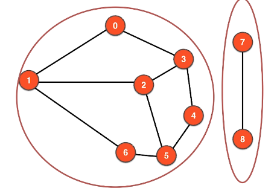
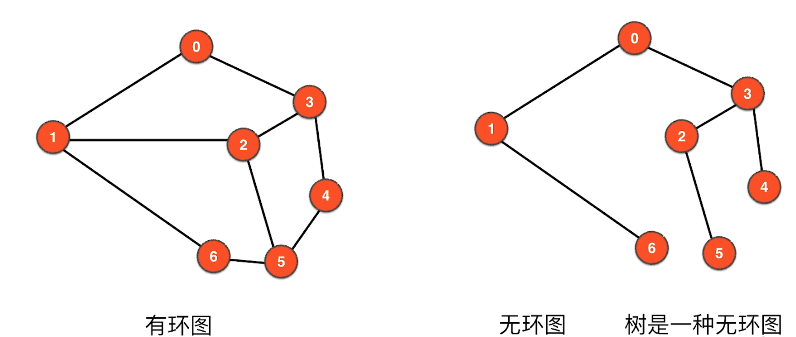
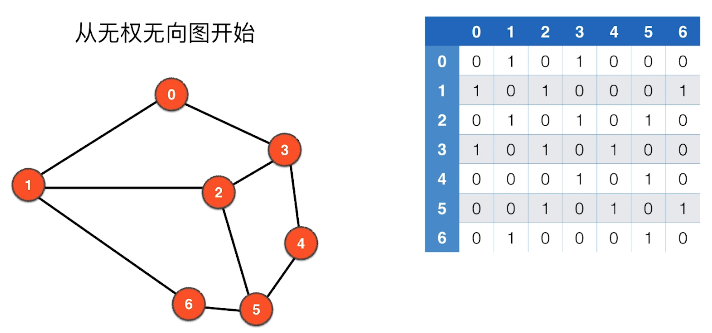
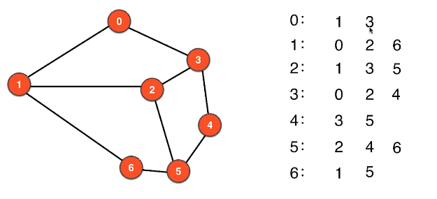
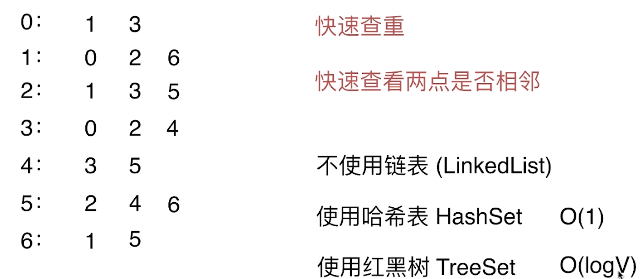
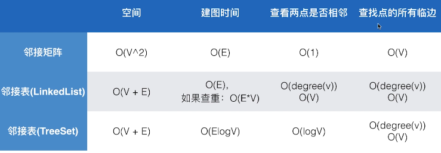

## 图的基本表示

### 图的表示（存储）

- 邻接矩阵
- 邻接表

### 图的分类

图由**顶点**和**边**组成

- 无向图
- 有向图
- 带权图

**可以组合成以下几种情况:**
- 无向无权图
- 无向有权图
- 有向无权图
- 有向有权图


### 图的基本概念

针对于无向无权图

- 两点相邻（两点之间有边）
- 点的邻边（和点相连的边）
- 路径（从A点到点B的路线）
- 环（从A点经过路线之后又回到A点）
- 自环边（从A点直接到A点，自己到自己）
- 平行边（两个顶点之间有两条边，这两条边被称为平行边）


- 联通分量（一张图中互相连接，可以互相抵达的顶点集合称为联通分量）



**一个图的所有顶点不一定全部相连**

**一个图可能有多个联通分量**


没有自环边，没有平行边的图称为**简单图**

- 有环图
- 无环图(树也是一种无环图)




#### 数据结构中的树与图论中树的区别:
数据结构中的树我们会指定一个根结点，但在图论中的树根结点是不唯一的


**树是一种无环图，但无环图不一定是树, 如下图所示，右面的图有两个联通分量，不属于树**

**联通的无环图属于树**


**联通图的生成树,包含图的所有顶点，边的数量为 V-1**


**不是联通图的，就没有生成树，但有生成森林**

**顶点的度**
- 对于无向图，度就是顶点相邻的边


### 图的表示--> 邻接矩阵

使用矩阵表示图（二维数组）:



对于简单图，不存在自环边，所以主对角线的值为0

**对于无向图来说, A[i][j] = 1 的话, A[j][i] 也等于 1**, 即对于无向图，矩阵关于主对角线对称

**邻接矩阵实现图(AdjMatrix.java):**

```
import java.io.File;
import java.io.IOException;
import java.util.Scanner;
import java.util.ArrayList;

public class AdjMatrix {
    private int V;  //顶点的数量
    private int E;  //边的数量
    private int[][] adj;  //使用二维数组表示图的结构

    //构造函数, 从文件中读取数据
    public AdjMatrix(String filename){
        File file = new File(filename);
        try(Scanner scanner = new Scanner(file)){
            V = scanner.nextInt();
            if(V<0){
                throw new IllegalArgumentException("V must be non-negative");
            } 
            adj = new int[V][V];

            E = scanner.nextInt();
            if(V<0){
                throw new IllegalArgumentException("E must be non-negative");
            }
            for(int i = 0; i < E; i++){
                int a = scanner.nextInt();
                validateVertex(a);
                int b = scanner.nextInt();
                validateVertex(b);

                //自环边检测
                if(a == b){
                    throw new IllegalArgumentException("Self Loop is Detected!");
                }
                //平行边检测
                if(adj[a][b] == 1){
                    throw new IllegalArgumentException("Parallel Edges are Detected!");
                }

                adj[a][b] = 1;
                adj[b][a] = 1;
            }
        }
        catch (IOException e){
            e.printStackTrace();
        }
    }

    //判断顶点是否合法的私有接口
    private void validateVertex(int v){
        if(v < 0 || v >= V){
            throw new IllegalArgumentException("vertex " + v + "is invalid");
        }
    }

    //返回顶点数的接口
    public int V(){
        return V;
    }

    //返回边数的接口
    public int E(){
        return E;
    }

    //判断两个顶点之间是否存在边的接口
    public boolean hasEdge(int v, int w){
        validateVertex(v);
        validateVertex(w);
        return adj[v][w] == 1;
    }

    //返回顶点v相邻边的接口
    public ArrayList<Integer> adj(int v){
        validateVertex(v);
        ArrayList<Integer> res = new ArrayList<>();
        for(int i = 0; i < V; i++){
            if(adj[v][i] == 1){
                res.add(i);
            }
        }
        return res;
    }

    //返回一个顶点度的接口
    public int degree(int v){
        return adj(v).size();
    }

    @Override
    public String toString(){
        StringBuilder sb = new StringBuilder();
        sb.append(String.format("V = %d, E = %d\n", V, E));
        for(int i = 0; i < V; i++){
            for(int j = 0; j < V; j++){
                sb.append(String.format("%d ", adj[i][j]));
            }
            sb.append('\n');
        }
        return sb.toString();
    }

    public static void main(String[] args){
        AdjMatrix adjMatrix = new AdjMatrix("g.txt");
        System.out.print(adjMatrix);
    }
}
```

### 图的表示--> 邻接表

邻接矩阵从数据结构的角度来讲，就是一个二维数组，空间复杂度为 `O(V^2)`，时间复杂度为`O(E)`

- V, 表示图的顶点
- E, 表示图的边

**邻接矩阵对于存储稀疏图时的空间复杂是非常高的，求一个点的相邻结点时间复杂度也很高**

- 稀疏图
- 稠密图

**稀疏图和稠密图区分的标准是边的数量**


**完全图，每个顶点都和其他的所有顶点相连接**

**大多数情况下，我们处理的是稀疏图**

#### 邻接表:
图中的每个顶点都对应一条链表，链表中存储的是与该顶点相连的顶点



#### 邻接表实现图(AdjList.java):

```
import java.io.File;
import java.io.IOException;
import java.util.Scanner;
import java.util.LinkedList;

public class AdjList {
    private int V;  //顶点的数量
    private int E;  //边的数量
    private LinkedList<Integer>[] adj;  //使用链表表示图的结构

    //构造函数, 从文件中读取数据
    public AdjList(String filename){
        File file = new File(filename);
        try(Scanner scanner = new Scanner(file)){
            V = scanner.nextInt();
            if(V<0){
                throw new IllegalArgumentException("V must be non-negative");
            } 
            adj = new LinkedList[V];
            for(int i = 0; i < V; i++){
                adj[i] = new LinkedList<Integer>();
            }

            E = scanner.nextInt();
            if(V<0){
                throw new IllegalArgumentException("E must be non-negative");
            }
            for(int i = 0; i < E; i++){
                int a = scanner.nextInt();
                validateVertex(a);
                int b = scanner.nextInt();
                validateVertex(b);

                //自环边检测
                if(a == b){
                    throw new IllegalArgumentException("Self Loop is Detected!");
                }
                //平行边检测
                if(adj[a].contains(b)){
                    throw new IllegalArgumentException("Parallel Edges are Detected!");
                }

                adj[a].add(b);
                adj[b].add(a);
            }
        }
        catch (IOException e){
            e.printStackTrace();
        }
    }

    //判断顶点是否合法的私有接口
    private void validateVertex(int v){
        if(v < 0 || v >= V){
            throw new IllegalArgumentException("vertex " + v + "is invalid");
        }
    }

    //返回顶点数的接口
    public int V(){
        return V;
    }

    //返回边数的接口
    public int E(){
        return E;
    }

    //判断两个顶点之间是否存在边的接口
    public boolean hasEdge(int v, int w){
        validateVertex(v);
        validateVertex(w);
        return adj[v].contains(w);
    }

    //返回顶点v相邻边的接口
    public LinkedList<Integer> adj(int v){
        validateVertex(v);
        return adj[v];
    }

    //返回一个顶点度的接口
    public int degree(int v){
        return adj(v).size();
    }

    @Override
    public String toString(){
        StringBuilder sb = new StringBuilder();
        sb.append(String.format("V = %d, E = %d\n", V, E));
        for(int v = 0; v < V; v++){
            sb.append(String.format("%d : ", v));
            for(int w: adj[v]){
                sb.append(String.format("%d ", w));
            }
            sb.append('\n');
        }
        return sb.toString();
    }

    public static void main(String[] args){
        AdjList adjList = new AdjList("g.txt");
        System.out.print(adjList);
    }
}
```

#### 邻接表的问题

- V 顶点
- E 边

邻接表的空间复杂度 `O(V+E)`

邻接表的时间复杂度:
- 建图: `O(E*V)`
- 查看两点是否相邻: `O(degree(v))`
- 求一个点的相邻顶点: `O(degree(v))`

**把每个顶点相邻顶点的存储结构替换--> 把链表切换为 哈希表或红黑树，提高查找效率**

- 使用哈希表-->  O(1)
- 使用红黑树-->  O(logV)
- `O(1) < O(logn) < O(n)`, 如果 n=100万，则有 `1 < 20 < 1000000`，所以 `O(logn)` 更接近与 `O(1)`



**红黑树和二叉搜索树的升级，保持了数据的有序性，而哈希表不保证数据的有序性**

遍历一个顶点的相邻顶点时数据的有序性更好

**红黑树比哈希表更节省空间**

#### 使用红黑树代替链表来存储与顶点相连的其他顶点(AdjSet.java):

```
import java.io.File;
import java.io.IOException;
import java.util.Scanner;
import java.util.TreeSet;

public class AdjSet {
    private int V;  //顶点的数量
    private int E;  //边的数量
    private TreeSet<Integer>[] adj;  //使用红黑树表示图的结构

    //构造函数, 从文件中读取数据
    public AdjSet(String filename){
        File file = new File(filename);
        try(Scanner scanner = new Scanner(file)){
            V = scanner.nextInt();
            if(V<0){
                throw new IllegalArgumentException("V must be non-negative");
            } 
            adj = new TreeSet[V];
            for(int i = 0; i < V; i++){
                adj[i] = new TreeSet<Integer>();
            }

            E = scanner.nextInt();
            if(V<0){
                throw new IllegalArgumentException("E must be non-negative");
            }
            for(int i = 0; i < E; i++){
                int a = scanner.nextInt();
                validateVertex(a);
                int b = scanner.nextInt();
                validateVertex(b);

                //自环边检测
                if(a == b){
                    throw new IllegalArgumentException("Self Loop is Detected!");
                }
                //平行边检测
                if(adj[a].contains(b)){
                    throw new IllegalArgumentException("Parallel Edges are Detected!");
                }

                adj[a].add(b);
                adj[b].add(a);
            }
        }
        catch (IOException e){
            e.printStackTrace();
        }
    }

    //判断顶点是否合法的私有接口
    private void validateVertex(int v){
        if(v < 0 || v >= V){
            throw new IllegalArgumentException("vertex " + v + "is invalid");
        }
    }

    //返回顶点数的接口
    public int V(){
        return V;
    }

    //返回边数的接口
    public int E(){
        return E;
    }

    //判断两个顶点之间是否存在边的接口
    public boolean hasEdge(int v, int w){
        validateVertex(v);
        validateVertex(w);
        return adj[v].contains(w);
    }

    //返回顶点v相邻边的接口
    //使用矩阵的时候返回的是 ArrayList类型
    //使用链表的时候返回的是 LinkedList类型
    //使用红黑树的时候返回的是 TreeSet类型
    //使用哈希表时返回的是 HashSet类型
    //这样用户就需要关注具体实现细节才能正确使用，所以使用Iterable，使用统一接口
    public Iterable<Integer> adj(int v){
        validateVertex(v);
        return adj[v];
    }

    //返回一个顶点度的接口
    public int degree(int v){
        validateVertex(v);
        return adj[v].size();
    }

    @Override
    public String toString(){
        StringBuilder sb = new StringBuilder();
        sb.append(String.format("V = %d, E = %d\n", V, E));
        for(int v = 0; v < V; v++){
            sb.append(String.format("%d : ", v));
            for(int w: adj[v]){
                sb.append(String.format("%d ", w));
            }
            sb.append('\n');
        }
        return sb.toString();
    }

    public static void main(String[] args){
        AdjSet adjSet = new AdjSet("g.txt");
        System.out.print(adjSet);
    }
}
```

### 图的基本表示的比较

- 邻接矩阵
- 邻接表(LinkedList)
- 邻接表(TreeSet)
- 邻接表(HashSet)



