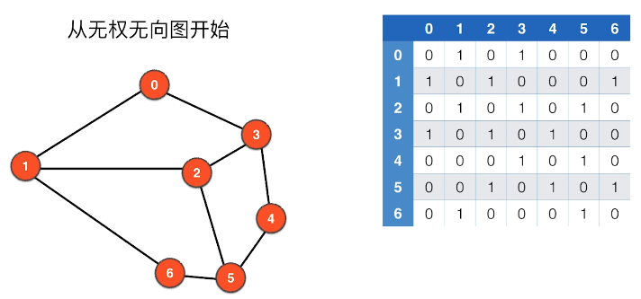

## 图论学习记录

### 图的表示（存储）

- 邻接矩阵
- 邻接表

### 图的分类

图由**顶点**和**边**组成

- 无向图
- 有向图
- 带权图

**可以组合成以下几种情况:**
- 无向无权图
- 无向有权图
- 有向无权图
- 有向有权图


### 图的基本概念

针对于无向无权图

- 两点相邻（两点之间有边）
- 点的邻边（和点相连的边）
- 路径（从A点到点B的路线）
- 环（从A点经过路线之后又回到A点）
- 自环边（从A点直接到A点，自己到自己）
- 平行边（两个顶点之间有两条边，这两条边被称为平行边）


- 联通分量（一张图中互相连接，可以互相抵达的顶点集合称为联通分量）


**一个图的所有顶点不一定全部相连**

**一个图可能有多个联通分量**


没有自环边，没有平行边的图称为**简单图**

- 有环图
- 无环图(树也是一种无环图)


#### 数据结构中的树与图论中树的区别:
数据结构中的树我们会指定一个根结点，但在图论中的树根结点是不唯一的


**树是一种无环图，但无环图不一定是树, 如下图所示，右面的图有两个联通分量，不属于树**

**联通的无环图属于树**


**联通图的生成树,包含图的所有顶点，边的数量为 V-1**


**不是联通图的，就没有生成树，但有生成森林**

**顶点的度**
- 对于无向图，度就是顶点相邻的边


### 图的表示--> 邻接矩阵

使用矩阵表示图（二维数组）:



对于简单图，不存在自环边，所以主对角线的值为0

**对于无向图来说, A[i][j] = 1 的话, A[j][i] 也等于 1**, 即对于无向图，矩阵关于主对角线对称

**邻接矩阵实现图(AdjMatrix.java):**

```
import java.io.File;
import java.io.IOException;
import java.util.Scanner;
import java.util.ArrayList;

public class AdjMatrix {
    private int V;  //顶点的数量
    private int E;  //边的数量
    private int[][] adj;  //使用二维数组表示图的结构

    //构造函数, 从文件中读取数据
    public AdjMatrix(String filename){
        File file = new File(filename);
        try(Scanner scanner = new Scanner(file)){
            V = scanner.nextInt();
            if(V<0){
                throw new IllegalArgumentException("V must be non-negative");
            } 
            adj = new int[V][V];

            E = scanner.nextInt();
            if(V<0){
                throw new IllegalArgumentException("E must be non-negative");
            }
            for(int i = 0; i < E; i++){
                int a = scanner.nextInt();
                validateVertex(a);
                int b = scanner.nextInt();
                validateVertex(b);

                //自环边检测
                if(a == b){
                    throw new IllegalArgumentException("Self Loop is Detected!");
                }
                //平行边检测
                if(adj[a][b] == 1){
                    throw new IllegalArgumentException("Parallel Edges are Detected!");
                }

                adj[a][b] = 1;
                adj[b][a] = 1;
            }
        }
        catch (IOException e){
            e.printStackTrace();
        }
    }

    //判断顶点是否合法的私有接口
    private void validateVertex(int v){
        if(v < 0 || v >= V){
            throw new IllegalArgumentException("vertex " + v + "is invalid");
        }
    }

    //返回顶点数的接口
    public int V(){
        return V;
    }

    //返回边数的接口
    public int E(){
        return E;
    }

    //判断两个顶点之间是否存在边的接口
    public boolean hasEdge(int v, int w){
        validateVertex(v);
        validateVertex(w);
        return adj[v][w] == 1;
    }

    //返回顶点v相邻边的接口
    public ArrayList<Integer> adj(int v){
        validateVertex(v);
        ArrayList<Integer> res = new ArrayList<>();
        for(int i = 0; i < V; i++){
            if(adj[v][i] == 1){
                res.add(i);
            }
        }
        return res;
    }

    //返回一个顶点度的接口
    public int degree(int v){
        return adj(v).size();
    }

    @Override
    public String toString(){
        StringBuilder sb = new StringBuilder();
        sb.append(String.format("V = %d, E = %d\n", V, E));
        for(int i = 0; i < V; i++){
            for(int j = 0; j < V; j++){
                sb.append(String.format("%d ", adj[i][j]));
            }
            sb.append('\n');
        }
        return sb.toString();
    }

    public static void main(String[] args){
        AdjMatrix adjMatrix = new AdjMatrix("g.txt");
        System.out.print(adjMatrix);
    }
}
```


---------------------------

数据结构的表示