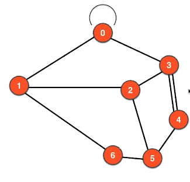
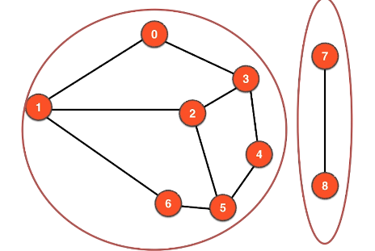
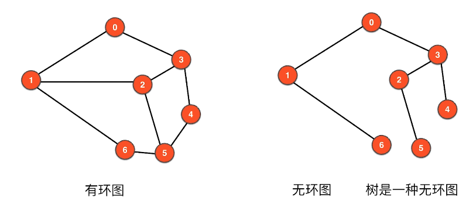
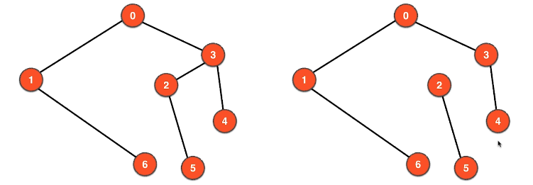
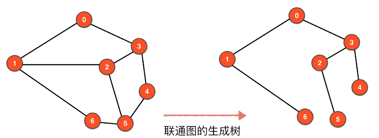

## 图论学习记录

### 图的表示（存储）

- 邻接矩阵
- 邻接表

### 图的分类

图由**顶点**和**边**组成

- 无向图
- 有向图
- 带权图

**可以组合成以下几种情况:**
- 无向无权图
- 无向有权图
- 有向无权图
- 有向有权图

### 图的基本概念

针对于无向无权图

- 两点相邻（两点之间有边）
- 点的邻边（和点相连的边）
- 路径（从A点到点B的路线）
- 环（从A点经过路线之后又回到A点）
- 自环边（从A点直接到A点，自己到自己）
- 平行边（两个顶点之间有两条边，这两条边被称为平行边）

- 联通分量（一张图中互相连接，可以互相抵达的顶点集合称为联通分量）

**一个图的所有顶点不一定全部相连**

**一个图可能有多个联通分量**

没有自环边，没有平行边的图称为**简单图**

- 有环图
- 无环图(树也是一种无环图)

#### 数据结构中的树与图论中树的区别:
数据结构中的树我们会指定一个根结点，但在图论中的树根结点是不唯一的

**树是一种无环图，但无环图不一定是树, 如下图所示，右面的图有两个联通分量，不属于树**

**联通的无环图属于树**

**联通图的生成树,包含图的所有顶点，边的数量为 V-1**

**不是联通图的，就没有生成树，但有生成森林**

**顶点的度**
- 对于无向图，度就是顶点相邻的边

---------------------------

数据结构的表示