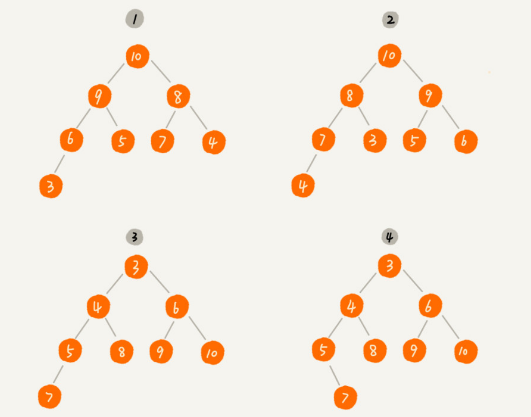
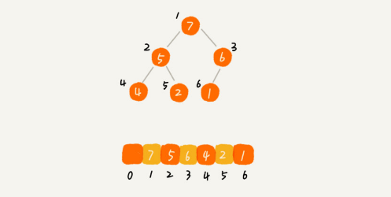
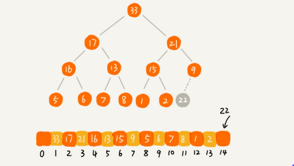
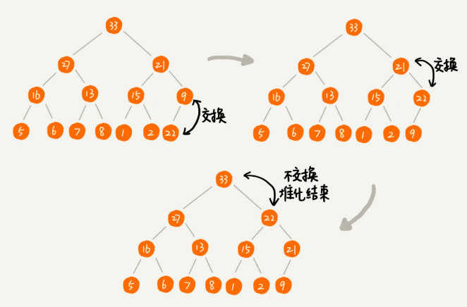
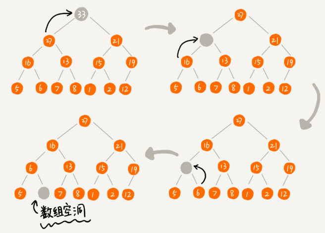
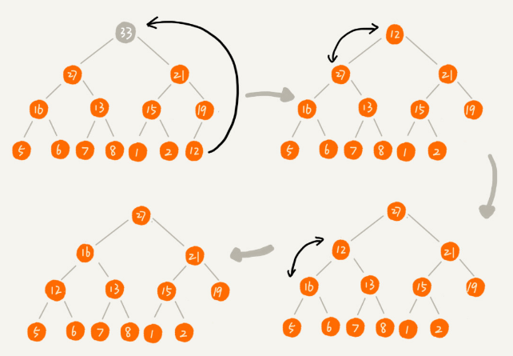

### 堆
堆是一种特殊的树:
- 堆是一个完全二叉树
- 堆中每一个节点的值都必须大于等于（或小于等于）其子树中每个节点的值

**堆必须是一个完全二叉树,完全二叉树要求，除了最后一层，其他层的节点个数都是满的，最后一层的节点都靠左排列**

**堆中的每个节点的值必须大于等于（或者小于等于）其子树中每个节点的值。实际上，我们还可以换一种说法，堆中每个节点的值都大于等于（或者小于等于）其左右子节点的值。这两种表述是等价的**

对于每个节点的值都大于等于子树中每个节点值的堆，我们叫做**大顶堆**

对于每个节点的值都小于等于子树中每个节点值的堆，我们叫做**小顶堆**



其中第 1 个和第 2 个是大顶堆，第 3 个是小顶堆，第 4 个不是堆。除此之外，从图中还可以看出来，对于同一组数据，我们可以构建多种不同形态的堆

### 如何实现一个堆

**完全二叉树比较适合用数组来存储。用数组来存储完全二叉树是非常节省存储空间的。因为我们不需要存储左右子节点的指针，单纯地通过数组的下标，就可以找到一个节点的左右子节点和父节点**



从图中我们可以看到，数组中下标为 `i` 的节点的左子节点，就是下标为 `i∗2` 的节点，右子节点就是下标为 `i∗2+1` 的节点，父节点就是下标为 `i/2` 的节点

### 往堆中插入一个元素

往堆中插入一个元素后，我们需要继续满足堆的两个特性



如果我们把新插入的元素放到堆的最后，是不是不符合堆的特性了？于是，我们就需要进行调整，让其重新满足堆的特性，这个过程我们起了一个名字，就叫做**堆化**（heapify）

**从下往上的堆化:**

堆化非常简单，就是顺着节点所在的路径，向上或者向下，对比，然后交换



我们可以让新插入的节点与父节点对比大小。如果不满足子节点小于等于父节点的大小关系，我们就互换两个节点。一直重复这个过程，直到父子节点之间满足刚说的那种大小关系

```
public class Heap {
  private int[] a; // 数组，从下标1开始存储数据
  private int n;  // 堆可以存储的最大数据个数
  private int count; // 堆中已经存储的数据个数

  public Heap(int capacity) {
    a = new int[capacity + 1];
    n = capacity;
    count = 0;
  }

  public void insert(int data) {
    if (count >= n) return; // 堆满了
    ++count;
    a[count] = data;
    int i = count;
    while (i/2 > 0 && a[i] > a[i/2]) { // 自下往上堆化
      swap(a, i, i/2); // swap()函数作用：交换下标为i和i/2的两个元素
      i = i/2;
    }
  }
 }
```

### 删除堆顶元素

任何节点的值都大于等于（或小于等于）子树节点的值，我们可以发现，**堆顶元素存储的就是堆中数据的最大值或者最小值**

假设我们构造的是大顶堆，堆顶元素就是最大的元素。当我们删除堆顶元素之后，就需要把第二大的元素放到堆顶，那第二大元素肯定会出现在左右子节点中。然后我们再迭代地删除第二大节点，以此类推，直到叶子节点被删除



可以看出，最后堆化出来的堆并不满足完全二叉树的特性

实际上，我们稍微改变一下思路，就可以解决这个问题。**我们把最后一个节点放到堆顶，然后利用同样的父子节点对比方法。对于不满足父子节点大小关系的，互换两个节点，并且重复进行这个过程，直到父子节点之间满足大小关系为止。这就是从上往下的堆化方法**



```
public void removeMax() {
  if (count == 0) return -1; // 堆中没有数据
  a[1] = a[count];
  --count;
  heapify(a, count, 1);
}

private void heapify(int[] a, int n, int i) { // 自上往下堆化
  while (true) {
    int maxPos = i;
    if (i*2 <= n && a[i] < a[i*2]) maxPos = i*2;
    if (i*2+1 <= n && a[maxPos] < a[i*2+1]) maxPos = i*2+1;
    if (maxPos == i) break;
    swap(a, i, maxPos);
    i = maxPos;
  }
}
```

个包含 `n` 个节点的完全二叉树，树的高度不会超过 `log2^​n`。堆化的过程是顺着节点所在路径比较交换的，所以堆化的时间复杂度跟树的高度成正比，也就是 `O(logn)`。插入数据和删除堆顶元素的主要逻辑就是**堆化**，所以，往堆中插入一个元素和删除堆顶元素的时间复杂度都是 `O(logn)`


### 如何基于堆实现排序

这里我们借助于堆这种数据结构实现的排序算法，就叫做堆排序。这种排序方法的时间复杂度非常稳定，是 `O(nlogn)`，并且它还是原地排序算法

我们可以把堆排序的过程大致分解成两个大的步骤:
1. 建堆
2. 排序


