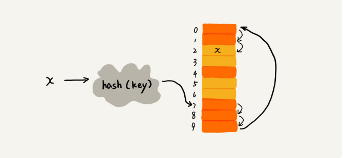
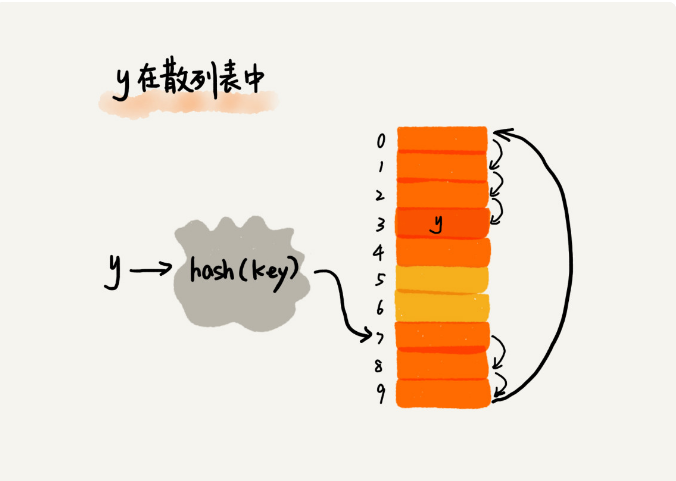
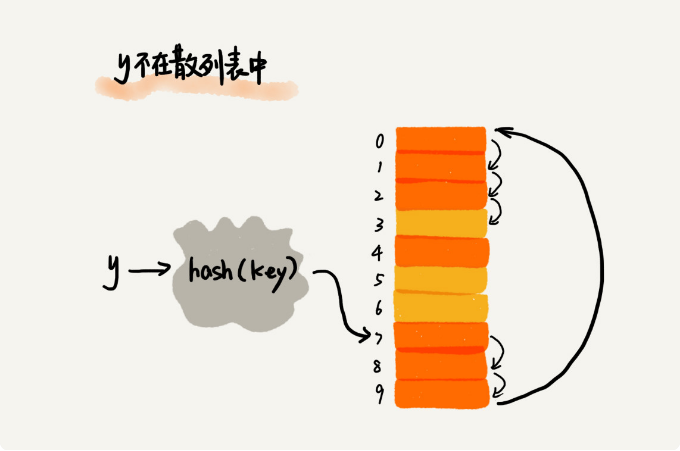
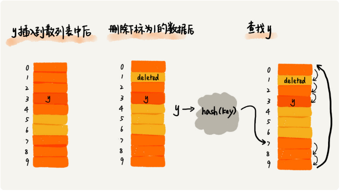
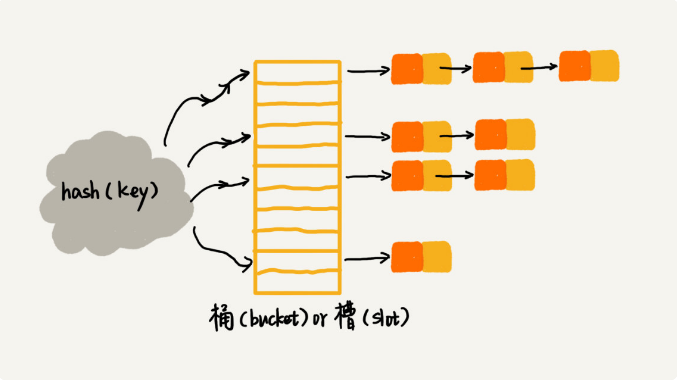

散列表的英文叫`Hash Table`，我们平时也叫它**哈希表**或者**Hash 表**

**散列表用的是数组支持按照下标随机访问数据的特性，所以散列表其实就是数组的一种扩展，由数组演化而来。可以说，如果没有数组，就没有散列表**

### 散列思想

散列表用的就是数组支持按照下标随机访问的时候，时间复杂度是 `O(1)` 的特性。我们通过散列函数把元素的键值映射为下标，然后将数据存储在数组中对应下标的位置。当我们按照键值查询元素时，我们用同样的散列函数，将键值转化数组下标，从对应的数组下标的位置取数据

### 散列函数

散列函数，顾名思义，它是一个函数。我们可以把它定义成 `hash(key)`，其中 `key` 表示元素的键值，`hash(key)` 的值表示经过散列函数计算得到的散列值

### 该如何构造散列函数呢

1. 散列函数计算得到的散列值是一个非负整数, 因为数组下标是从 0 开始的，所以散列函数生成的散列值也要是非负整数
2. 如果 `key1 = key2`，那 `hash(key1) == hash(key2)`, 相同的 `key`，经过散列函数得到的散列值也应该是相同的
3. 如果 `key1 ≠ key2`，那 `hash(key1) ≠ hash(key2)`, 这个要求看起来合情合理，但是在真实的情况下，要想找到一个不同的 `key` 对应的散列值都不一样的散列函数，几乎是不可能的。即便像业界著名的`MD5、SHA、CRC`等哈希算法，也无法完全避免这种散列冲突。而且，因为数组的存储空间有限，也会加大散列冲突的概率

所以我们几乎无法找到一个完美的无冲突的散列函数，即便能找到，付出的时间成本、计算成本也是很大的，所以针对散列冲突问题，我们需要通过其他途径来解决

### 散列冲突

再好的散列函数也无法避免散列冲突。那究竟该如何解决散列冲突问题呢？我们常用的散列冲突解决方法有两类，**开放寻址法（open addressing）和链表法（chaining）**

#### 1. 开放寻址法

开放寻址法的核心思想是，如果出现了散列冲突，我们就重新探测一个空闲位置，将其插入

**那如何重新探测新的位置呢？**

*线性探测*: 当我们往散列表中插入数据时，如果某个数据经过散列函数散列之后，存储位置已经被占用了，我们就从当前位置开始，依次往后查找，看是否有空闲位置，直到找到为止

从图中可以看出，散列表的大小为 10，在元素 x 插入散列表之前，已经 6 个元素插入到散列表中。x 经过 Hash 算法之后，被散列到位置下标为 7 的位置，但是这个位置已经有数据了，所以就产生了冲突。于是我们就顺序地往后一个一个找，看有没有空闲的位置，遍历到尾部都没有找到空闲的位置，于是我们再从表头开始找，直到找到空闲位置 2，于是将其插入到这个位置

**在散列表中查找元素的过程有点儿类似插入过程。我们通过散列函数求出要查找元素的键值对应的散列值，然后比较数组中下标为散列值的元素和要查找的元素。如果相等，则说明就是我们要找的元素；否则就顺序往后依次查找。如果遍历到数组中的空闲位置，还没有找到，就说明要查找的元素并没有在散列表中**

散列表跟数组一样，不仅支持插入、查找操作，还支持删除操作。对于使用线性探测法解决冲突的散列表，删除操作稍微有些特别。我们不能单纯地把要删除的元素设置为空。这是为什么呢？

还记得我们刚讲的查找操作吗？在查找的时候，一旦我们通过线性探测方法，找到一个空闲位置，我们就可以认定散列表中不存在这个数据。但是，如果这个空闲位置是我们后来删除的，就会导致原来的查找算法失效。本来存在的数据，会被认定为不存在。这个问题如何解决呢？

我们可以将删除的元素，特殊标记为 deleted。当线性探测查找的时候，遇到标记为 deleted 的空间，并不是停下来，而是继续往下探测

**你可能已经发现了，线性探测法其实存在很大问题。当散列表中插入的数据越来越多时，散列冲突发生的可能性就会越来越大，空闲位置会越来越少，线性探测的时间就会越来越久。极端情况下，我们可能需要探测整个散列表，所以最坏情况下的时间复杂度为 O(n)。同理，在删除和查找时，也有可能会线性探测整张散列表，才能找到要查找或者删除的数据**

对于开放寻址冲突解决方法，除了线性探测方法之外，还有另外两种比较经典的探测方法，**二次探测（Quadratic probing）和双重散列（Double hashing）**

所谓二次探测，跟线性探测很像，线性探测每次探测的步长是 1，那它探测的下标序列就是 `hash(key)+0，hash(key)+1，hash(key)+2` 而二次探测探测的步长就变成了原来的二次方，也就是说，它探测的下标序列就是 `hash(key)+0，hash(key)+1^2，hash(key)+2^2`

所谓双重散列，意思就是不仅要使用一个散列函数。我们使用一组散列函数 `hash1(key)，hash2(key)，hash3(key)……`我们先用第一个散列函数，如果计算得到的存储位置已经被占用，再用第二个散列函数，依次类推，直到找到空闲的存储位置

管采用哪种探测方法，当散列表中空闲位置不多的时候，散列冲突的概率就会大大提高。为了尽可能保证散列表的操作效率，一般情况下，我们会尽可能保证散列表中有一定比例的空闲槽位。我们用**装载因子**（load factor）来表示空位的多少

#### 2. 链表法

链表法是一种更加常用的散列冲突解决办法，相比开放寻址法，它要简单很多。我们来看这个图，在散列表中，每个**桶（bucket）”或者“槽（slot）**会对应一条链表，所有散列值相同的元素我们都放到相同槽位对应的链表中

当插入的时候，我们只需要通过散列函数计算出对应的散列槽位，将其插入到对应链表中即可，所以插入的时间复杂度是 `O(1)`。当查找、删除一个元素时，我们同样通过散列函数计算出对应的槽，然后遍历链表查找或者删除。那查找或删除操作的时间复杂度是多少呢？

实际上，这两个操作的时间复杂度跟链表的长度 k 成正比，也就是 `O(k)`。对于散列比较均匀的散列函数来说，理论上讲，`k=n/m`，其中 `n` 表示散列中数据的个数，`m` 表示散列表中**槽**的个数

### 阶段小结

散列表来源于数组，它借助散列函数对数组这种数据结构进行扩展，利用的是数组支持按照下标随机访问元素的特性。散列表两个核心问题是**散列函数设计和散列冲突解决**。散列冲突有两种常用的解决方法，**开放寻址法和链表法**。散列函数设计的好坏决定了散列冲突的概率，也就决定散列表的性能

