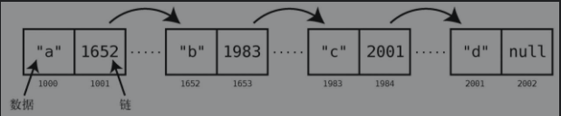

## 数据结构为何重要
哪怕只写过几行代码的人都会发现，编程基本上就是在跟数据打交道。计算机程序总是在接收数据、操作数据或返回数据

**数据结构**则是指数据的组织形式

**数据结构**不只是用于组织数据，它还极大地影响着代码的运行速度。因为数据结构不同，程序的运行速度可能相差多个数量级。如果你写的程序要处理大量的数据，或者要让数千人同时使用，那么你采用何种数据结构，将决定它是能够运行，还是会因为不堪重负而崩溃

一旦对各种数据结构有了深刻的理解，并明白它们对程序性能方面的影响，你就能写出快速而优雅的代码，从而使软件运行得快速且流畅。当然，你的编程技能也会更上一层楼

### 基础数据结构: 数组
**数组**是计算机科学中最基本的数据结构之一

若想了解某个数据结构的性能，得分析程序怎样操作这一数据结构

一般数据结构都有以下4种操作:
- 读取
- 查找
- 插入
- 删除

第一个重要理论: ***操作的速度，并不按时间计算，而是按步数计算**

因为，你不可能很绝对地说，某项操作要花5秒。它在某台机器上要跑5秒，但换到一台旧一点的机器，可能就要多于5秒，而换到一台未来的超级计算机，运行时间又将显著缩短。所以，受硬件影响的计时方法，非常不可靠

然而，若按步数来算，则确切得多。如果A操作要5步，B操作要500步，那么我们可以很肯定地说，无论是在什么样的硬件上对比，A都快过B。因此，衡量步数是分析速度的关键

此外，操作的速度，也常被称为**时间复杂度**。在本书中，我们会提到速度、时间复杂度、效率、性能，但它们其实指的都是*步数**

在数组中，这种逐个去检查的做法，就是最基本的查找方法——**线性查找**


### 集合: 一条规则决定性能
集合：**它是一种不允许元素重复的数据结构**

其实集合是有不同形式的，但现在我们只讨论基于数组的那种。这种集合跟数组差不多，都是一个普通的元素列表，唯一的区别在于，**集合不允许插入重复的值**

集合就是用于确保数据不重复

**理解数据结构的性能，关键在于分析操作所需的步数**

## 算法为何重要
数据结构确定了，代码的速度也还会受另一重要因素影响，那就是**算法**

**算法只是解决某个问题的一套流程**

不同的数据结构有不同的时间复杂度，类似地，不同的算法(即使是用在同一种数据结构上)也有不同的时间复杂度。既然我们已经学会了**时间复杂度**的分析方法，那么现在就可以用它来对比各种算法，找出能够发挥代码极限性能的那个

### 有序数组
有序数组跟上面讨论的数组几乎一样，唯一区别就是有序数组要求其值总是保持有序。即每次插入新值时，它会被插入到适当的位置，使整个数组的值仍然按顺序排列。常规的数组则并不考虑是否有序，直接把值加到末尾也没问题

往有序数组中插入新值，需要先做一次查找以确定插入的位置。这是它跟常规数组的关键区别(在性能方面)之一

虽然插入的性能比不上常规数组，但在查找方面，有序数组却有着特殊优势

### 查找有序数组
上面介绍了常规数组的查找方式：从左至右，逐个格子检查，直至找到。这种方式称为**线性查找**

接下来看看有序数组的线性查找跟常规数组有何不同:
- 设一个常规数组`[17,3,75,202,80]`，如果想在里面查找`22`（其实并不存在），那你就得逐个元素去检查，因为`22`可能在任何一个位置上。要想在到达末尾之前结束检查，那么所找的值必须在末尾之前出现
- 然而对于有序数组来说，即便它不包含要找的值，我们也可以提早停止查找。假设要在有序数组`[3,17,75,80,202]`里查找`22`，我们可以在查到`75`的时候就结束，因为`22`不可能出现在`75`的右边

Go语言实现有序数组线性查找:
```
package main

import "fmt"

func linear_search(arr []int, val int) int {
	if len(arr) == 0 {
		return -1
	}
	for _, v := range arr {
		if v == val {
			return val
		} else if v > val {
			break
		}
	}
	return -1
}

func main() {
	arr := []int{3, 17, 75, 80, 202}
	value := linear_search(arr, 80)
	fmt.Println(value)
}
```

因此，有序数组的线性查找大多数情况下都会快于常规数组。除非要找的值是最后那个，或者比最后的值还大，那就只能一直查到最后了

只看到这里的话，可能你还是不会觉得两种数组在性能上有什么巨大区别

至今我们提到的查找有序数组的方法就只有**线性查找**。但其实，**线性查找**只不过是查找算法的其中一种而已

有序数组相比常规数组的一大优势就是它可以使用另一种查找算法。此种算法名为**二分查找**，它比线性查找要快得多

### 二分查找
有序数组相比常规数组的一大优势就是它除了可以用线性查找，还可以用**二分查找**。常规数组因为无序，所以不可能运用二分查找

```
package main

import "fmt"

func binarySearch(arr []int, k int) int {
	l := 0
	r := len(arr) - 1

	for l <= r {
		mid := (l + r) / 2
		if k == arr[mid] {
			return mid
		}
		if k < arr[mid] {
			r = mid - 1
		} else {
			l = mid + 1
		}
	}
	return -1
}

func main() {
	arr := []int{3, 17, 75, 80, 202}
	value := binarySearch(arr, 80)
	fmt.Println(value)
}
```

### 二分查找与线性查找
对于长度太小的有序数组，二分查找并不比线性查找好多少。但我们来看看更大的数组:

对于拥有100个值的数组来说，两种查找需要的最多步数如下所示:
- 线性查找,100步
- 二分查找,7步

**二分查找会在每次猜测后排除掉一半的元素**

不过还要记住，有序数组并不是所有操作都比常规数组要快。如你所见，它的插入就相对要慢。衡量起来，虽然插入是慢了一些，但查找却快了许多。还是那句话，**你得根据应用场景来判断哪种更合适**


----------------

很多时候，计算一样东西并不只有一种方法，换种算法可能会极大地影响程序的性能

同时你还应意识到，世界上并没有哪种适用于所有场景的数据结构或者算法。你不能因为有序数组能使用二分查找就永远只用有序数组。在经常插入而很少查找的情况下，显然插入迅速的常规数组会是更好的选择

如之前所述，比较算法的方式就是**比较各自的步数**

下面，我们将会学习如何规范地描述数据结构和算法的时间复杂度。有了这种通用的表达方式，就能更容易地观察出哪种算法符合我们的实际需求

## 大 O 记法
从之前的内容中得知，影响算法性能的主要因素是其所需的**步数**

量化线性查找效率的更准确的方式应该是:**对于具有n个元素的数组，线性查找最多需要n步**

为了方便表达数据结构和算法的**时间复杂度**，计算机科学家从数学界借鉴了一种简洁又通用的方式，那就是`大O记法`。这种规范化语言使得我们可以轻松地指出一个算法的性能级别，也令学术交流变得简单

掌握了`大O记法`，就掌握了算法分析的专业工具

### 大O:数步数
为了统一描述，`大O`不关注算法所用的时间，只关注其所用的**步数**

数组不论多大，读取都只需1步。用`大O记法`来表示，就是: `O(1)`

`O(1)`意味着一种算法无论面对多大的数据量，其步数总是相同的。就像无论数组有多大，读取元素都只要1步。这1步在旧机器上也许要花20分钟，而用现代的硬件却只要1纳秒。但这两种情况下，读取数组都是1步

下面研究一下`大O记法`如何描述线性查找的效率。回想一下，线性查找在数组上要逐个检查每个格子。在最坏情况下，线性查找所需的步数等于格子数。即如前所述：对于n个元素的数组，线性查找需要花n步,用`大O记法`来表示，即为: `O(n)`

### 常数时间与线性时间
从 `O(n)`可以看出，`大O记法`不只是用固定的数字（如22、440）来表示算法的步数，而是基于要处理的数据量来描述算法所需的步数。或者说，`大O`解答的是这样的问题：当数据增长时，步数如何变化?

`O(n)`算法所需的步数等于数据量，意思是当数组增加一个元素时，`O(n)`算法就要增加1步。而`O(1)`算法无论面对多大的数组，其步数都不变

`O(n)`呈现为一条对角线。当数据增加一个单位时，算法也随之增加一步。也就是说，数据越多，算法所需的步数就越多。`O(n)`也被称为**线性时间**

相比之下，`O(1)`则为一条水平线，因为不管数据量是多少，算法的步数都恒定。所以，`O(1)`也被称为**常数时间**

因为不管数据量怎样变化，算法的步数都恒定，所以这也是常数时间，也可以表示为`O(1)`。虽然从技术上来说它需要3步而不是1步，但`大O记法`并不纠结于此。简单来说，**O(1)就是用来表示所有数据增长但步数不变的算法**

### 同一算法，不同场景
线性查找并不总是`O(n)`的。当要找的元素在数组末尾，那确实是`O(n)`。但如果它在数组开头，1步就能找到的话，那么技术上来说应该是`O(1)`。所以概括来说，线性查找的最好情况是`O(1)`，最坏情况是`O(n)`

虽然`大O`可以用来表示给定算法的最好和最坏的情景，但若无特别说明，`大O记法`一般都是指最坏情况。因此尽管线性查找有`O(1)`的最好情况，但大多数资料还是把它归类为`O(n)`

这种悲观主义其实是很有用的:知道各种算法会差到什么程度，能使我们做好最坏打算，以选出最适合的算法

### 第三种算法
在同一个有序数组里，二分查找比线性查找要快。下面就来看看如何用`大O记法`描述二分查找

它不能写成 `O(1)`，因为二分查找的步数会随着数据量的增长而增长。它也不能写成 `O(n)`，因为步数比元素数量要少得多，包含100个元素的数组只要7步就能找完

看来，二分查找的时间复杂度介于`O(1)`和`O(n)`之间

二分查找的大O记法是: `O(logn)`, 归于此类的算法，它们的时间复杂度都叫作**对数时间**

简单来说，`O(logn)`意味着该算法当数据量翻倍时，步数加1。这确实符合之前我们所介绍的**二分查找**

到这里我们所提过的3种时间复杂度，按照效率由高到低来排序的话，会是这样:
1. O(1)
2. O(logn)
3. O(n)


### 对数
**对数是指数的反函数**，所以我们先回顾一下指数

`2^3` 等于: `2*2*2`, 结果为 `8`

`log2^8`则将上述计算反过来，它意思是：**要把2乘以自身多少次，才能得到8**。因为需要3次，所以，`log2^8=3`


### 解释O(logn)
现在回到`大O记法`。当我们说`O(logn)`时，其实指的是`O(log2^n)`，不过为了方便就省略了2而已

你应该还记得O(n)代表算法处理n个元素需要n步。如果元素有8个，那么这种算法就需要8步

`O(logn)`则代表算法处理n个元素需要`log2^n`步。如果有8个元素，那么这种算法需要3步，因为`log2^8=3`


从另一个角度来看，如果要把8个元素不断地分成两半，那么得拆分3次才能拆到只剩1个元素

这正是二分查找所干的事情。它就是不断地将数组拆成两半，直至范围缩小到只剩你要找的那个元素

简单来说，O(log2^N)算法的步数等于二分数据直至元素剩余1个的次数

下表是`O(N)`和`O(log2^N)`的效率对比:


每次数据量翻倍时，`O(N)`算法的步数也跟着翻倍，`O(log2^N)`算法却只需加1

---------

学会`大O记法`，我们在比较算法时就有了一致的参考系。有了它，我们就可以在现实场景中测量各种数据结构和算法，写出更快的代码，更轻松地应对高负荷的环境

## 运用大O来给代码提速
`大O记法`能客观地衡量各种算法的时间复杂度，是比较算法的利器。我们也试过用它来对比二分查找和线性查找的步数差异，发现二分查找的步数为`O(log2^N)`，比线性查找的`O(N)`快得多

然而，写代码的时候并不总有这样明确的二选一，更多时候你可能就直接采用首先想到的那种算法了。不过有了`大O`的话，你就可以与其他常用的算法比较，然后问自己:**我的算法跟它们相比，是快还是慢?**

如果你通过`大O`发现自己的算法比其他的要慢，你就应该退一步，好好想想怎样优化它，才能使它变成更快的那种`大O`。虽然并不总有提升空间，但在确定编码之前多加考虑还是好的

### 冒泡排序
**排序算法**是计算机科学中被广泛研究的一个课题

如何将一个无序的数字数组整理成升序？

**冒泡排序**是一种很基本的排序算法，步骤如下:

1. 指向数组中两个相邻的元素,最开始是数组的头两个元素,比较它们的大小
2. 如果它们的顺序错了,即左边的值大于右边,就互换位置
3. 将两个指针右移一格,重复第(1)步和第(2)步，直至指针到达数组末尾
4. 重复第(1)至(3)步，直至从头到尾都无须再做交换，这时数组就排好序了

这里被重复的第(1)至(3)步是一个轮回，也就是说，这个算法的主要步骤被“轮回”执行，直到整个数组的顺序正确

### 冒泡排序实战

```
package main

import "fmt"

func bubbleSort(arr []int) []int {
	for i := 0; i < len(arr)-1; i++ {
		//本循环代表外层将要与哪一位做比较
		for k := i + 1; k < len(arr); k++ {
			if arr[i] > arr[k] {
				arr[i], arr[k] = arr[k], arr[i]
			}
		}
	}
	return arr
}

func main() {
	arr := []int{56, 2, 1, 3, 17, 75, 80, 202}
	value := bubbleSort(arr)
	fmt.Println(value)
}
```

每一次轮回过后，未排序的值中最大的那个都会冒到正确的位置上

### 冒泡排序的效率

冒泡排序的执行步骤可分为两种:
- 比较, 比较两个数看哪个更大
- 交换, 交换两个数的位置以使它们按顺序排列

描述冒泡排序效率的**大O记法**，是`O(N^2)`

`O(N^2)`算法是比较低效的，随着数据量变多，其步数也剧增

`O(N^2)`也被叫作**二次时间**

### 二次问题
N个元素要比较N2次。因为外层循环需要N步来遍历数组，而这里的每1步，又会发起内层循环去用N步遍历数组。所以N步乘以N步等于`N^2`步

毫无疑问，**嵌套循环算法**的效率就是`O(N^2)`。一旦看到嵌套循环，你就应该马上想到`O(N^2)`

此时,应意识到它的`O(N^2)`意味着低效。当遇到低效的算法时，我们都应该花些时间思考下有没有更快的做法。特别是当数据量巨大的时候，优化不足的应用甚至可能会突然挂掉。尽管这可能已经是最佳方案，但你还是要确认一下

### 线性解决
我们知道`O(N)`远远快于`O(N^2)`, 所以我们应该想办法把 `O(N^2)` 优化到 `O(N)`

----------------

毫无疑问，熟悉**大O记法**能使我们发现低效的代码，有助于我们挑选出更快的算法。然而，偶尔也会有两种算法的`大O`相同，但实际上二者快慢不一的情况

## 用或不用大O来优化代码

`大O`是一种能够比较算法效率，并告诉我们在特定环境下应采用何种算法的伟大工具。但我们不能完全依赖于它。因为有时候即使两种算法的`大O`记法完全一样，但实际上其中一个比另一个要快得多

### 选择排序

上一章分析了冒泡排序算法，其效率是`O(N^2)`。现在我们再来探索另一种排序算法，选择排序，并将它跟冒泡排序对比一下

选择排序的步骤如下:
1. 从左至右检查数组的每个格子，找出值最小的那个,在此过程中，我们会用一个变量来记住检查过的数字的最小值,如果一个格子中的数字比记录的最小值还要小，就把变量改成该格子的索引
2. 知道哪个格子的值最小之后，将该格与本次检查的起点交换,第1次检查的起点是索引0，第2次是索引1，以此类推
3. 重复第(1) (2)步，直至数组排好序

### 选择排序实战

选择排序的原理:**每次从余下的数中找最小的，并排到余下的数的最开头**

```
package main

import "fmt"

func selectSort(arr []int) []int {
	if len(arr) <= 1 {
		return nil
	}

	for i := 0; i < len(arr); i++ {
		min := i //初始的最小值位置从0开始，一次向右

		//从i右侧的所有元素中找出当前最小值所在的下标
		for j := len(arr) - 1; j > i; j-- {
			if arr[j] < arr[i] {
				min = j
			}
		}

		//把每次找出来的最小值与之前的最小值交换
		arr[i], arr[min] = arr[min], arr[i]
	}
	return arr
}

func main() {
	arr := []int{56, 2, 1, 3, 17, 75, 80, 202}
	value := selectSort(arr)
	fmt.Println(value)
}
```

### 选择排序的效率

选择排序的步骤可分为两类：**比较和交换**，也就是在每轮检查中把未排序的值跟该轮已遇到的最小值做比较，以及将最小值与该轮起点的值交换以使其位置正确

选择排序每轮的交换最多只有1次。如果该轮的最小值已在正确位置，就无须交换，否则要做1次交换。相比之下，冒泡排序在最坏情况（完全逆序）时，每次比较过后都要进行1次交换

下表为冒泡排序和选择排序的并列对比:


从表中可以清晰地看到，选择排序的步数大概只有冒泡排序的一半，即选择排序比冒泡排序快一倍

### 忽略常数
但有趣的是，选择排序的`大O记法`跟冒泡排序是一样的

还记得我们说过，`大O记法`用来表示步数与数据量的关系。所以你可能会以为步数约为`N^2`的一半的选择排序，其`大O`会写成`O(N^2/2)`，以表示N个元素需要`N^2/2`步

但事实上，选择排序的大O记法为`O(N^2)`，跟冒泡排序一样。这是因为大O记法的一条重要规则我们至今还没提到: **大O记法忽略常数**

### 大O的作用
尽管不能比较冒泡排序和选择排序，大O还是很重要的，因为它能够区分不同算法的长期增长率。当数据量达到一定程度时，`O(N)`的算法就会永远快过 `O(N^2)`，无论这个 `O(N)`实际上是`O(2N)`还是`O(100N)`。即使是`O(100N)`，这个临界点也是存在的

即使两种算法的大O记法一样，但实际速度也可能并不一样。虽然选择排序比冒泡排序快1倍，但它们的大O记法都是`O(N^2)`。因此，大O记法非常适合用于不同大 O分类下的算法的对比，对于大O同类的算法，我们还需要进一步的解析才能分辨出具体差异


----------------

现在我们已经掌握了一些非常强大的算法分析手法。我们能够使用大O去判断各种算法的效率，即便两种算法的大O记法一样，也知道如何对比它们

## 乐观地调优

之前我们衡量一个算法的效率时，都是着眼于它在最坏情况下需要多少步。原因很简单，连最坏的情况都做足准备了，其他情况自然不在话下

### 插入排序

我们已经学过两种排序算法：**冒泡排序和选择排序**。虽然它们的效率都是`O(N^2)`，但其实选择排序比冒泡排序快一倍。现在来学第三种排序算法,插入排序。你会发现，顾及最坏情况以外的场景将是多么有用


插入排序包括以下步骤:
1. 在第一轮里，暂时将索引1的值移走，并用一个临时变量来保存它。这使得该索引处留下一个空隙，因为它不包含值.(在之后的轮回，我们会移走后面索引的值)
2. 接着便是平移阶段，我们会拿空隙左侧的每一个值与临时变量的值进行比较,如果空隙左侧的值大于临时变量的值，则将该值右移一格,随着值右移，空隙会左移。如果遇到比临时变量小的值，或者空隙已经到了数组的最左端，就结束平移阶段
3. 将临时移走的值插入当前空隙
4. 重复第(1)至(3)步，直至数组完全有序


### 插入排序实战

插入排序算法原理：**顺序从序列中取一个数与左侧的元素们做比较，如果左侧的元素比取的数大，就向右移，直到把取的数插入到不小于左侧元素的位置处,然后接着循环**

```
package main

import "fmt"

func insertSort(arr []int) []int {
	if len(arr) <= 1 {
		return nil
	}

	for i := 1; i < len(arr); i++ {
		tmp := arr[i] //从第2个位置开始，从左向右依此取数
		key := i - 1

		//每次取到的数都跟左侧的数做比较，如果左侧的数比取的数大，就将左侧的数右移一位，直至左侧没有数字比取的数大为止
		for key >= 0 && tmp < arr[key] {
			arr[key+1] = arr[key]
			key--
		}

		//将取到的数插入到不小于左侧数的位置
		if key+1 != i {
			arr[key+1] = tmp
		}
	}

	return arr
}

func main() {
	arr := []int{80, 202, 56, 2, 1, 3, 17, 75}
	value := insertSort(arr)
	fmt.Println(value)
}
```

### 插入排序的效率
插入排序包含4种步骤：**移除、比较、平移和插入**。要分析插入算法的效率，就得把每种步骤都统计一遍

你会发现，在最坏的情况里，插入排序的时间复杂度跟冒泡排序、选择排序一样，都是`O(N^2)`

### 平均情况
确实，在最坏情况里，选择排序比插入排序快。但是我们还应该考虑平均情况

------------

懂得区分最好、平均、最坏情况，是为当前场景选择最优算法以及给现有算法调优以适应环境变化的关键。记住，虽然为最坏情况做好准备十分重要，但大部分时间我们面对的是平均情况


## 查找迅速的散列表
名为**散列表**的数据结构，只用`O(1)`步就能找出数据

理解此数据结构的原理以及其适用场景，你就能依靠其快速查找的能力来应对各种状况

### 探索散列表
大多数编程语言都自带散列表这种能够快速读取的数据结构。但在不同的语言中，它有不同的名字，除了散列表，还有散列、映射、散列映射、字典、关联数组

散列表由一对对的数据组成。一对数据里，一个叫作键，另一个叫作值。键和值应该具有某种意义上的关系

### 用散列函数来做散列

一个散列函数需满足以下条件才有效：每次对同一字符串调用该散列函数，返回的都应是同一数字串。如果每次都返回不一样的结果，那就无效

从散列表里读取数据只需要 O(1), 因为其过程所花的时间是恒定的。它总是先计算出键的散列值，然后根据散列值跳到对应的格子去

### 处理冲突
一种经典的做法就是**分离链接**。当冲突发生时，我们不是将值放到格子里，而是放到该格子所关联的数组里

### 找到平衡

归根到底，散列表的效率取决于以下因素:
- 要存多少数据
- 有多少可用的空间
- 用什么样的散列函数

这就是使用散列表时所需要权衡的：**既要避免冲突，又要节约空间**

幸运的是，一般编程语言都自带散列表的管理机制，它会帮你决定散列表的大小、散列函数的逻辑以及扩展的时机。既然你已经理解了散列表的原理，那么在处理一些问题时你就可以用它取代数组，利用其`O(1)`的查找速度来提升代码性能

--------------

高效的软件离不开散列表，因为其`O(1)`的读取和插入带来了无与伦比的性能优势

到现在为止，我们探讨各种数据结构时都只考虑了性能。但你知道有些数据结构的优点并不在于性能吗？

## 用栈和队列来构造灵巧的代码

迄今为止，我们对数据结构的讨论都集中于它们在各种操作上表现出的性能。但其实，掌握多种数据结构还有助于简化代码，提高可读性

**栈和队列**:事实上它们并不是全新的东西，只不过是多加了一些约束条件的数组而已。但正是这些约束条件为它们赋予了巧妙的用法

具体一点说: **栈和队列都是处理临时数据的灵活工具。在操作系统、打印任务、数据遍历等各种需要临时容器才能构造出美妙算法的场景，它们都大有作为**

### 栈
栈存储数据的方式跟数组一样，都是将元素排成一行。只不过它还有以下3条约束:
1. 只能在末尾插入数据
2. 只能读取末尾的数据
3. 只能移除末尾的数据

绝大部分计算机科学家都把栈的末尾称为**栈顶**，把栈的开头称为**栈底**

尽管这些约束看上去令人很拘束，但很快你就会发现它们带来的好处

往栈里插入数据也叫作**压栈**

从栈顶移除数据叫作**出栈**


压栈和出栈可被形容为`LIFO（last in, first out）`后进先出。解释起来就是最后入栈的元素，会最先出栈。

**就像无心学习的学生，最迟到校的总是他，最早回家的也是他**


### 栈实战
栈很少用于需要长期保留数据的场景，却常用于各种处理临时数据的算法


用栈去跟踪函数的调用，那也是递归的核心思想

当数据的处理顺序要与接收顺序相反时，用栈就对了


### 队列
队列对于临时数据的处理也十分有趣，它跟栈一样都是有约束条件的数组。**区别在于我们想要按什么顺序去处理数据**，而这个顺序当然是要取决于具体的应用场景

因此计算机科学家都用缩写`FIFO（first in, firstout）`先进先出，来形容它

与栈类似，队列也有3个限制:
1. 只能在末尾插入数据
2. 只能读取开头的数据
3. 只能移除开头的数据

### 队列实战
队列应用广泛，从打印机的作业设置，到网络应用程序的后台任务，都有队列的存在

队列也是处理异步请求的理想工具——它能保证请求按接收的顺序来执行

---------------

如你所见，**栈和队列**是能巧妙解决各种现实问题的编程工具。

掌握了栈和队列，就解锁出了下一个目标：学习基于栈的递归。

**递归**也是其他高级算法的基础


## 递归
在学习其余算法之前，你得先学会**递归**。解决很多看似复杂的问题时，如果从递归的角度去思考，会出人意料地简单，而且代码量还会大大减少

**函数调用自身，就叫作递归**

无限递归用处不大，甚至还挺危险，但是有限的递归很强大

掌控好递归能帮助我们解决某些棘手的问题，我很快就会证明给我看

### 用递归代替循环
倒数程序: 

该程序接收一个数字，例如10，然后显示从10到0的数字。选择一门编程语言来实现这个程序:

```
package main

import "fmt"

func countDown(n int) {
	for i := n; i >= 0; i-- {
		fmt.Println(i)
	}
}

func main() {
	countDown(10)
}
```

这样写没什么问题，只是你可能没想到循环以外的做法

递归写法:
```
package main

import "fmt"

func countDown(n int) {
	fmt.Println(n)
	countDown(n - 1)
}

func main() {
	countDown(10)
}
```
`countDown`里并没有任何循环结构，它通过调用自身就能够从10开始倒数并将每个数字打印出来

**几乎所有循环都能够转换成递归**。但能用不代表该用。递归的强项在于巧妙地解决问题，但在上面的例子中，它并不比普通的循环更加优雅、高效


### 基准情形
我们需要加个条件判断，来保证当n为0时，不再调用countDown()
```
func countDown(n int) {
	fmt.Println(n)
    if n == 0 {
        return
    }
	countDown(n - 1)
}
```

在递归领域（真有这么一个地方），不再递归的情形称为**基准情形**。对于刚才的countDown()函数来说，0就是**基准情形**


### 阅读递归代码
递归是需要时间和练习才能适应的，到那时候，你会掌握两种技巧:
- 阅读递归代码
- 编写递归代码

**阶乘**:

3的阶乘是: `3*2*1=6`

5的阶乘是: `5*4*3*2*1=120`

以下代码会以递归计算的方式返回一个数的阶乘:
```
func factorial(n int) int {
	if n == 1 {
		return 1
	}
	return n * factorial(n-1)
}
```

### 计算机眼中的递归
细想一下我们的`factorial`方法，你会发觉当`factorial(3)`执行时，会有如下事情发生:

计算机调用`factorial(3)`，并在该方法返回前，调用了`factorial(2)`，而在`factorial(2)`返回前，又调用了`factorial(1)`。从技术上来说，当计算机执行`factorial(1)`时，它其实还在`factorial(2)`之中，而`factorial(2)`又正在`factorial(3)`之中

计算机是用栈来记录每个调用中的函数。这个栈就叫作**调用栈**

让我们以`factorial`为例来观察调用栈如何运作:

1. 起初计算机调用的是`factorial(3)`。然而，在该方法完成之前，它又调用了`factorial(2)`。为了记住自己还在`factorial(3)`中，计算机将此事压入调用栈中
2. 接着计算机开始处理`factorial(2)`。该`factorial(2)`会调用`factorial(1)`。不过在进入`factorial(1)`前，计算机得记住自己还在`factorial(2)`中，于是，它将此事也压入调用栈中
3. 然后计算机执行`factorial(1)`。因为1已经是基准情形了，所以它可以返回，不用再调用`factorial`


尽管`factorial(1)`结束了，但调用栈内仍存在数据，意味着整件事还没完，计算机还处于其他函数当中。你应该还记得，栈的规定是只有栈顶元素（即最后的元素）才能被看到。所以，计算机接下来就去检查了调用栈的栈顶，发现那是`factorial(2)`

由于`factorial(2)`是调用栈的最后一项，因此代表最近调用并且最应该先完成的是`factorial(2)`, 于是计算机将`factorial(2)`从调用栈弹出,并将其结束

然后计算机再次检查调用栈，看下一步应该结束哪个方法

于是计算机将`factorial(3)`从调用栈弹出，并将其结束

到这里，调用栈就清空了，计算机也因此得知所有方法都执行完了，递归结束


从更高的角度去看，可以看出计算机处理3的阶乘时，步骤如下:
1. `factorial(3)`被第一个调用
2. `factorial(2)`被第二个调用
3. `factorial(1)`被第三个调用
4. `factorial(1)`被第一个完成
5. `factorial(2)`在`factorial(1)`的基础上完成
6. 最后,`factorial(3)`在`factorial(2)`的基础上完成

有趣的是，**无限递归**的程序会一直将同一方法加到调用栈上，直到计算机的内存空间不足，最终导致**栈溢出**的错误


### 递归实战
事实上，递归可以自然地用于实现那些需要重复自身的算法。在这些情况下，递归可以增强代码的可读性


注意，改用递归并不会改变算法的**大O**

递归可以作为算法的核心组件，影响算法的速度

-----------

递归十分适用于那些无法预估计算深度的问题

掌握递归，你就解锁了一批高效但更为高深的算法。它们都离不开递归的原理


## 飞快的递归算法

前面我们学会了一些排序算法，包括冒泡排序、选择排序和插入排序。但在现实中，数组排序不是通过它们来做的。为了免去大家重复编写排序算法的烦恼，大多数编程语言都自带用于数组排序的函数，其中很多采用的都是**快速排序**

虽然它已经实现好了，但我们还是想研究一下它的原理，因为其运用递归来给算法提速的做法极具推广意义


快速排序真的很快。尽管在最坏情况（数组逆序）下它跟插入排序、选择排序的效率差不多，但在日常多见的平均情况中，它的确表现优异


快速排序依赖于一个名为**分区**的概念，所以我们先从它开始了解

### 分区
此处的分区指的是从数组随机选取一个值，以其为**轴**，将比它小的值放到它左边，比它大的值放到它右边

假设有一个下面这样的数组:
`[0, 5, 2, 1, 6, 3]`

从技术上来说，选任意值为轴都可以，我们就以数组最右的值为轴吧。现在轴就是3了

然后**放置指针**，它们应该分别指向排除轴元素的数组**最左和最右**的元素

接着就可以分区了，步骤如下:
1. 左指针逐个格子向右移动，当遇到大于或等于轴的值时，就停下来
2. 右指针逐个格子向左移动，当遇到小于或等于轴的值时，就停下来
3. 将两指针所指的值交换位置
4. 重复上述步骤，直至两指针重合，或左指针移到右指针的右边
5. 将轴与左指针所指的值交换位置

当分区完成时，在轴左侧的那些值肯定比轴要小，在轴右侧的那些值肯定比轴要大。因此，**轴**的位置也就确定了，虽然其他值的位置还没有完全确定

### 快速排序
快速排序严重依赖于分区。它的运作方式如下所示:

1. 把数组分区。使**轴**到正确的位置上去
2. 对轴左右的两个子数组递归地重复第1、2步，也就是说，两个子数组都各自分区，并形成各自的轴以及由轴分隔的更小的子数组。然后也对这些子数组分区，以此类推
3. 当分出的子数组长度为0或1时，即达到基准情形，无须进一步操作


快速排序思路: **快速排序通过分支法的思想，从一个数组中选取一个基准元素pivot，把这个数组中小于pivot的移动到左边，把大于pivot的移动到右边。然后再分别对左右两边数组进行快速排序**
```
func partition(arr []int, startIndex, endIndex int) []int {
	var (
		pivot = arr[startIndex]
		left  = startIndex
		right = endIndex
	)

	for left != right {
		for left < right && pivot < arr[right] {
			right--
		}
		for left < right && pivot >= arr[left] {
			left++
		}
		if left < right {
			arr[left], arr[right] = arr[right], arr[left]
		}
	}
	arr[startIndex], arr[left] = arr[left], arr[startIndex]
	return arr
}
```

另一种实现方法:
```
func quickSort(arr []int) {
	if len(arr) < 2 {
		return
	}

	start, end := 0, len(arr)-1
	value := arr[start]   //arr[start]就是我们的标尺

	for start < end {
		if arr[start+1] > value {   //标尺元素遇到大于它的，就把这个元素丢到最右边end
			arr[start+1], arr[end] = arr[end], arr[start+1]
			end--
		} else if arr[start+1] > arr[start] {   //标尺元素遇到小于它的，就换位置，标尺右移动一位
			arr[start], arr[start+1] = arr[start+1], arr[start]
			start++
		} else {   //相等不用交换
			start++
		}
	}

	//进过上面的处理，保证了标尺左边的元素都小于等于标尺元素（s[head]），右边的元素大于等于标尺元素
	quickSort(arr[:start])
	quickSort(arr[start+1:])
}
```


### 快速排序的效率
为了搞清楚快速排序的效率，我们先从分区开始。分解来看，你会发现它包含两种步骤:

- 比较,每个值都要与轴做比较
- 交换,在适当时候将左右指针所指的两个值交换位置

一次分区至少有N次比较，即数组的每个值都要与轴做比较。因为每次分区时，左右指针都会从两端开始靠近，直到相遇

交换的次数则取决于数据的排列情况。一次分区里，交换最少会有1次，最多会有`N/2`次，因为即使所有元素都需要交换，我们也只是将左半部分与右半部分进行交换

对于随机排列的数据，粗略来算就是`N/2`的一半，即`N/4`次交换。于是，N次比较加上`N/4`次交换，共`1.25N`步。最后根据**大O记法**的规则，忽略常数项，得出分区操作的时间为`O(N)`

这就是一次分区的效率。但完整的快速排序需要对多个数组以及不同大小的子数组分区，想知道整个过程所花的时间，还要再进一步分析才行

因为等分发生了`logN`次，而每次都要对总共N个元素做分区，所以总步数为`N×logN`

在快速排序里，最佳情况应该是每次分区后轴都刚好落在子数组的中间

### 最坏情况
快速排序最坏的情况就是每次分区都使轴落在数组的开头或结尾。导致这种情况的原因有好几种，包括数组已升序排列，或已降序排列

快速排序最坏情况下的效率为`O(N^2)`

由于快速排序在平均情况下表现优异，于是很多编程语言自带的排序函数都采用它来实现。因此一般你不需要自己写快速排序。但你可能需要学会写快速选择——它是一种类似快速排序的实用算法

### 快速选择
假设有一个无序的数组，你不需要将它排序，只要找出里面第10小的值，或第5大的值。就像从一堆测试成绩中找出第25百分位，或找出中等成绩那样

你首先想到的，可能是把整个数组排序，然后再跳到对应的格子里去找

但这样做的话，即使是用快速排序那样高效的算法，一般也需要`O(NlogN)`。虽然这也不算差，但一种名为**快速选择**的算法可以做得更好。快速选择需要对数组分区，这跟快速排序类似，或者你可以把它想象成是**快速排序和二分查找**的结合


如之前所述，分区的作用就是把轴排到正确的格子上。快速选择就利用了这一点

假如轴已安放在正确位置了，那是第5个格子，所以我们掌握了数组第5小的值是什么。虽然我们要找的是第2小的值，但刚才的操作足以让我们忽略轴右侧的那些元素，将查找范围缩小到轴左侧的子数组上。这看起来就像是不断地把查找范围缩小一半的二分查找

**快速选择**的优势就在于它不需要把整个数组都排序就可以找到正确位置的值

----------

由于运用了**递归**，**快速排序和快速选择**可以将棘手的问题解决得既巧妙又高效。这也提醒了我们，有些看上去很普通的算法，可能是经过反复推敲的高性能解法

其实能递归的不只有算法，还有数据结构。后面将要接触的链表、二叉树以及图，就利用了自身递归的特性，给我们提供了迅速的数据操作方式

## 基于结点的数据结构
接下来将要学习的各种数据结构，都涉及一种概念, 结点。基于结点的数据结构拥有独特的存取方式，因此在某些时候具有性能上的优势

虽然链表和数组看上去差不多，但在性能上却各有所长

### 链表

像数组一样，链表也用来表示一系列的元素。事实上，能用数组来做的事情，一般也可以用链表来做。然而，链表的实现跟数组是不一样的，在不同场景它们会有不同的性能表现

与数组不同的是，组成链表的格子不是连续的。它们可以分布在内存的各个地方。这种不相邻的格子，就叫作**结点**

链表的关键：每个结点除了保存数据，它还保存着链表里的**下一结点的内存地址**

这份用来指示下一结点的内存地址的额外数据，被称为**链**。链表如下图所示:



若想使用链表，你只需知道第一个结点在内存的什么位置。因为每个结点都有指向下一结点的链，所以只要有给定的第一个结点，就可以用结点1的链找到结点2，再用结点2的链找到结点3……如此遍历链表的剩余部分

**链表相对于数组的一个好处就是，它可以将数据分散到内存各处，无须事先寻找连续的空格子**

### 实现一个链表

```
type Node struct {
	Data interface{}
	Next *Node
}

type Llist struct {
	Header *Node  //指向第一个节点
	Length int
}

func CreateNode(v interface{}) *Node {
	return &Node{v, nil}
}

func CreateList() *Llist {
	header := CreateNode(nil)
	return &Llist{header, 0}
}

//往链表头增加一个节点
func (l *Llist) Add(data interface{}) {
	newNode := CreateNode(data)
	defer func() {
		l.Length++
	}()

	if l.Length == 0 {
		l.Header = newNode
	} else {
		newNode.Next = l.Header
		l.Header = newNode  //头指针指向新增节点
	}
}

//往链表尾部加一个节点
func (l *Llist) Append(data interface{}) {
	newNode := CreateNode(data)
	defer func() {
		l.Length++
	}()

	if l.Length == 0 {
		l.Header = newNode
	}
	if l.Length > 0 {
		current := l.Header
		for current.Next != nil {  //循环找到最后一个节点
			current = current.Next
		}
		current.Next = newNode  //把新节点的地址给最后一个节点的Next
	}
}

//往i中插入一个节点
func (l *Llist) Insert(i int, data interface{}) {
	defer func() {
		l.Length++
	}()

	if i >= l.Length {
		l.Append(data)
		return
	}

	newNode := CreateNode(data)

    //找到第i个节点 pre 和 i+1 个after节点
	j := 1
	pre := l.Header
	for j != i {
		pre = pre.Next
		j++
	}
	after := pre.Next  //获取到第 i+1 个节点
	//修改i节点，新节点的指针
    pre.Next = newNode
	newNode.Next = after
}

//删除第i个节点
func (l *Llist) Delete(i int) {
	defer func() {
		l.Length--
	}()

	if i == 1 {
		l.Header = l.Header.Next
		return
	}

	j := 0
	current := l.Header
	for j == i-1 {
		current = current.Next
		j++
	}
	after := current.Next.Next
	current.Next = after
}

//遍历链表
func (l *Llist) Scan() {
	current := l.Header
	i := 1
	for current.Next != nil {
		fmt.Printf("第%d的节点是%d\n", i, current.Data)
		current = current.Next
		i++
	}
	fmt.Printf("第%d的节点是%d\n", i, current.Data)
}
```

### 链表的读取
我们曾经说过，当计算机要从数组中读取一个值时，它会一步跳到对应的格子上，其效率为`O(1)`。但在链表中就不是这样了

假设程序要读取链表中索引2的值，计算机不可能在一步之内完成，因为无法一下子算出它在内存的哪个位置。毕竟，链表的结点可以分布在内存的任何地方。程序知道的只有第1个结点的内存地址，要找到索引2的结点，程序必须先读取索引0的链，然后顺着该链去找索引1。接着再读取索引1的链，去找索引2，这才能读取到索引2里的值

读取链表中某个索引值的最坏情况，应该是读取最后一个索引。这种情况下，因为计算机得从第一个结点开始，沿着链一直读到最后一个结点，于是需要N步。由于**大O记法**默认采用最坏情况，所以我们说读取链表的时间复杂度为`O(N)`。这跟读取数组的`O(1)`相比，的确是一大劣势

### 链表的查找
链表的查找效率跟数组一样。记住，所谓查找就是从列表中找出某个特定值所在的索引。对于数组和链表来说，它们都是从第一格开始逐个格子地找，直至找到。如果是最坏情况，即所找的值在列表末尾，或完全不在列表里，那就要花`O(N)`步

### 链表的插入
在某些情况下，链表的插入跟数组相比，有着明显的优势。回想插入数组的最坏情况：当插入位置为索引0时，因为需要先将插入位置右侧的数据都右移一格，所以会导致 `O(N)`的时间复杂度。然而，若是往链表的表头进行插入，则只需一步，即`O(1)`

虽然理论上在链表的任何一处做插入都只需要1步，但事实上没那么简单. 在该动作之前，计算机还得先找到索引，让结点的链指向新的结点。这个过程就是之前所说的读取链表，其效率为`O(N)`

你会发现链表的最坏情况和最好情况与数组刚好相反。在链表开头插入很方便，在数组开头插入却很麻烦；在数组的末尾插入是最好情况，在链表的末尾插入却是最坏情况

### 链表的删除
从效率上来看，删除跟插入是相似的。如果删除的是链表的第一个结点，那就只要1步：将链表的`first_node`设置成当前的第二个结点

删除链表的最后一个结点，其实际的删除动作只需1步——令倒数第二的结点的链指向`null`。然而，要找出倒数第二的结点，得花 `N`步，因为我们依然只能从第一个结点顺着链往下一个个地找

要在链表中间做删除，计算机需要修改被删结点的前一结点的链

尽管两者的查找、插入、删除的效率看起来差不多，但在读取方面，数组比链表要快得多


### 链表实战
高效地遍历单个列表并删除其中多个元素，是链表的亮点之一

### 双向链表
链表的另一个引人注目的应用，就是作为队列的底层数据结构

之前我们已经介绍过队列，你应该还记得它就是一种只能在末尾插入元素，在开头删除元素的数据结构。当时我们用数组作为队列的底层，并解释说队列只是有约束条件的数组。其实，改用链表来做队列的底层也可以，同样地，只要使该链表的元素只在末尾插入，并在开头删除就好了

再强调一次，队列插入数据只能在末尾。在数组的末尾插入是极快的，时间复杂度为`O(1)`。链表则要`O(N)`。所以在插入方面，选择数组比链表更好

但到了删除的话，就是链表更快了，因为它只要`O(1)`，而数组是`O(N)`

基于以上分析，似乎用数组还是链表都无所谓。因为它们总有一种操作是 `O(1)`，另一种是`O(N)`：**数组的插入是O(1)，删除是O(N)；链表则反过来，分别是O(N)和O(1)**

然而，要是采用**双向链表**这一链表的变种，就能使队列的插入和删除都为`O(1)`

双向链表跟链表差不多，只是它每个结点都含有两个链——一个指向下一结点，另一个指向前一结点。此外，它还能直接访问**第一个和最后一个结点**

由于双向链表总会记住**第一个和最后一个结点**，因此能够一步（以`O(1)`的时间）访问到它们。更进一步地，在末尾插入数据也可以一步完成

因为双向链表能直接访问前端和末端的结点，所以在两端插入的效率都为`O(1)`，在两端删除的效率也为 `O(1)`。由于在末尾插入和在开头删除都能在 `O(1)`的时间内完成，**因此拿双向链表作为队列的底层数据结构就最好不过了**

```
type ListNode struct {
    prev *ListNode
    next *ListNode
    value int
}
```

---------------

尽管目前还没用到队列，或者用了数组但没用双向链表也运行得很好。但是现在，你知道了还有其他选择，也学习了什么时候应该做出什么选择。

你学会了在特定情况下使用链表来改善性能。后面还会介绍更复杂的基于结点的数据结构，它们更常用，并且对性能的提升更大

## 让一切操作都更快的二叉树
前面介绍了二分查找这一概念，并演示了当数组有序时，运用二分查找就能以`O(log N)`的时间复杂度找出任意值的所在位置。可见，有序的数组是多么美好

但是有序数组存在着另一个问题

有序数组的插入和删除是缓慢的。往有序数组中插入一个值前，你得将所有大于它的元素右移一格。从有序数组中删除一个值后，你得将所有大于它的元素左移一格。最坏情况下（插入或删除发生在数组开头）这会需要N步，平均情况则是`N/2`步。不管怎样，都是`O(N)`的效率，而`O(N)`算是挺慢的

后来，我们学到了散列表能以`O(1)`的效率进行查找、插入和删除，但它又有另一明显的不足：**不保持顺序**

既要保持顺序，又要快速查找、插入和删除，看来有序数组和散列表都不行。那还有什么数据结构可以选择?

**二叉树**

### 二叉树
