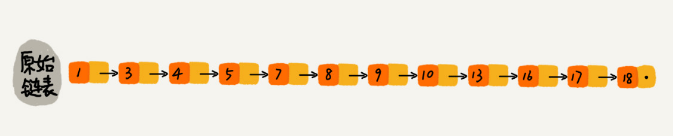
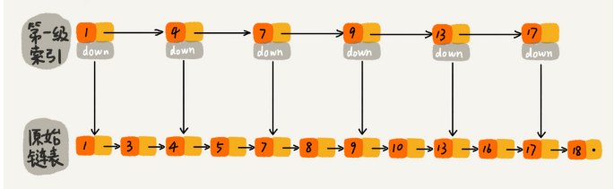
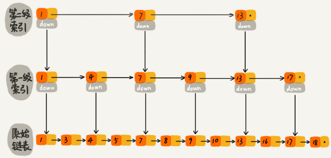
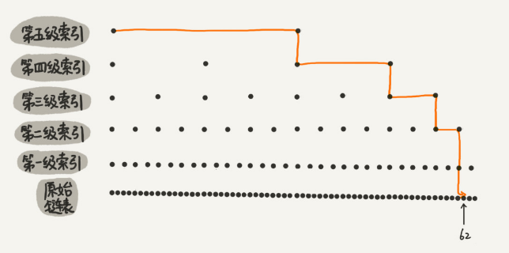
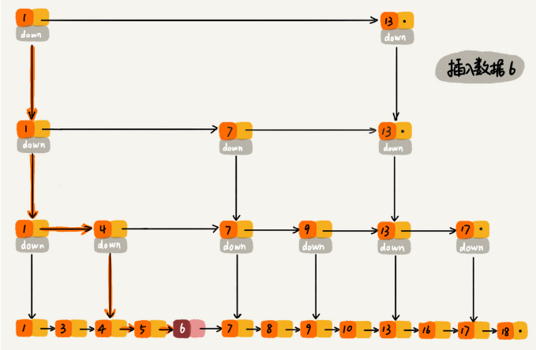

我们只需要对链表稍加改造，就可以支持类似二分的查找算法。我们把改造之后的数据结构叫做**跳表**（Skip list）

对于一个单链表来讲，即便链表中存储的数据是有序的，如果我们要想在其中查找某个数据，也只能从头到尾遍历链表。这样查找效率就会很低，时间复杂度会很高，是 `O(n)`

对链表建立一级**索引**，查找起来是不是就会更快一些呢？每两个结点提取一个结点到上一级，我们把抽出来的那一级叫做**索引或索引层**

如果我们现在要查找某个结点，比如 16。我们可以先在索引层遍历，当遍历到索引层中值为 13 的结点时，我们发现下一个结点是 17，那要查找的结点 16 肯定就在这两个结点之间。然后我们通过索引层结点的 down 指针，下降到原始链表这一层，继续遍历。这个时候，我们只需要再遍历 2 个结点，就可以找到值等于 16 的这个结点了。这样，原来如果要查找 16，需要遍历 10 个结点，现在只需要遍历 7 个结点

**加来一层索引之后，查找一个结点需要遍历的结点个数减少了，也就是说查找效率提高了**

**链表加多级索引的结构，就是跳表**

### 高效的动态插入和删除

对于跳表来说，查找某个结点的时间复杂度是 `O(logn)`，所以这里查找某个数据应该插入的位置，方法也是类似的，时间复杂度也是 `O(logn)`

**跳表的空间复杂度是 O(n)。不过，跳表的实现非常灵活，可以通过改变索引构建策略，有效平衡执行效率和内存消耗。虽然跳表的代码实现并不简单，但是作为一种动态数据结构，比起红黑树来说，实现要简单多了。所以很多时候，我们为了代码的简单、易读，比起红黑树，我们更倾向用跳表**

