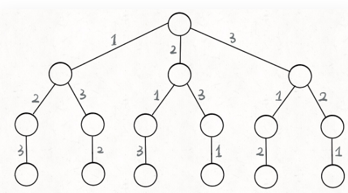
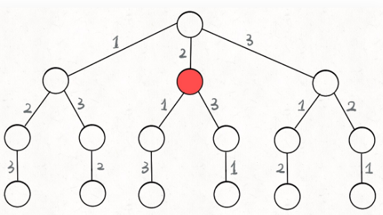

## 常用算法代码整理

### go 常用片段

#### go 通过切片模拟栈和队列

*栈操作*
```
//创建栈
stack := make([]int, 0)

//push压入
stack = append(stack, 10)

//pop 弹出
val := stack[len(stack)-1]
stack = stack[:len(stack)-1]

//检查栈空
len(stack) == 0
```

*队列操作*
```
//创建队列
queue := make([]int, 0)

//入队
queue = append(queue, 10)

//出队
val := queue[0]
queue = queue[1:]

//判断队为空
len(queue) == 0
```

- `s = s[0:len(s)]`，取下限不取上限

#### 字典
```
//创建字典
m := make(map[string]int)

//设置k, v
m["test"] = 10

//删除k
delete(m, "test")

//遍历字典
for k, v := range m {
    fmt.Println(k, v)
}
```

- map 键需要可比较，不能为 slice、map、function
- map 值都有默认值，可以直接操作默认值，如：`m[age]++` 值由 0 变为 1
- 比较两个 map 需要遍历，其中的 kv 是否相同，因为有默认值关系，所以需要检查 val 和 ok 两个值

#### 常用标准库函数

*sort*
```
//int排序
sort.Ints([]int{})

//字符串排序
sort.Strings([]string{})

//自定义排序
sort.Slice(s, func(i, j int) bool {return s[i] < s[j]>})
```

*math*
```
math.MaxInt32
math.MinInt32

math.MaxInt64
math.MinInt64
```

*copy*
```
待补充
```

#### 类型转换

```
// byte转数字
s="12345"  // s[0] 类型是byte

num:=int(s[0]-'0') // 1
str:=string(s[0]) // "1"
b:=byte(num+'0') // '1'
fmt.Printf("%d%s%c\n", num, str, b) // 111

//字符串转数字
num,_:=strconv.Atoi()
str:=strconv.Itoa()
```

----------------------------------------------------

### 数据结构与算法

数据结构是一种数据的表现形式，如链表、二叉树、栈、队列等都是内存中一段数据表现的形式。 算法是一种通用的解决问题的模板或者思路，大部分数据结构都有一套通用的算法模板，所以掌握这些通用的算法模板即可解决各种算法问题

-------------------------------------------------------

### 二叉树

#### 二叉树遍历

- 前序遍历: 先访问根节点，再前序遍历左子树，再前序遍历右子树
- 中序遍历: 先中序遍历左子树，再访问根节点，再中序遍历右子树
- 后序遍历: 先后序遍历左子树，再后序遍历右子树，再访问根节点

**以根访问顺序决定是什么遍历, 左子树都是优先右子树**


##### 前序递归
```
func preorderTraversal(root *TreeNode) {
    if root == nil {
        return
    }
    //先访问根再访问左右
    fmt.Println(root.Val)
    preorderTraversal(root.Left)
    preorderTraversal(root.Right)
}
```

##### 前序非递归
```
func preorderTraversal(root *TreeNode) []int {
    if root == nil {
        return nil
    }
    result := make([]int, 0)
    stack := make([]*TreeNode, 0)

    for root != nil || len(stack) != 0 {
        for root != nil {
            //前序遍历，先保存结果
            result = append(result, root.Val)
            stack = append(stack, root)
            root = root.Left
        }
        //pop操作
        node := stack[len(stack)-1]
        stack = stack[:len(stack)-1]
        root = node.Right
    }
    return result
}
```

##### 中序非递归
```
//通过stack 保存已经访问的元素，用于原路返回
func inorderTraversal(root *TreeNode) []int {
    if root == nil {
        return nil
    }
    result := make([]int, 0)
    stack := make([]*TreeNode, 0)

    for len(stack) > 0 || root != nil {
        for root != nil {
            stack = append(stack, root)
            root = root.Left
        }
        //弹出操作
        node := stack[len(stack)-1]
        stack = stack[:len(stack)-1]
        result = append(result, node.Val)
        root = node.Right
    }
    return result
}
```

##### 后序非递归
```
func postorderTraversal(root *TreeNode) []int {
    if root == nil {
        return nil
    }
    result := make([]int, 0)
    stack := make([]*TreeNode, 0)
    //通过lastVisit标识右子节点是否已经弹出
    var lastVisit *TreeNode

    for root != nil || len(stack) != 0 {
        for root != nil {
            stack = append(stack, root)
            root = root.Left
        }
        //这里先看看，先不弹出
        node := stack[len(stack)-1]
        // 根节点必须在右节点弹出之后，再弹出
        if node.Right == nil || node.Right == lastVist {
            //弹出
            stack = stack[:len(stack)-1]
            result = append(result, node.Val)
            //标记当前这个节点已经弹出过
            lastVisit = node
        } else {
            root = node.Right
        }
    }
    return result
}
```

#### DFS 深度搜索-从上到下

```
type TreeNode struct {
    Val int
    Left *TreeNode
    Right *TreeNode
}

func preorderTraversal(root *TreeNode) []int {
    result := make([]int, 0)
    dfs(root, &result)
    return result
}

//深度遍历，结果指针作为参数传入到函数内部
func dfs(root *TreeNode, result *[]int) {
    if root == nil {
        return
    }

    *result = append(*result, root.Val)
    dfs(root.Left, result)
    dfs(root.Right, result)
}
```

#### DFS 深度搜索-从下向上（分治法）
```
func preorderTraversal(root *TreeNode) []int {
    result := divideAndConquer(root)
    return result
}

//通过分治法遍历
func divideAndConquer(root *TreeNode) []int {
    result := make([]int, 0)
    if root == nil {
        return result
    }

    //分治(Divide)
    left := divideAndConquer(root.Left)
    right := divideAndConquer(root.Right)

    //合并结果(Conquer)
    result = append(result, root.Val)
    result = append(result, left...)
    result = append(result, right...)
    return result
}
```

#### BFS 层次遍历

```
func levelOrder(root *TreeNode) [][]int {
    if root == nil {
        return nil
    }
    result := make([][]int, 0)
    queue := make([]*TreeNode, 0)
    queue = append(queue, root)

    for len(queue)>0 {
        list := make([]int, 0)
        //为什么要取length？
        //记录当前层有多少元素（遍历当前层，再添加下一层）
        l := len(queue)

        for i := 0; i < l; i++ {
            //出队
            level := queue[0]
            queue = queue[1:]
            list = append(list, level.Val)
            if level.Left != nil {
                queue = append(queue, level.Left)
            }
            if level.Right != nil {
                queue = append(queue, level.Right)
            }
        }
        result = append(result, list)
    }
    return result
}
```

#### 分治法的应用

先分别处理局部，再合并结果

- 快速排序
- 归并排序
- 二叉树相关问题

分治法解题模板：
- 递归返回条件
- 分段处理
- 合并结果

##### 归并排序

```
func MergeSort(nums []int) []int {
    return mergeSort(nums)
}

func mergeSort(nums []int) []int {
    if len(nums) <= 1 {
        return nums
    }

    //分治法：divide 分为两段
    mid := len(nums)/2
    left := mergeSort(nums[:mid])
    right := mergeSort(nums[mid:])

    //合并两段数据
    result := merge(left, right)
    return result
}

func merge(left, right []int) (result []int) {
    // 两边数组合并游标
    l := 0
    r := 0

    // 注意不能越界
    for l < len(left) && r < len(right) {
        if left[l] > right[r] {
            result = append(result, right[r])
            r++
        } else {
            result = append(result, left[l])
            l++
        }
    }
    // 剩余部分合并
    result = append(result, left[l:]...)
    result = append(result, right[r:]...)
    return
}
```

#### 快速排序

```
func QuickSort(nums []int) []int {
    // 思路：把一个数组分为左右两段，左段小于右段，类似分治法没有合并过程
    quickSort(nums, 0, len(nums)-1)
    return nums
}

// 原地交换，所以传入交换索引
func quickSort(nums []int, start, end int) {
    if start < end {
        // 分治法：divide
        pivot := partition(nums, start, end)
        quickSort(nums, 0, pivot-1)
        quickSort(nums, pivot+1, end)
    }
}

// 分区
func partition(nums []int, start, end int) int {
    p := nums[end]
    i := start
    for j := start; j < end; j++ {
        if nums[j] < p {
            swap(nums, i, j)
            i++
        }
    }
    // 把中间的值换为用于比较的基准值
    swap(nums, i, end)
    return i
}

func swap(nums []int, i, j int) {
    t := nums[i]
    nums[i] = nums[j]
    nums[j] = t
}
```

#### 给定一个二叉树，找出其最大深度

分治法
```
func maxDepth(root *TreeNode) int {
    // 返回条件处理
    if root == nil {
        return 0
    }
    // divide：分左右子树分别计算
    left := maxDepth(root.Left)
    right := maxDepth(root.Right)

    // conquer：合并左右子树结果
    if left > right {
        return left + 1
    }
    return right + 1
}
```

----------------------------------------------

### 链表

需要重点掌握的一些链表操作:

- nil 异常处理
- 设置哑巴节点
- 快慢指针
- 插入一个节点到排序链表
- 从一个链表中移除一个节点
- 翻转链表
- 合并两个链表
- 找到链表的中间节点

#### 给定一个排序链表，删除所有重复的元素，使得每个元素只出现一次

```
func deleteDuplicates(head *ListNode) *ListNode {
    current := head
    for current != nil {
        // 全部删除完再移动到下一个元素
        for current.Next != nil && current.Val == current.Next.Val {
            current.Next = current.Next.Next
        }
        current = current.Next
    }
    return head
}
```

#### 反转一个单链表

用一个 prev 节点保存向前指针，temp 保存向后的临时指针

```
func reverseList(head *ListNode) *ListNode {
    var prev *ListNode
    for head != nil {
        // 保存当前head.Next节点，防止重新赋值后被覆盖
        // 一轮之后状态：nil<-1 2->3->4
        //              prev   head
        temp := head.Next
        head.Next = prev
        // pre 移动
        prev = head
        // head 移动
        head = temp
    }
    return prev
}
```

-------------------------------------------------

### 栈和队列

栈的特点是后入先出, 根据这个特点可以临时保存一些数据，之后用到依次再弹出来，常用于 DFS 深度搜索, 队列一般常用于 BFS 广度搜索，类似一层一层的搜索

#### 代码示例

待补充

----------------------------------------------------

### 二进制

#### 代码示例

待补充

--------------------------------------------------

### 二分搜索

*给定一个 n 个元素有序的（升序）整型数组 nums 和一个目标值 target ，写一个函数搜索 nums 中的 target，如果目标值存在返回下标，否则返回 -1*
```
// 二分搜索最常用模板
func search(nums []int, target int) int {
    // 1、初始化start、end
    start := 0
    end := len(nums) - 1
    // 2、处理for循环
    for start+1 < end {
        mid := start + (end-start)/2
        // 3、比较a[mid]和target值
        if nums[mid] == target {
            end = mid
        } else if nums[mid] < target {
            start = mid
        } else if nums[mid] > target {
            end = mid
        }
    }
    // 4、最后剩下两个元素，手动判断
    if nums[start] == target {
        return start
    }
    if nums[end] == target {
        return end
    }
    return -1
}
```

**时间复杂度 O(logn)，使用场景一般是有序数组的查找**

------------------------------------------------

### 排序算法

#### 快速排序

```
func QuickSort(nums []int) []int {
    // 思路：把一个数组分为左右两段，左段小于右段
    quickSort(nums, 0, len(nums)-1)
    return nums

}
// 原地交换，所以传入交换索引
func quickSort(nums []int, start, end int) {
    if start < end {
        // 分治法：divide
        pivot := partition(nums, start, end)
        quickSort(nums, 0, pivot-1)
        quickSort(nums, pivot+1, end)
    }
}
// 分区
func partition(nums []int, start, end int) int {
    // 选取最后一个元素作为基准pivot
    p := nums[end]
    i := start
    // 最后一个值就是基准所以不用比较
    for j := start; j < end; j++ {
        if nums[j] < p {
            swap(nums, i, j)
            i++
        }
    }
    // 把基准值换到中间
    swap(nums, i, end)
    return i
}
// 交换两个元素
func swap(nums []int, i, j int) {
    t := nums[i]
    nums[i] = nums[j]
    nums[j] = t
}
```

#### 归并排序

```
func MergeSort(nums []int) []int {
    return mergeSort(nums)
}
func mergeSort(nums []int) []int {
    if len(nums) <= 1 {
        return nums
    }
    // 分治法：divide 分为两段
    mid := len(nums) / 2
    left := mergeSort(nums[:mid])
    right := mergeSort(nums[mid:])
    // 合并两段数据
    result := merge(left, right)
    return result
}
func merge(left, right []int) (result []int) {
    // 两边数组合并游标
    l := 0
    r := 0
    // 注意不能越界
    for l < len(left) && r < len(right) {
        // 谁小合并谁
        if left[l] > right[r] {
            result = append(result, right[r])
            r++
        } else {
            result = append(result, left[l])
            l++
        }
    }
    // 剩余部分合并
    result = append(result, left[l:]...)
    result = append(result, right[r:]...)
    return
}
```

#### 堆排序

```
func HeapSort(a []int) []int {
    // 1、无序数组a
    // 2、将无序数组a构建为一个大根堆
    for i := len(a)/2 - 1; i >= 0; i-- {
        sink(a, i, len(a))
    }
    // 3、交换a[0]和a[len(a)-1]
    // 4、然后把前面这段数组继续下沉保持堆结构，如此循环即可
    for i := len(a) - 1; i >= 1; i-- {
        // 从后往前填充值
        swap(a, 0, i)
        // 前面的长度也减一
        sink(a, 0, i)
    }
    return a
}
func sink(a []int, i int, length int) {
    for {
        // 左节点索引(从0开始，所以左节点为i*2+1)
        l := i*2 + 1
        // 右节点索引
        r := i*2 + 2
        // idx保存根、左、右三者之间较大值的索引
        idx := i
        // 存在左节点，左节点值较大，则取左节点
        if l < length && a[l] > a[idx] {
            idx = l
        }
        // 存在右节点，且值较大，取右节点
        if r < length && a[r] > a[idx] {
            idx = r
        }
        // 如果根节点较大，则不用下沉
        if idx == i {
            break
        }
        // 如果根节点较小，则交换值，并继续下沉
        swap(a, i, idx)
        // 继续下沉idx节点
        i = idx
    }
}
func swap(a []int, i, j int) {
    a[i], a[j] = a[j], a[i]
}
```

**堆---用数组表示的完全二叉树**

-----------------------------------------------

### 动态规划


----------------------------------------------

### 算法思维

- 递归思维
- 回溯法
- 滑动窗口思想
- 动态规划
- 二叉搜索树


#### 递归

人理解迭代，神理解递归

递归(recursion)，则是一种反人类的逆向思维。作为一个程序员，每次使用递归时，代码总是简洁到让自己心虚，因为这种思维逻辑甚至是反常识的

先说一个简单的例子，阶乘。计算5!，迭代的思维一般是按照`1x2x3x4x5`的顺序计算。而递归的思维则是`5! = 5x4!`，那么4!是什么呢？不重要，因为`4! = 4x3!`。这样一直往前推，直到`1! = 1`。这个时候再把每个值往回代入计算，就能得到最终的结果

**一旦理解了递归，很多问题就会变得很傻瓜**

最后，友情提醒，不要试图短时间内理解递归，其结果要么是理解错了，要么会很痛苦

在初学递归的时候, 看到一个递归实现, 我们总是难免陷入不停的回溯验证之中, 因为回溯就像反过来思考迭代, 这是我们习惯的思维方式


- 如何解决问题的一般情况, 通过将问题切分成有限小并更小的子问题
- 如何通过有限的步骤, 来解决最小的问题

如果这两件事完成了, 那问题就解决了. 因为递归每次都将问题变得更小, 而一个有限的问题终究会被解决的, 而最小的问题仅需几个有限的步骤就能解决

---------------------------------------

#### 回溯法

回溯算法其实就是我们常说的 DFS 算法，本质上就是一种暴力穷举算法

解决一个回溯问题，实际上就是一个决策树的遍历过程。你只需要思考 3 个问题：
- 路径：也就是已经做出的选择
- 选择列表：也就是你当前可以做的选择
- 结束条件：也就是到达决策树底层，无法再做选择的条件

回溯算法的框架：
```
result = []
def backtrack(路径, 选择列表):
    if 满足结束条件:
        result.add(路径)
        return
    
    for 选择 in 选择列表:
        做选择
        backtrack(路径, 选择列表)
        撤销选择
```

**其核心就是 for 循环里面的递归，在递归调用之前「做选择」，在递归调用之后「撤销选择」**

##### 全排列问题

那么我们是怎么穷举全排列的呢？比方说给三个数 [1,2,3]，你肯定不会无规律地乱穷举，一般是这样：

先固定第一位为 1，然后第二位可以是 2，那么第三位只能是 3；然后可以把第二位变成 3，第三位就只能是 2 了；然后就只能变化第一位，变成 2，然后再穷举后两位……，其实这就是**回溯算法**



只要从根遍历这棵树，记录路径上的数字，其实就是所有的全排列。我们不妨把这棵树称为回溯算法的「决策树」, 为啥说这是决策树呢，因为你在每个节点上其实都在做决策

比如说你站在下图的红色节点上：



你现在就在做决策，可以选择 1 那条树枝，也可以选择 3 那条树枝。为啥只能在 1 和 3 之中选择呢？因为 2 这个树枝在你身后，这个选择你之前做过了，而全排列是不允许重复使用数字的

现在可以解答开头的几个名词：[2] 就是「路径」，记录你已经做过的选择；[1,3] 就是「选择列表」，表示你当前可以做出的选择；「结束条件」就是遍历到树的底层，在这里就是选择列表为空的时候

再进一步，如何遍历一棵树？，各种搜索问题其实都是树的遍历问题，而多叉树的遍历框架就是这样：
```
void traverse(TreeNode root) {
    for (TreeNode child : root.childern)
        // 前序遍历需要的操作
        traverse(child);
        // 后序遍历需要的操作
}
```

而所谓的前序遍历和后序遍历，他们只是两个很有用的时间点, 前序遍历的代码在进入某一个节点之前的那个时间点执行，后序遍历代码在离开某个节点之后的那个时间点执行

回溯算法的核心框架:
```
for 选择 in 选择列表:
    # 做选择
    将该选择从选择列表移除
    路径.add(选择)
    backtrack(路径, 选择列表)
    # 撤销选择
    路径.remove(选择)
    将该选择再加入选择列表
```

我们只要在递归之前做出选择，在递归之后撤销刚才的选择，就能正确得到每个节点的选择列表和路径

全排列代码:
```
List<List<Integer>> res = new LinkedList<>();

/* 主函数，输入一组不重复的数字，返回它们的全排列 */
List<List<Integer>> permute(int[] nums) {
    // 记录「路径」
    LinkedList<Integer> track = new LinkedList<>();
    backtrack(nums, track);
    return res;
}

// 路径：记录在 track 中
// 选择列表：nums 中不存在于 track 的那些元素
// 结束条件：nums 中的元素全都在 track 中出现
void backtrack(int[] nums, LinkedList<Integer> track) {
    // 触发结束条件
    if (track.size() == nums.length) {
        res.add(new LinkedList(track));
        return;
    }
    
    for (int i = 0; i < nums.length; i++) {
        // 排除不合法的选择
        if (track.contains(nums[i]))
            continue;
        // 做选择
        track.add(nums[i]);
        // 进入下一层决策树
        backtrack(nums, track);
        // 取消选择
        track.removeLast();
    }
}
```

回溯时间复杂度都不可能低于 O(N!)，因为穷举整棵决策树是无法避免的。这也是回溯算法的一个特点，不像动态规划存在重叠子问题可以优化，回溯算法就是纯暴力穷举，复杂度一般都很高


##### 总结

回溯算法就是个多叉树的遍历问题，关键就是在前序遍历和后序遍历的位置做一些操作，算法框架如下：
```
def backtrack(...):
    for 选择 in 选择列表:
        做选择
        backtrack(...)
        撤销选择
```
写 backtrack 函数时，需要维护走过的「路径」和当前可以做的「选择列表」，当触发「结束条件」时，将「路径」记入结果集


---------------------------------------------

#### 滑动窗口思想

滑动窗口算法，这个算法技巧的思路非常简单，就是维护一个窗口，不断滑动，然后更新答案

#### 动态规划

动态规划问题的一般形式就是求最值，比如说让你求最长递增子序列，最小编辑距离等等

既然是要求最值，核心问题是什么呢？求解动态规划的核心问题是穷举。因为要求最值，肯定要把所有可行的答案穷举出来，然后在其中找最值

- 动态规划的穷举有点特别，因为这类问题存在「重叠子问题」，如果暴力穷举的话效率会极其低下，所以需要「备忘录」来优化穷举过程，避免不必要的计算
- 动态规划问题一定会具备「最优子结构」，才能通过子问题的最值得到原问题的最值, 子问题间必须互相独立
- 虽然动态规划的核心思想就是穷举求最值，但是问题可以千变万化，穷举所有可行解其实并不是一件容易的事，只有列出正确的「状态转移方程」，才能正确地穷举

以上提到的**重叠子问题**、**最优子结构**、**状态转移方程**就是动态规划三要素。但是在实际的算法问题中，写出状态转移方程是最困难的

```
# 初始化 base case
dp[0][0][...] = base
# 进行状态转移
for 状态1 in 状态1的所有取值：
    for 状态2 in 状态2的所有取值：
        for ...
            dp[状态1][状态2][...] = 求最值(选择1，选择2...)
```

动态规划问题思维框架：*明确 base case -> 明确「状态」-> 明确「选择」 -> 定义 dp 数组/函数的含义*


##### 斐波那契数列

1. 暴力递归:
```
func fib(n int) int {
    if n == 1 || n == 2 {
        return 1
    }
    return fib(n-1) + fib(n-2)
}
```

我们知道这样写代码虽然简洁易懂，但是十分低效, f(20), 存在大量重复计算，比如 f(18) 被计算了两次，而且你可以看到，以 f(18) 为根的这个递归树体量巨大，多算一遍，会耗费巨大的时间。更何况，还不止 f(18) 这一个节点被重复计算，所以这个算法及其低效

这就是动态规划问题的第一个性质：**重叠子问题**

2. 带备忘录的递归解法
明确了问题，其实就已经把问题解决了一半。即然耗时的原因是重复计算，那么我们可以造一个「备忘录」，每次算出某个子问题的答案后别急着返回，先记到「备忘录」里再返回；每次遇到一个子问题先去「备忘录」里查一查，如果发现之前已经解决过这个问题了，直接把答案拿出来用，不要再耗时去计算了

一般使用一个数组充当这个「备忘录」，当然也可以使用哈希表（字典），思想都是一样的

```
//备忘录初始化为空
var record map[int]int = map[int]int{}

func fib(n int) int {
	if n == 1 || n == 2 {
		return 1
	}
    //查询备忘录
	if _, ok := record[n]; ok {
		return record[n]
	}
    //把子结果存入备忘录
	record[n] = fib(n-1) + fib(n-2)
	return record[n]
}
```

实际上，带「备忘录」的递归算法，把一棵存在巨量冗余的递归树通过「剪枝」，改造成了一幅不存在冗余的递归图，极大减少了子问题

这种解法和迭代的动态规划已经差不多了，只不过这种方法叫做「自顶向下」，动态规划叫做「自底向上」

啥叫「自顶向下」？注意我们刚才画的递归树（或者说图），是从上向下延伸，都是从一个规模较大的原问题比如说 f(20)，向下逐渐分解规模，直到 f(1) 和 f(2) 这两个 base case，然后逐层返回答案，这就叫「自顶向下」

啥叫「自底向上」？反过来，我们直接从最底下，最简单，问题规模最小的 f(1) 和 f(2) 开始往上推，直到推到我们想要的答案 f(20)，这就是动态规划的思路，这也是为什么动态规划一般都脱离了递归，而是由循环迭代完成计算

3. 迭代解法

有了上一步「备忘录」的启发，我们可以把这个「备忘录」独立出来成为一张表，在这张表上完成「自底向上」的推算

```
func fib(n int) int {
	if n == 1 || n == 2 {
		return 1
	}
    //递推求解fib(n)
	record := map[int]int{}
	record[1] = 1
	record[2] = 1
	for i := 3; i <= n; i++ {
		record[i] = record[i-1] + record[i-2]
	}
	return record[n]
}
```

状态转移方程」这个名词，实际上就是描述问题结构的数学形式:`f(n) = f(n-1) + f(n-2), n>2`

你把 f(n) 想做一个状态 n，这个状态 n 是由状态 n - 1 和状态 n - 2 相加转移而来，这就叫状态转移，仅此而已

列出「状态转移方程」，它是解决问题的核心。而且很容易发现，状态转移方程直接代表着暴力解法

动态规划问题最困难的就是写出这个暴力解，即**状态转移方程**。只要写出暴力解，优化方法无非是用备忘录，再无奥妙可言

根据斐波那契数列的状态转移方程，当前状态只和之前的两个状态有关，其实并不需要那么长的一个备忘录来存储所有的状态，只要想办法存储之前的两个状态就行了。所以，可以进一步优化，把空间复杂度降为 O(1)：
```
func fib(n int) int {
	if n == 1 || n == 2 {
		return 1
	}
	prev := 1
	curr := 1
	for i := 3; i <= n; i++ {
		sum := prev + curr
		prev = curr
		curr = sum
	}
	return curr
}
```

这个技巧就是所谓的「状态压缩」，如果我们发现每次状态转移只需要备忘录中的一部分，那么可以尝试用状态压缩来缩小备忘录的大小，只记录必要的数据，上述例子就相当于把备忘录的大小从 n 缩小到 2。后续的动态规划章节中我们还会看到这样的例子，一般来说是把一个二维的备忘录压缩成一维，即把空间复杂度从 O(n^2) 压缩到 O(n)


##### 凑零钱问题

*给你 k 种面值的硬币，面值分别为 c1, c2 ... ck，每种硬币的数量无限，再给一个总金额 amount，问你最少需要几枚硬币凑出这个金额，如果不可能凑出，算法返回 -1*

比如说 k = 3，面值分别为 1，2，5，总金额 amount = 11。那么最少需要 3 枚硬币凑出，即 11 = 5 + 5 + 1

1. 暴力递归

首先，这个问题是动态规划问题，因为它具有「最优子结构」的。要符合「最优子结构」，**子问题间必须互相独立**

为什么说它符合最优子结构呢？比如你想求 amount = 11 时的最少硬币数（原问题），如果你知道凑出 amount = 10 的最少硬币数（子问题），你只需要把子问题的答案加一（再选一枚面值为 1 的硬币）就是原问题的答案。因为硬币的数量是没有限制的，所以子问题之间没有相互制，是互相独立的

既然知道了这是个动态规划问题，就要思考如何列出正确的状态转移方程？
- 确定 base case，这个很简单，显然目标金额 amount 为 0 时算法返回 0，因为不需要任何硬币就已经凑出目标金额了
- 确定「状态」，也就是原问题和子问题中会变化的变量。由于硬币数量无限，硬币的面额也是题目给定的，只有目标金额会不断地向 base case 靠近，所以唯一的「状态」就是目标金额 amount
- 确定「选择」，也就是导致「状态」产生变化的行为。目标金额为什么变化呢，因为你在选择硬币，你每选择一枚硬币，就相当于减少了目标金额。所以说所有硬币的面值，就是你的「选择」

```
def coinChange(coins: List[int], amount: int):

    def dp(n):
        # base case
        if n == 0: return 0
        if n < 0: return -1
        # 求最小值，所以初始化为正无穷
        res = float('INF')
        for coin in coins:
            subproblem = dp(n - coin)
            # 子问题无解，跳过
            if subproblem == -1: continue
            res = min(res, 1 + subproblem)

        return res if res != float('INF') else -1
    
    return dp(amount)
```

2. 带备忘录的递归

```
def coinChange(coins: List[int], amount: int):
    # 备忘录
    memo = dict()
    def dp(n):
        # 查备忘录，避免重复计算
        if n in memo: return memo[n]
        # base case
        if n == 0: return 0
        if n < 0: return -1
        res = float('INF')
        for coin in coins:
            subproblem = dp(n - coin)
            if subproblem == -1: continue
            res = min(res, 1 + subproblem)
        
        # 记入备忘录
        memo[n] = res if res != float('INF') else -1
        return memo[n]
    
    return dp(amount)
```

3. 迭代解法

```
int coinChange(vector<int>& coins, int amount) {
    // 数组大小为 amount + 1，初始值也为 amount + 1
    vector<int> dp(amount + 1, amount + 1);
    // base case
    dp[0] = 0;
    // 外层 for 循环在遍历所有状态的所有取值
    for (int i = 0; i < dp.size(); i++) {
        // 内层 for 循环在求所有选择的最小值
        for (int coin : coins) {
            // 子问题无解，跳过
            if (i - coin < 0) continue;
            dp[i] = min(dp[i], 1 + dp[i - coin]);
        }
    }
    return (dp[amount] == amount + 1) ? -1 : dp[amount];
}
```

**第一个斐波那契数列的问题，解释了如何通过「备忘录」或者「dp table」的方法来优化递归树，并且明确了这两种方法本质上是一样的，只是自顶向下和自底向上的不同而已**

**第二个凑零钱的问题，展示了如何流程化确定「状态转移方程」，只要通过状态转移方程写出暴力递归解，剩下的也就是优化递归树，消除重叠子问题而已**

计算机解决问题其实没有任何奇技淫巧，它唯一的解决办法就是穷举，穷举所有可能性。算法设计无非就是先思考如何穷举，然后再追求如何聪明地穷举

