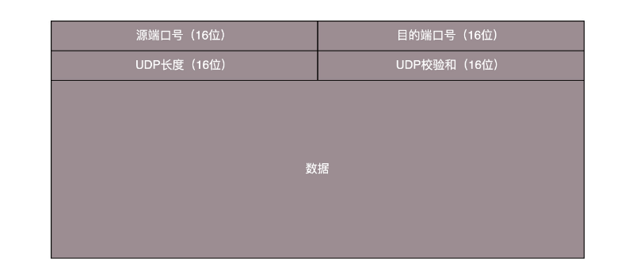

## UDP协议

传输层里比较重要的两个协议，一个是 `TCP`，一个是 `UDP`。对于不从事底层开发的人员来讲，或者对于开发应用的人来讲，最常用的就是这两个协议。面试的时候，这两个协议经常会被放在一起问

### TCP 和 UDP 有哪些区别？
一般面试的时候问这两个协议的区别，**大部分人会回答，TCP 是面向连接的，UDP 是面向无连接的**

**什么叫面向连接，什么叫无连接呢？**在互通之前，面向连接的协议会先建立连接。例如，TCP 会三次握手，而 UDP 不会。为什么要建立连接呢？你 TCP 三次握手，我 UDP 也可以发三个包玩玩，有什么区别吗？

**所谓的建立连接，是为了在客户端和服务端维护连接，而建立一定的数据结构来维护双方交互的状态，用这样的数据结构来保证所谓的面向连接的特性**

**TCP 提供可靠交付**。通过 TCP 连接传输的数据，无差错、不丢失、不重复、并且按序到达。我们都知道 IP 包是没有任何可靠性保证的，一旦发出去，走丢了，都只能随它去。但是 TCP 号称能做到那个连接维护的程序做的事情。而 UDP 继承了 IP 包的特性，不保证不丢失，不保证按顺序到达

**TCP 是面向字节流的**。发送的时候发的是一个流，没头没尾。IP 包可不是一个流，而是一个个的 IP 包。之所以变成了流，这也是 TCP 自己的状态维护做的事情。而 UDP 继承了 IP 的特性，基于数据报的，一个一个地发，一个一个地收

**TCP 是可以有拥塞控制的**。它意识到包丢弃了或者网络的环境不好了，就会根据情况调整自己的行为，看看是不是发快了，要不要发慢点。UDP 就不会，应用让我发，我就发，管它洪水滔天

**因而 TCP 其实是一个有状态服务，里面精确地记着发送了没有，接收到没有，发送到哪个了，应该接收哪个了，错一点儿都不行。而 UDP 则是无状态服务，发出去就发出去了**

如果 MAC 层定义了本地局域网的传输行为，IP 层定义了整个网络端到端的传输行为，这两层基本定义了这样的基因：网络传输是以包为单位的，二层叫帧，网络层叫包，传输层叫段。我们笼统地称为包。包单独传输，自行选路，在不同的设备封装解封装，不保证到达。基于这个基因，生下来的孩子 UDP 完全继承了这些特性，几乎没有自己的思想

### UDP 包头是什么样的
当我发送的 UDP 包到达目标机器后，发现 MAC 地址匹配，于是就取下来，将剩下的包传给处理 IP 层的代码。把 IP 头取下来，发现目标 IP 匹配

发送的时候，我知道我发的是一个 UDP 的包，收到的那台机器咋知道的呢？所以在 IP 头里面有个 8 位协议，这里会存放，数据里面到底是 TCP 还是 UDP，当然这里是 UDP。于是，如果我们知道 UDP 头的格式，就能从数据里面，将它解析出来

处理完传输层的事情，内核的事情基本就干完了，里面的数据应该交给应用程序自己去处理

无论应用程序写的使用 TCP 传数据，还是 UDP 传数据，都要监听一个端口。正是这个端口，用来区分应用程序，要不说端口不能冲突呢。两个应用监听一个端口，到时候包给谁呀？所以，按理说，无论是 TCP 还是 UDP 包头里面应该有端口号，根据端口号，将数据交给相应的应用程序

当我们看到 UDP 包头的时候，发现的确有端口号，有源端口号和目标端口号。因为是两端通信嘛，这很好理解。但是你还会发现，UDP 除了端口号，再没有其他的了

### UDP 的三大特点

1. 沟通简单。前提是它相信网络世界是美好的，秉承性善论，相信网络通路默认就是很容易送达的，不容易被丢弃的
2. 轻信他人。它不会建立连接，虽然有端口号，但是监听在这个地方，谁都可以传给他数据，他也可以传给任何人数据，甚至可以同时传给多个人数据
3. 它不会根据网络的情况进行发包的拥塞控制，无论网络丢包丢成啥样了，它该怎么发还怎么发

### UDP 的三大使用场景

1. 需要资源少，在网络情况比较好的内网，或者对于丢包不敏感的应用
2. 不需要一对一沟通，建立连接，而是可以广播的应用
3. 需要处理速度快，时延低，可以容忍少数丢包，但是要求即便网络拥塞，也毫不退缩，一往无前的时候

### 基于 UDP 的例子

**网页或者 APP 的访问**

原来访问网页和手机 APP 都是基于 HTTP 协议的。HTTP 协议是基于 TCP 的，建立连接都需要多次交互，对于时延比较大的目前主流的移动互联网来讲，建立一次连接需要的时间会比较长，然而既然是移动中，TCP 可能还会断了重连，也是很耗时的。而且目前的 HTTP 协议，往往采取多个数据通道共享一个连接的情况，这样本来为了加快传输速度，但是 TCP 的严格顺序策略使得哪怕共享通道，前一个不来，后一个和前一个即便没关系，也要等着，时延也会加大

而 QUIC（全称 Quick UDP Internet Connections，快速 UDP 互联网连接）是 Google 提出的一种基于 UDP 改进的通信协议，其目的是降低网络通信的延迟，提供更好的用户互动体验

QUIC 在应用层上，会自己实现快速连接建立、减少重传时延，自适应拥塞控制

**流媒体的协议**

当网络不好的时候，TCP 协议会主动降低发送速度，这对本来当时就卡的看视频来讲是要命的，应该应用层马上重传，而不是主动让步。因而，很多直播应用，都基于 UDP 实现了自己的视频传输协议

**实时游戏**

游戏有一个特点，就是实时性比较高。快一秒你干掉别人，慢一秒你被别人爆头，所以很多职业玩家会买非常专业的鼠标和键盘，争分夺秒

因而，实时游戏中客户端和服务端要建立长连接，来保证实时传输。但是游戏玩家很多，服务器却不多。由于维护 TCP 连接需要在内核维护一些数据结构，因而一台机器能够支撑的 TCP 连接数目是有限的，然后 UDP 由于是没有连接的，在异步 IO 机制引入之前，常常是应对海量客户端连接的策略

另外还是 TCP 的强顺序问题，对战的游戏，对网络的要求很简单，玩家通过客户端发送给服务器鼠标和键盘行走的位置，服务器会处理每个用户发送过来的所有场景，处理完再返回给客户端，客户端解析响应，渲染最新的场景展示给玩家

如果出现一个数据包丢失，所有事情都需要停下来等待这个数据包重发。客户端会出现等待接收数据，然而玩家并不关心过期的数据，激战中卡 1 秒，等能动了都已经死了

游戏对实时要求较为严格的情况下，采用自定义的可靠 UDP 协议，自定义重传策略，能够把丢包产生的延迟降到最低，尽量减少网络问题对游戏性造成的影响

**IoT 物联网**

物联网领域终端资源少，很可能只是个内存非常小的嵌入式系统，而维护 TCP 协议代价太大；另一方面，物联网对实时性要求也很高，而 TCP 还是因为上面的那些原因导致时延大。Google 旗下的 Nest 建立 Thread Group，推出了物联网通信协议 Thread，就是基于 UDP 协议的

**移动通信领域**

在 4G 网络里，移动流量上网的数据面对的协议 GTP-U 是基于 UDP 的。因为移动网络协议比较复杂，而 GTP 协议本身就包含复杂的手机上线下线的通信协议。如果基于 TCP，TCP 的机制就显得非常多余

### 阶段小结
UDP 虽然简单，但它有简单的用法。它可以用在环境简单、需要多播、应用层自己控制传输的地方。例如 DHCP、VXLAN、QUIC 等

## TCP 协议
