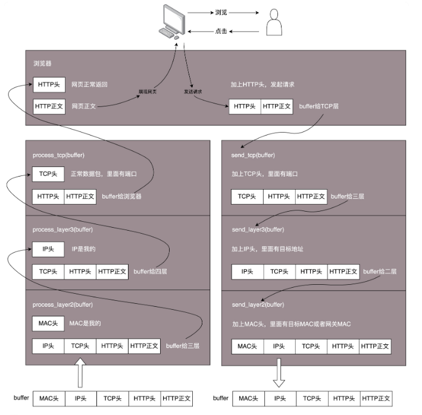
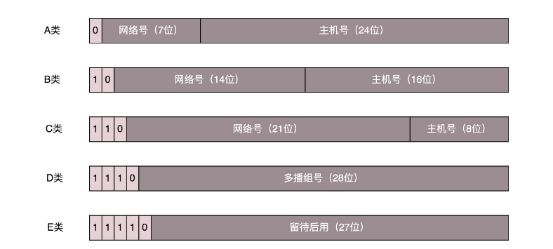
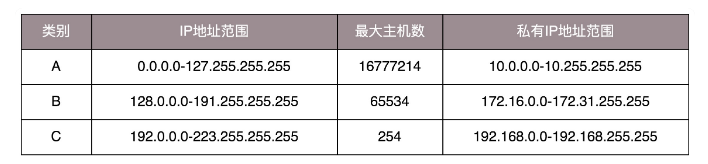
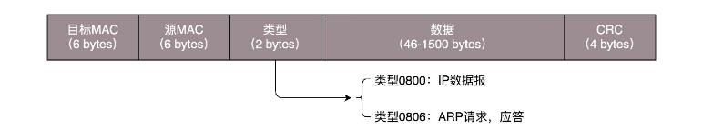
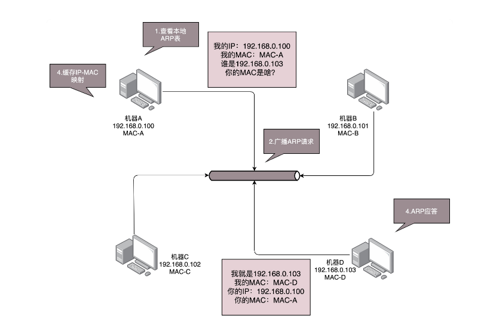
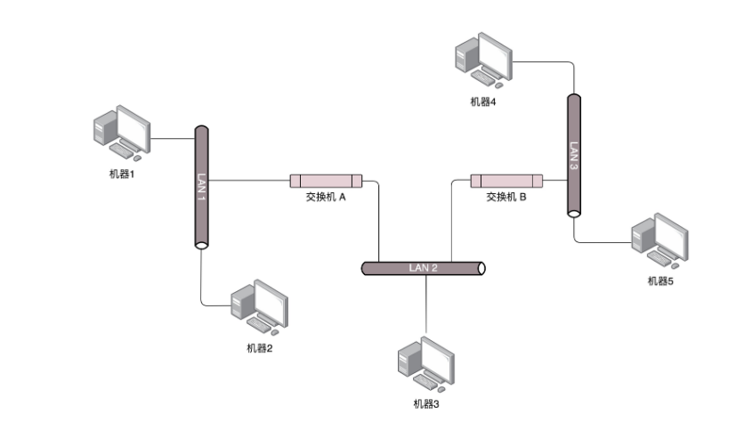
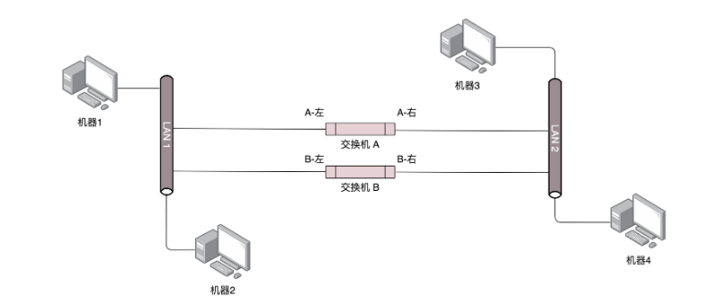
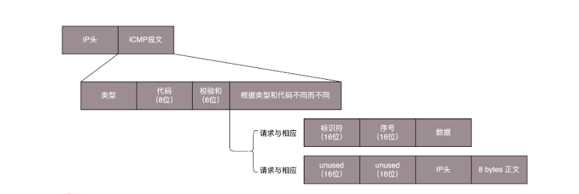

### 网络分层的真实含义是什么？
当你听到什么**二层设备、三层设备、四层 LB 和七层 LB** 中层的时候，是否有点一头雾水，不知道这些所谓的层，对应的各种协议具体要做什么工作?

#### 网络为什么要分层？
一般复杂的程序都要分层，这是程序设计的要求

复杂的电商会分数据库层、缓存层、Compose 层、Controller 层和接入层，每一层专注做本层的事情

#### 程序是如何工作的？



当一个网络包从一个网口经过的时候，你看到了，首先先看看要不要请进来，处理一把。有的网口配置了混杂模式，凡是经过的，全部拿进来

拿进来以后，就要交给一段程序来处理。于是，你调用 `process_layer2(buffer)`。当然，这是一个假的函数。但是你明白其中的意思，知道肯定是有这么个函数的。那这个函数是干什么的呢？从 `Buffer` 中，摘掉二层的头，看一看，应该根据头里面的内容做什么操作

假设你发现这个包的 `MAC` 地址和你的相符，那说明就是发给你的，于是需要调用 `process_layer3(buffer)`。这个时候，`Buffer` 里面往往就没有二层的头了，因为已经在上一个函数的处理过程中拿掉了，或者将开始的偏移量移动了一下。在这个函数里面，摘掉三层的头，看看到底是发送给自己的，还是希望自己转发出去的

如何判断呢？如果 `IP` 地址不是自己的，那就应该转发出去；如果 `IP` 地址是自己的，那就是发给自己的。根据 `IP` 头里面的标示，拿掉三层的头，进行下一层的处理，到底是调用 `process_tcp(buffer)` 呢，还是调用 `process_udp(buffer)` 呢？

假设这个地址是 `TCP` 的，则会调用 `process_tcp(buffer)`。这时候，`Buffer` 里面没有三层的头，就需要查看四层的头，看这是一个发起，还是一个应答，又或者是一个正常的数据包，然后分别由不同的逻辑进行处理。如果是发起或者应答，接下来可能要发送一个回复包；如果是一个正常的数据包，就需要交给上层了。交给谁呢？是不是有 `process_http(buffer)` 函数呢？

没有的，如果你是一个网络包处理程序，你不需要有 `process_http(buffer)`，而是应该交给应用去处理。交给哪个应用呢？在四层的头里面有端口号，不同的应用监听不同的端口号。如果发现浏览器应用在监听这个端口，那你发给浏览器就行了。至于浏览器怎么处理，和你没有关系

浏览器自然是解析 `HTML`，显示出页面来。电脑的主人看到页面很开心，就点了鼠标。点击鼠标的动作被浏览器捕获。浏览器知道，又要发起另一个 `HTTP` 请求了，于是使用端口号，将请求发给了你

你应该调用 `send_tcp(buffer)`。不用说，`Buffer` 里面就是 `HTTP` 请求的内容。这个函数里面加一个 `TCP` 的头，记录下源端口号。浏览器会给你目的端口号，一般为 `80` 端口

然后调用 `send_layer3(buffer)`。`Buffer` 里面已经有了 `HTTP` 的头和内容，以及 `TCP` 的头。在这个函数里面加一个 `IP` 的头，记录下源 `IP` 的地址和目标 `IP` 的地址

然后调用 `send_layer2(buffer)`。`Buffer` 里面已经有了 `HTTP` 的头和内容、`TCP` 的头，以及 `IP` 的头。这个函数里面要加一下 `MAC` 的头，记录下源 `MAC` 地址，得到的就是本机器的 `MAC` 地址和目标的 `MAC` 地址。不过，这个还要看当前知道不知道，知道就直接加上；不知道的话，就要通过一定的协议处理过程，找到 `MAC` 地址。反正要填一个，不能空着

万事俱备，只要 `Buffer` 里面的内容完整，就可以从网口发出去了，你作为一个程序的任务就算告一段落了

#### 揭秘层与层之间的关系

网络分层比喻：**现实生活中，往往是员工说一句，组长补充两句，然后经理补充两句，最后总经理再补充两句。但是在网络世界，应该是总经理说话，经理补充两句，组长补充两句，员工再补充两句**

那 TCP 在三次握手的时候，IP 层和 MAC 层在做什么呢？当然是 TCP 发送每一个消息，都会带着 IP 层和 MAC 层了。因为，TCP 每发送一个消息，IP 层和 MAC 层的所有机制都要运行一遍

这里要记住一点：**只要是在网络上跑的包，都是完整的。可以有下层没上层，绝对不可能有上层没下层**

所以，对 TCP 协议来说，三次握手也好，重试也好，只要想发出去包，就要有 IP 层和 MAC 层，不然是发不出去的

经常有人会问这样一个问题，我都知道那台机器的 IP 地址了，直接发给他消息呗，要 MAC 地址干啥？这里的关键就是，没有 MAC 地址消息是发不出去的

所以如果一个 HTTP 协议的包跑在网络上，它一定是完整的。无论这个包经过哪些设备，它都是完整的

**所谓的二层设备、三层设备，都是这些设备上跑的程序不同而已。一个 HTTP 协议的包经过一个二层设备，二层设备收进去的是整个网络包。这里面 HTTP、TCP、 IP、 MAC 都有。什么叫二层设备呀，就是只把 MAC 头摘下来，看看到底是丢弃、转发，还是自己留着。那什么叫三层设备呢？就是把 MAC 头摘下来之后，再把 IP 头摘下来，看看到底是丢弃、转发，还是自己留着**

#### 阶段小结
- 始终想象自己是一个处理网络包的程序：如何拿到网络包，如何根据规则进行处理，如何发出去；
- 始终牢记一个原则：只要是在网络上跑的包，都是完整的。可以有下层没上层，绝对不可能有上层没下层


### 查看ip地址
大部分的网卡都会有一个 IP 地址, **IP 地址是一个网卡在网络世界的通讯地址，相当于我们现实世界的门牌号码**

IP 地址不能大家都一样，不然就会起冲突, 有时候咱们的电脑弹出网络地址冲突，出现上不去网的情况，多半是 IP 地址冲突了

`10.100.122.2` 就是一个 IP 地址。这个地址被点分隔为四个部分，每个部分 `8 个 bit`，所以 IP 地址总共是 `32` 位。这样产生的 IP 地址的数量很快就不够用了。因为当时设计 IP 地址的时候，哪知道今天会有这么多的计算机啊！因为不够用，于是就有了 `IPv6`， `fe80::f816:3eff:fec7:7975/64`。这个有 `128` 位，现在看来是够了，但是未来的事情谁知道呢？

本来 32 位的 IP 地址就不够，还被分成了 5 类:



在网络地址中，至少在当时设计的时候，对于 A、B、 C 类主要分两部分，前面一部分是**网络号**，后面一部分是**主机号**。这很好理解，大家都是六单元 1001 号，我是小区 A 的六单元 1001 号，而你是小区 B 的六单元 1001 号

A、B、C 三类地址所能包含的主机的数量:



这里面有个尴尬的事情，就是 C 类地址能包含的最大主机数量实在太少了，只有 254 个。当时设计的时候恐怕没想到，现在估计一个网吧都不够用吧。而 B 类地址能包含的最大主机数量又太多了。6 万多台机器放在一个网络下面，一般的企业基本达不到这个规模，闲着的地址就是浪费

#### 无类型域间选路（CIDR）

**CIDR**这种方式打破了原来设计的几类地址的做法，将 32 位的 IP 地址一分为二，前面是**网络号**，后面是**主机号**。从哪里分呢？你如果注意观察的话可以看到，`10.100.122.2/24`，这个 IP 地址中有一个**斜杠**，斜杠后面有个数字 `24`。这种地址表示形式，就是 **CIDR**。后面 24 的意思是，32 位中，**前 24 位是网络号，后 8 位是主机号**


伴随着 **CIDR** 存在的，一个是**广播地址**，`10.100.122.255`。如果发送这个地址，所有 `10.100.122` 网络里面的机器都可以收到。另一个是**子网掩码**，`255.255.255.0`


**将子网掩码和 IP 地址进行 AND 计算。前面三个 255，转成二进制都是 1。1 和任何数值取 AND，都是原来数值，因而前三个数不变，为 10.100.122。后面一个 0，转换成二进制是 0，0 和任何数值取 AND，都是 0，因而最后一个数变为 0，合起来就是 10.100.122.0。这就是网络号。将子网掩码和 IP 地址按位计算 AND，就可得到网络号**


#### 公有 IP 地址和私有 IP 地址

平时我们看到的数据中心里，办公室、家里或学校的 IP 地址，一般都是私有 IP 地址段。因为这些地址允许组织内部的 IT 人员自己管理、自己分配，而且可以重复。因此，你学校的某个私有 IP 地址段和我学校的可以是一样的

公有 IP 地址有个组织统一分配，你需要去买。如果你搭建一个网站，给你学校的人使用，让你们学校的 IT 人员给你一个 IP 地址就行。但是假如你要做一个类似网易 163 这样的网站，就需要有公有 IP 地址，这样全世界的人才能访问


表格中的 `192.168.0.x` 是最常用的私有 IP 地址。你家里有 `Wi-Fi`，对应就会有一个 IP 地址。一般你家里地上网设备不会超过 256 个，所以 `/24` 基本就够了。有时候我们也能见到 `/16` 的 CIDR，这两种是最常见的，也是最容易理解的


不需要将十进制转换为二进制 32 位，就能明显看出 `192.168.0` 是网络号，后面是主机号。而整个网络里面的第一个地址 `192.168.0.1`，往往就是你这个私有网络的出口地址。例如，你家里的电脑连接 Wi-Fi，Wi-Fi 路由器的地址就是 `192.168.0.1`，而 `192.168.0.255` 就是**广播地址**。一旦发送这个地址，整个 `192.168.0` 网络里面的所有机器都能收到


#### 一个容易犯错的 CIDR
我们来看 `16.158.165.91/22` 这个 CIDR。求一下这个网络的第一个地址、子网掩码和广播地址?

`/22` 不是 8 的整数倍，不好办，只能先变成二进制来看。`16.158` 的部分不会动，它占了前 16 位。中间的 165，变为二进制为‭`10100101‬`。除了前面的 16 位，还剩 6 位。所以，这 8 位中前 6 位是网络号，`16.158.<101001>`，而 `<01>.91` 是机器号。


第一个地址是 `16.158.<101001><00>.1`，即 `16.158.164.1`。子网掩码是 `255.255.<111111><00>.0`，即 `255.255.252.0`。广播地址为 `16.158.<101001><11>.255`，即 `16.158.167.255`


在 IP 地址的后面有个 scope，对于 `eth0` 这张网卡来讲，是 `globa`l，说明这张网卡是可以对外的，可以接收来自各个地方的包。对于 `lo` 来讲，是 `host`，说明这张网卡仅仅可以供本机相互通信

lo 全称是 `loopback`，又称**环回接口**，往往会被分配到 `127.0.0.1` 这个地址。这个地址用于本机通信，经过内核处理后直接返回，不会在任何网络中出现

#### MAC 地址

在 IP 地址的上一行是 `link/ether fa:16:3e:c7:79:75 brd ff:ff:ff:ff:ff:ff`，这个被称为 **MAC 地址**，是一个网卡的物理地址，用十六进制，6 个 byte 表示


MAC 地址是一个很容易让人误解的地址。因为 MAC 地址号称全局唯一，不会有两个网卡有相同的 MAC 地址，而且网卡自生产出来，就带着这个地址。很多人看到这里就会想，既然这样，整个互联网的通信，全部用 MAC 地址好了，只要知道了对方的 MAC 地址，就可以把信息传过去


这样当然是不行的。 **一个网络包要从一个地方传到另一个地方，除了要有确定的地址，还需要有定位功能。 而有门牌号码属性的 IP 地址，才是有远程定位功能的**

你去北京市雍和路 599 号 B 楼 6 层找A，你在路上问路，可能被问的人不知道 B 楼是哪个，但是可以给你指雍和路怎么去。但是如果你问一个人，你知道这个身份证号的人在哪里吗？可想而知，没有人知道


**MAC 地址更像是身份证，是一个唯一的标识。它的唯一性设计是为了组网的时候，不同的网卡放在一个网络里面的时候，可以不用担心冲突。从硬件角度，保证不同的网卡有不同的标识**


**MAC 地址是有一定定位功能的，只不过范围非常有限**

MAC 地址的通信范围比较小，局限在一个子网里面。例如，从 `192.168.0.2/24` 访问 `192.168.0.3/24` 是可以用 MAC 地址的。一旦跨子网，即从 `192.168.0.2/24` 到 `192.168.1.2/24`，MAC 地址就不行了，需要 IP 地址起作用了


#### 网络设备的状态标识

解析完了 MAC 地址，我们再来看`BROADCAST,MULTICAST,UP,LOWER_UP`是干什么的？这个叫做 `net_device flags`，**网络设备的状态标识**

**UP 表示网卡处于启动的状态；BROADCAST 表示这个网卡有广播地址，可以发送广播包；MULTICAST 表示网卡可以发送多播包；LOWER_UP 表示 L1 是启动的，也即网线插着呢。MTU1500 是指什么意思呢？是哪一层的概念呢？最大传输单元 MTU 为 1500，这是以太网的默认值**


我们讲过网络包是层层封装的。MTU 是二层 MAC 层的概念。MAC 层有 MAC 的头，以太网规定连 MAC 头带正文合起来，不允许超过 1500 个字节。正文里面有 IP 的头、TCP 的头、HTTP 的头。如果放不下，就需要分片来传输


#### 阶段小结
- IP 是地址，有定位功能；MAC 是身份证，无定位功能
- CIDR 可以用来判断是不是本地人
- IP 分公有的 IP 和私有的 IP

---------------------


## DHCP与PXE：IP是怎么来的，又是怎么没的？
如果需要和其他机器通讯，我们就需要一个通讯地址，我们需要给网卡配置这么一个地址(IP)

### 如何配置 IP 地址？

你可以用命令行自己配置一个地址。可以使用 `ifconfig`，也可以使用 `ip addr`。设置好了以后，用这两个命令，将网卡 `up` 一下，就可以开始工作了

- 使用 net-tools:
  ``` 
   sudo ifconfig eth1 10.0.0.1/24
   sudo ifconfig eth1 up
  ```
- 使用 iproute2:
  ```
   sudo ip addr add 10.0.0.1/24 dev eth1
   sudo ip link set up eth1
  ```

你可能会问了，自己配置这个自由度太大了吧，我是不是配置什么都可以？如果配置一个和谁都不搭边的地址呢？例如，旁边的机器都是 `192.168.1.x`，我非得配置一个 `16.158.23.6`，会出现什么现象呢？

不会出现任何现象，就是包发不出去,为什么发不出去呢？


`192.168.1.6` 就在你这台机器的旁边，甚至是在同一个**交换机**上，而你把机器的地址设为了 `16.158.23.6`。在这台机器上，你企图去 `ping192.168.1.6`，你觉得只要将包发出去，同一个交换机的另一台机器马上就能收到，对不对？

可是 Linux 系统不是这样的，它没你想的那么智能

**只要是在网络上跑的包，都是完整的，可以有下层没上层，绝对不可能有上层没下层**

所以，你看着它有自己的源 IP 地址 `16.158.23.6`，也有目标 IP 地址 `192.168.1.6`，但是包发不出去，这是**因为 MAC 层还没填**


自己的 MAC 地址自己知道，这个容易。但是目标 MAC 填什么呢？是不是填 `192.168.1.6` 这台机器的 MAC 地址呢？

**当然不是。Linux 首先会判断，要去的这个地址和我是一个网段的吗，或者和我的一个网卡是同一网段的吗？只有是一个网段的，它才会发送 ARP 请求，获取 MAC 地址**。如果发现不是呢？

**Linux 默认的逻辑是，如果这是一个跨网段的调用，它便不会直接将包发送到网络上，而是企图将包发送到网关**


如果你配置了网关的话，Linux 会获取网关的 MAC 地址，然后将包发出去。对于 `192.168.1.6` 这台机器来讲，虽然路过它家门的这个包，目标 IP 是它，但是无奈 MAC 地址不是它的，所以它的网卡是不会把包收进去的


**如果没有配置网关呢？那包压根就发不出去**


如果将网关配置为 `192.168.1.6` 呢？不可能，Linux 不会让你配置成功的，因为**网关要和当前的网络至少一个网卡是同一个网段的**，怎么可能 `16.158.23.6` 的网关是 `192.168.1.6` 呢？


### 动态主机配置协议（DHCP）

有了这个协议，网络管理员就轻松多了。他只需要配置一段共享的 IP 地址。每一台新接入的机器都通过 DHCP 协议，来这个共享的 IP 地址里申请，然后自动配置好就可以了。等人走了，或者用完了，还回去，这样其他的机器也能用


### 解析 DHCP 的工作方式
1. 当一台机器新加入一个网络的时候，只知道自己的 MAC 地址。怎么办？先吼一句，我来啦，有人吗？这时候的沟通基本靠吼。这一步，我们称为 `DHCP Discover`
2. 新来的机器使用 IP 地址 `0.0.0.0` 发送了一个广播包，目的 IP 地址为 `255.255.255.255`。广播包封装了 UDP，UDP 封装了 BOOTP。其实 DHCP 是 BOOTP 的增强版，但是如果你去抓包的话，很可能看到的名称还是 BOOTP 协议
3. 在这个广播包里面，新人大声喊：我是新来的（Boot request），我的 MAC 地址是这个，我还没有 IP，谁能给租给我个 IP 地址
4. 如果一个网络管理员在网络里面配置了 `DHCP Server` 的话，他就相当于这些 IP 的管理员。他立刻能知道来了一个**新人**。这个时候，我们可以体会 MAC 地址唯一的重要性了。当一台机器带着自己的 MAC 地址加入一个网络的时候，MAC 是它唯一的身份，如果连这个都重复了，就没办法配置了
5. 只有 MAC 唯一，IP 管理员才能知道这是一个新人，需要租给它一个 IP 地址，这个过程我们称为 `DHCP Offer`。同时，DHCP Server 为此客户保留为它提供的 IP 地址，从而不会为其他 DHCP 客户分配此 IP 地址
6. `DHCP Server` 仍然使用广播地址作为目的地址，因为，**此时请求分配 IP 的新人还没有自己的 IP**。`DHCP Server` 回复说，我分配了一个可用的 IP 给你，你看如何？除此之外，服务器还发送了子网掩码、网关和 IP 地址租用期等信息
7. 新来的机器很开心，它的吼得到了回复，并且有人愿意租给它一个 IP 地址了，这意味着它可以在网络上立足了。当然更令人开心的是，如果有多个 `DHCP Server`，这台新机器会收到多个 IP 地址，简直受宠若惊
8. 它会选择其中一个 `DHCP Offer`，一般是最先到达的那个，并且会向网络发送一个` DHCP Request` 广播数据包，包中包含客户端的 MAC 地址、接受的租约中的 IP 地址、提供此租约的 DHCP 服务器地址等，并告诉所有 `DHCP Server` 它将接受哪一台服务器提供的 IP 地址，告诉其他 DHCP 服务器，谢谢你们的接纳，并请求撤销它们提供的 IP 地址，以便提供给下一个 IP 租用请求者
9. 此时，由于还没有得到 `DHCP Server` 的最后确认，客户端仍然使用 `0.0.0.0` 为源 IP 地址、`255.255.255.255` 为目标地址进行广播。在 BOOTP 里面，接受某个 `DHCP Server` 的分配的 IP
10. 当 `DHCP Server` 接收到客户机的 `DHCP request` 之后，会广播返回给客户机一个 `DHCP ACK` 消息包，表明已经接受客户机的选择，并将这一 IP 地址的合法租用信息和其他的配置信息都放入该广播包，发给客户机，欢迎它加入网络大家庭
11. 最终租约达成的时候，还是需要广播一下，让大家都知道


### IP 地址的收回和续租
客户机会在租期过去 `50%` 的时候，直接向为其提供 IP 地址的 `DHCP Server` 发送 `DHCP request` 消息包。客户机接收到该服务器回应的 `DHCP ACK` 消息包，会根据包中所提供的新的租期以及其他已经更新的 `TCP/IP` 参数，更新自己的配置。这样，IP 租用更新就完成了


### 预启动执行环境（PXE）
网络管理员不仅能自动分配 IP 地址，还能帮你自动安装操作系统

数据中心里面的管理员可能一下子就拿到几百台空的机器，一个个安装操作系统，会累死的

所以管理员希望的不仅仅是自动分配 IP 地址，还要自动安装系统。装好系统之后自动分配 IP 地址，直接启动就能用了，这样当然最好了


**待补充**

### 阶段小结
- DHCP 协议主要是用来给客户租用 IP 地址
- DHCP 协议能给客户推荐“装修队”PXE，能够安装操作系统，这个在云计算领域大有用处


----------------

## 从物理层到MAC层

### 第一层（物理层）
物理层能折腾啥？现在的同学可能想不到，我们当时去学校配电脑的地方买网线，卖网线的师傅都会问，你的网线是要电脑连电脑啊，还是电脑连网口啊？

我们要的是电脑连电脑。这种方式就是一根网线，有两个头。一头插在一台电脑的网卡上，另一头插在另一台电脑的网卡上。但是在当时，普通的网线这样是通不了的，所以水晶头要做交叉线，用的就是所谓的 **1－3、2－6 交叉接法**

水晶头的第 1、2 和第 3、6 脚，它们分别起着收、发信号的作用。将一端的 1 号和 3 号线、2 号和 6 号线互换一下位置，就能够在物理层实现一端发送的信号，另一端能收到

当然电脑连电脑，除了网线要交叉，还需要配置这两台电脑的 IP 地址、子网掩码和默认网关。这三个概念上面描述过了。要想两台电脑能够通信，这三项必须配置成为一个网络，可以一个是 `192.168.0.1/24`，另一个是 `192.168.0.2/24`，否则是不通的

**这里我想问你一个问题，两台电脑之间的网络包，包含 MAC 层吗？当然包含，要完整。IP 层要封装了 MAC 层才能将包放入物理层**

有一个叫做 **Hub** 的东西，也就是**集线器**。这种设备有多个口，可以将宿舍里的多台电脑连接起来。但是，和交换机不同，集线器没有大脑，它完全在物理层工作。它会将自己收到的每一个字节，都复制到其他端口上去。这是第一层物理层联通的方案

### 第二层（数据链路层）
Hub 采取的是广播的模式，如果每一台电脑发出的包，宿舍的每个电脑都能收到，那就麻烦了。这就需要解决几个问题:
1. 这个包是发给谁的？谁应该接收？
2. 大家都在发，会不会产生混乱？有没有谁先发、谁后发的规则？
3. 如果发送的时候出现了错误，怎么办？

这几个问题，都是第二层，**数据链路层，也即 MAC 层**要解决的问题。MAC 的全称是 Medium Access Control，即**媒体访问控制**。控制什么呢？其实就是**控制在往媒体上发数据的时候，谁先发、谁后发的问题。防止发生混乱**。这解决的是第二个问题。这个问题中的规则，学名叫多路访问。

1. 分多个车道。每个车一个车道，你走你的，我走我的。这在计算机网络里叫作信道划分
2. 今天单号出行，明天双号出行，轮着来。这在计算机网络里叫作轮流协议
3. 不管三七二十一，有事儿先出门，发现特堵，就回去。错过高峰再出。我们叫作随机接入协议。著名的以太网，用的就是这个方式


解决了第二个问题，就是解决了媒体接入控制的问题，MAC 的问题也就解决好了。这和 **MAC 地址没什么关系**

接下来要解决第一个问题：发给谁，谁接收？**这里用到一个物理地址，叫作链路层地址。但是因为第二层主要解决媒体接入控制的问题，所以它常被称为MAC 地址**

解决第一个问题就牵扯到第二层的**网络包格式**。对于以太网，第二层的最开始，就是**目标的 MAC 地址和源的 MAC 地址**



接下来是类型，大部分的类型是 IP 数据包，然后 IP 里面包含 TCP、UDP，以及 HTTP 等，这都是里层封装的事情

有了这个目标 MAC 地址，数据包在链路上广播，MAC 的网卡才能发现，这个包是给它的。MAC 的网卡把包收进来，然后打开 IP 包，发现 IP 地址也是自己的，再打开 TCP 包，发现端口是自己，也就是 80，而 nginx 就是监听 80


于是将请求提交给 nginx，nginx 返回一个网页。然后将网页需要发回请求的机器。然后层层封装，最后到 MAC 层。因为来的时候有源 MAC 地址，返回的时候，源 MAC 就变成了目标 MAC，再返给请求的机器

对于以太网，第二层的最后面是 `CRC`，也就是**循环冗余检测**。通过 XOR 异或的算法，来计算整个包是否在发送的过程中出现了错误，主要解决第三个问题


这里还有一个没有解决的问题，当源机器知道目标机器的时候，可以将目标地址放入包里面，如果不知道呢？一个广播的网络里面接入了 N 台机器，我怎么知道每个 MAC 地址是谁呢？这就是 **ARP 协议**，也就是**已知 IP 地址，求 MAC 地址的协议**

在一个局域网里面，当知道了 IP 地址，不知道 MAC 怎么办呢？靠吼:



为了避免每次都用 ARP 请求，机器本地也会进行 **ARP 缓存**。当然机器会不断地上线下线，IP 也可能会变，所以 ARP 的 MAC 地址缓存过一段时间就会过期


### 局域网

交换机怎么知道每个口的电脑的 MAC 地址呢？这需要交换机会学习。

一台 MAC1 电脑将一个包发送给另一台 MAC2 电脑，当这个包到达交换机的时候，一开始交换机也不知道 MAC2 的电脑在哪个口，所以没办法，它只能将包转发给除了来的那个口之外的其他所有的口。但是，这个时候，交换机会干一件非常聪明的事情，就是交换机会记住，MAC1 是来自一个明确的口。以后有包的目的地址是 MAC1 的，直接发送到这个口就可以了

当交换机作为一个关卡一样，过了一段时间之后，就有了整个网络的一个结构了，这个时候，基本上不用广播了，全部可以准确转发。当然，每个机器的 IP 地址会变，所在的口也会变，因而交换机上的学习的结果，我们称为**转发表**，是有一个过期时间的

### 阶段小结
- MAC 层是用来解决多路访问的堵车问题的
- ARP 是通过吼的方式来寻找目标 MAC 地址的，吼完之后记住一段时间，这个叫作缓存
- 交换机是有 MAC 地址学习能力的，学完了它就知道谁在哪儿了，不用广播了


--------------------------

## 交换机与VLAN

### 拓扑结构是怎么形成的？
我们常见到的办公室大多是一排排的桌子，每个桌子都有网口，一排十几个座位就有十几个网口，一个楼层就会有几十个甚至上百个网口。如果算上所有楼层，这个场景自然比你宿舍里的复杂多了

这个时候，一个交换机肯定不够用，需要多台交换机，交换机之间连接起来，就形成一个稍微复杂的**拓扑结构**

我们先来看**两台交换机**的情形。两台交换机连接着三个局域网，每个局域网上都有多台机器。如果机器 1 只知道机器 4 的 IP 地址，当它想要访问机器 4，把包发出去的时候，它必须要知道机器 4 的 MAC 地址



于是机器 1 发起广播，机器 2 收到这个广播，但是这不是找它的，所以没它什么事。交换机 A 一开始是不知道任何拓扑信息的，在它收到这个广播后，采取的策略是，除了广播包来的方向外，它还要转发给其他所有的网口。于是机器 3 也收到广播信息了，但是这和它也没什么关系

当然，交换机 B 也是能够收到广播信息的，但是这时候它也是不知道任何拓扑信息的，因而也是进行广播的策略，将包转发到局域网三。这个时候，机器 4 和机器 5 都收到了广播信息。机器 4 主动响应说，这是找我的，这是我的 MAC 地址。于是一个 ARP 请求就成功完成了

在上面的过程中，交换机 A 和交换机 B 都是能够学习到这样的信息：机器 1 是在左边这个网口的。当了解到这些拓扑信息之后，情况就好转起来。当机器 2 要访问机器 1 的时候，机器 2 并不知道机器 1 的 MAC 地址，所以机器 2 会发起一个 ARP 请求。这个广播消息会到达机器 1，也同时会到达交换机 A。这个时候交换机 A 已经知道机器 1 是不可能在右边的网口的，所以这个广播信息就不会广播到局域网二和局域网三

当机器 3 要访问机器 1 的时候，也需要发起一个广播的 ARP 请求。这个时候交换机 A 和交换机 B 都能够收到这个广播请求。交换机 A 当然知道主机 A 是在左边这个网口的，所以会把广播消息转发到局域网一。同时，交换机 B 收到这个广播消息之后，由于它知道机器 1 是不在右边这个网口的，所以不会将消息广播到局域网三

### 如何解决常见的环路问题？

两个交换机将两个局域网同时连接起来的时候。你可能会觉得，这样反而有了高可用性。但是却不幸地出现了环路。出现了环路会有什么结果呢？



我们来想象一下机器 1 访问机器 2 的过程。一开始，机器 1 并不知道机器 2 的 MAC 地址，所以它需要发起一个 ARP 的广播。广播到达机器 2，机器 2 会把 MAC 地址返回来，看起来没有这两个交换机什么事情

但是问题来了，这两个交换机还是都能够收到广播包的。交换机 A 一开始是不知道机器 2 在哪个局域网的，所以它会把广播消息放到局域网二，在局域网二广播的时候，交换机 B 右边这个网口也是能够收到广播消息的。交换机 B 会将这个广播信息发送到局域网一。局域网一的这个广播消息，又会到达交换机 A 左边的这个接口。交换机 A 这个时候还是不知道机器 2 在哪个局域网，于是将广播包又转发到局域网二。左转左转左转，好像是个圈哦

机器 1 的广播包到达交换机 A 和交换机 B 的时候，本来两个交换机都学会了机器 1 是在局域网一的，但是当交换机 A 将包广播到局域网二之后，交换机 B 右边的网口收到了来自交换机 A 的广播包。根据学习机制，这彻底损坏了交换机 B 的三观，刚才机器 1 还在左边的网口呢，怎么又出现在右边的网口呢？哦，那肯定是机器 1 换位置了，于是就误会了，交换机 B 就学会了，机器 1 是从右边这个网口来的，把刚才学习的那一条清理掉。同理，交换机 A 右边的网口，也能收到交换机 B 转发过来的广播包，同样也误会了，于是也学会了，机器 1 从右边的网口来，不是从左边的网口来

然而当广播包从左边的局域网一广播的时候，两个交换机再次刷新三观，原来机器 1 是在左边的，过一会儿，又发现不对，是在右边的，过一会，又发现不对，是在左边的

这还是一个包转来转去，每台机器都会发广播包，交换机转发也会复制广播包，当广播包越来越多的时候，按照上面讲过一个共享道路的算法，也就是路会越来越堵，最后谁也别想走。所以，必须有一个方法解决环路的问题，怎么破除环路呢？

### STP 协议中那些难以理解的概念

在数据结构中，有一个方法叫做**最小生成树**。有环的我们常称为图。将图中的环破了，就生成了树。在计算机网络中，生成树的算法叫作 `STP`，全称 `Spanning Tree Protocol`

STP 协议比较复杂


### 如何解决广播问题和安全问题？

一个是物理隔离。每个部门设一个单独的会议室，对应到网络方面，就是每个部门有单独的交换机，配置单独的子网，这样部门之间的沟通就需要路由器了。

另外一种方式是虚拟隔离，就是用我们常说的 `VLAN`，或者叫虚拟局域网。使用 `VLAN`，一个交换机上会连属于多个局域网的机器

### 阶段小结

- 当交换机的数目越来越多的时候，会遭遇环路问题，让网络包迷路，这就需要使用 STP 协议
- 交换机数目多会面临隔离问题，可以通过 VLAN 形成虚拟局域网，从而解决广播问题和安全问题


------------------

## ICMP与ping

### ICMP 协议的格式
ping 是基于 ICMP 协议工作的。ICMP 全称 Internet Control Message Protocol，就是**互联网控制报文协议**

网络包在异常复杂的网络环境中传输时，常常会遇到各种各样的问题。当遇到问题的时候，总不能死个不明不白，要传出消息来，报告情况，这样才可以调整传输策略。这就相当于我们经常看到的电视剧里，古代行军的时候，为将为帅者需要通过侦察兵、哨探或传令兵等人肉的方式来掌握情况，控制整个战局

**ICMP 报文是封装在 IP 包里面的。因为传输指令的时候，肯定需要源地址和目标地址。它本身非常简单。因为作为侦查兵，要轻装上阵，不能携带大量的包袱**



ICMP 报文有很多的类型，不同的类型有不同的代码。**最常用的类型是主动请求为 8，主动请求的应答为 0**

### 查询报文类型

