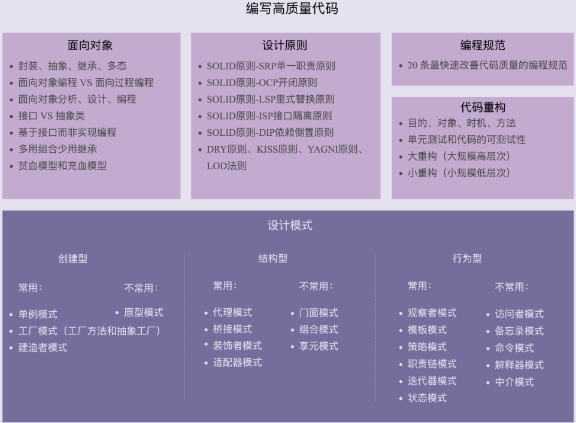

### 该模块记录常用的编程设计模式

**** 思考一个知识点的方式:

- 为什么要有这种设计原则、思想或者模式？
- 它能解决什么编程问题？
- 有哪些应用场景？
- 又该如何权衡、恰当地在项目中应用？

#### 常见的代码问题:

- 命名不规范
- 类设计不合理
- 分层不清晰
- 没有模块化概念
- 代码结构混乱
- 高度耦合

#### 代码设计问题

- 如何分层、分模块？
- 应该怎么划分类？
- 每个类应该具有哪些属性、方法？
- 怎么设计类之间的交互？
- 该用继承还是组合？
- 该使用接口还是抽象类？
- 怎样做到解耦、高内聚低耦合？
- 该用单例模式还是静态方法？
- 用工厂模式创建对象还是直接 new 出来？
- 如何避免引入设计模式提高扩展性的同时带来的降低可读性问题？

#### 代码的几个评价维度

1. 可维护性
2. 可读性
3. 可扩展性
4. 灵活性
5. 简洁性
6. 可复用性
7. 可测试性

#### 主流的编程范式或者是编程风格有三种
 - 面向过程
 - 面向对象
 - 函数式编程

#### 设计原则

- 单一职责原则
- 开闭原则
- 里氏替换原则
- 接口隔离原则
- 依赖倒置原则

#### 设计模式

- 单例模式
- 工厂模式
- 建造者模式
- 代理模式
- 桥接模式
- 装饰者模式
- 适配器模式
- 观察者模式
- 模板模式
- 策略模式
- 职责链模式
- 迭代器模式
- 状态模式

